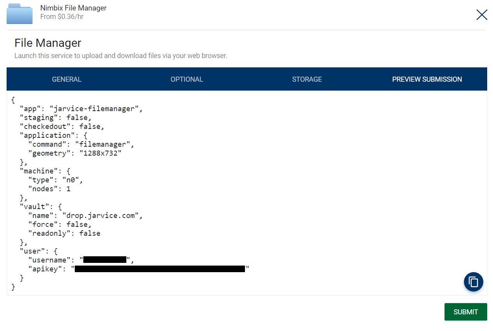

# Overview

The JARVICE API allows full control on running jobs as well as managing applications via PushToCompute&trade;.  The API server delivers the endpoints below - for the Nimbix Public Cloud the API server is:
```text
https://cloud.nimbix.net/api
```

Unless otherwise noted, all endpoints support both GET and POST request methods.  Also, unless otherwise noted, responses deliver both an HTTP status code and a JSON payload.

In all cases referring to an API key, this is available from the JARVICE portal in the *Account* section.  This is not the same as the password used to log into the portal.

## Job Control

These API endpoints allow you to submit jobs and control their execution.  Jobs run on one or more compute nodes and launch the image of an application from the service catalog.


---
### /jarvice/action (deprecated)

Executes an application-defined command inside a running job.  The command runs asynchronously and its standard output/standard error is accessible with [/jarvice/tail](#jarvicetail) while the job is running.

###### Parameters

* ```username``` - name of user to authenticate

* ```apikey``` - API key for user to authenticate

* ```name``` (optional) - job name (name key returned from [/jarvice/submit](#jarvicesubmit))

* ```number``` (optional) - job number (number key returned from [/jarvice/submit](#jarvicesubmit))

* ```action``` - the name of the action to run (must be a valid action from [/jarvice/info](#jarviceinfo))

###### Response

On success: ```{"status": "action requested"}```

###### Additional Notes

1. One of ``name`` or ``number`` must be specified

2. Action is requested asynchronously - if the action produces output in a batch job, it can be checked with [/jarvice/tail](#jarvicetail)


---
### /jarvice/shutdown

Requests a graceful termination of a job, executing the operating system ```poweroff``` mechanism if applicable.

###### Parameters

* ```username``` - name of user to authenticate

* ```apikey``` - API key for user to authenticate

* ```name``` (optional) - job name (name key returned from [/jarvice/submit](#jarvicesubmit))

* ```number``` (optional) - job number (number key returned from [/jarvice/submit](#jarvicesubmit))

###### Response

On success: ```{"status": "shutdown requested"}```

A job not in `PROCESSING STARTING` status will return an error, e.g. ```{"error": "Running job is not found"}```

###### Additional Notes

1. One of `name` or `number` must be specified

2. Shutdown is requested asynchronously - job status can be monitored with [/jarvice/status](#jarvicestatus)

3. Current job status must be `PROCESSING STARTING` as indicated by output of [/jarvice/status](#jarvicestatus), e.g. `{"job_status": "PROCESSING STARTING"}`. For other states, see [/jarvice/terminate](#jarviceterminate)

---
### /jarvice/signal

Send a signal to a running job (e.g. SIGTSTP/20).

###### Parameters

* ```username``` - name of user to authenticate

* ```apikey``` - API key for user to authenticate

* ```name``` (optional) - job name (name key returned from [/jarvice/submit](#jarvicesubmit))

* ```number``` (optional) - job number (number key returned from [/jarvice/submit](#jarvicesubmit))

* ```signal``` (optional) - signal to send to job (default to SIGTSTP/20)

###### Response

On success: ```{"signal": <signal>, "pid": <pid>}```

Where `pid` is the process that receives the `signal`.

###### Additional Notes

1. One of `name` or `number` must be specified

2. `signal` must use the integer representation for the signal

3. `/jarvice/signal` will set the substatus 'Suspended by user' which is updated on the JARVICE Dashboard. This substatus is cleared by signaling SIGCONT/18. Processes that ignore SIGTSTP are not suspended even if the job substatus is set to 'Suspended by user'
4. JarviceXE applications can override signal behavior by setting `JARVICE_SIGNAL_OVERRIDE` environment variable to a custom script to handle signals sent to the application from the JARVICE API. (see example [Dockerfile using ENV to set `JARVICE_SIGNAL_OVERRIDE`](https://github.com/nimbix/app-slurm/blob/main/Dockerfile) and [override script](https://github.com/nimbix/app-slurm/blob/main/scripts/signal-override.sh))

---
### /jarvice/submit

Submits a job for processing. The body is in JSON format and can be generated from the JARVICE web portal by clicking the *PREVIEW SUBMISSION* tab in the task builder and copying its contents to the clipboard - e.g.:



Click the copy icon above the *SUBMIT* button to copy the contents of the API call to the clipboard.

NOTE: Adding the [`identity` object](appdef.md#reference) in the submission json will replace the [NIMBIX Application Environment](nae.md) `nimbix` user. The JARVICE API cannot override an `identity` set by an AppDef file.

Sample `identity` object:
```
{
  "username": "hpc",
  "group": "jarvice",
  "uid": 1111,
  "gid": 2222
}
```

###### Parameters

**POST only**: JSON payload to run the compute job, generated as specified above.  If copying from the web portal, paste the text into a file or script to use as the JSON payload to submit.  Please note that authentication is performed from the ```username``` and ```apikey``` values in the JSON itself.

###### Response

On success, a JSON payload indicating the job name and job number (with ```name``` and ```number``` keys).

###### Additional Notes

1. All boolean values default to ```false``` if not specified

2. The ```nodes``` parameter in the machine section defaults to ```1``` if not specified

3. Even if a ```vault``` section is specified, ```password``` is optional and should only be supplied for encrypted block vaults

4. Even if ```vault``` section is specified, vault ```objects``` is optional and applies only to object storage vaults; it indicates which objects should be moved into the environments's backing store for processing. If ```readonly``` is set to ```false```, JARVICE automatically copies any new or changed objects from the backing store back to the object storage on normal job completion (but not immediate termination with [/jarvice/terminate](#jarviceterminate)).

5. ```ipaddr``` will be validated by the underlying platform for authorization for the user; it may also fail if the address is already assigned (but this won't be known until the job starts running).


---
### /jarvice/terminate

Immediately terminates a running job.  **NB**: This will terminate the job regardless of current status.

**Best Practice**: Use the [/jarvice/shutdown](#/jarvice/shutdown) for a job in `PROCESSING STARTING` state and **only** use [/jarvice/terminate](#jarviceterminate) for a job not in a `PROCESSING STARTING` state or not responding to a [/jarvice/shutdown](#/jarvice/shutdown). 

###### Parameters

* ```username``` - name of user to authenticate

* ```apikey``` - API key for user to authenticate

* ```name``` (optional) - job name (name key returned from [/jarvice/submit](#jarvicesubmit))

* ```number``` (optional) - job number (number key returned from [/jarvice/submit](#jarvicesubmit))

###### Response

On success: ```{"status": "terminated"}```

###### Additional Notes

1. One of ``name`` or ``number`` must be specified


## Status and Information

These API endpoints allow you to query status or request information from running or completed jobs.


---
### /jarvice/appdef

Returns the Application Definition (AppDef) for a given application.

###### Parameters

* ```username``` - name of user to authenticate

* ```apikey``` - API key for user to authenticate

* ```name``` - name of application to return information for; please note this is the application ID, not necessarily the same as the ```name``` value in the AppDef

###### Response

On success, a JSON payload with the AppDef requested.


---
### /jarvice/apps

Returns information about available application(s).

###### Parameters

* ```username``` - name of user to authenticate

* ```apikey``` - API key for user to authenticate

* ```name``` (optional) - name of application to return information for (default, if not specified: all)

###### Response

On success, a JSON payload with application information for each available application, or for the specific application name if available. The application name is used as the dictionary key, and the data subkey contains the raw definition in JSON format. The ```price``` value is the application price itself, not including underlying machine price (which is available by querying the machine type using [/jarvice/machines](#jarvicemachines)).

Note that application name is the application ID, not necessarily the same as the human readable ```name``` in the AppDef for the given application.


---
### /jarvice/projects

(JXE/System Admins only) Returns all JARVICE projects and members

###### Parameters

* ```username``` - name of user to authenticate

* ```apikey``` - API key for user to authenticate

##### Response

On success, a JSON payload, e.g.:

```
{
    "john-projectFoo": [
        "john",
        "doe",
        "jarvice"
    ],
    "nimbix-projectBar": [
        "nimbix",
        "jane"
    ]
}
```

##### Additional Notes

1. Endpoint is for JARVICE XE System Administrators only

2. Project name contains the project owner, `<owner>-<project-name>`

---
### /jarvice/billing

(JXE/System Admins only) Returns billing report for JARVICE users

###### Parameters

* ```username``` - name of user to authenticate

* ```apikey``` - API key for user to authenticate

* ```reportuser``` (optional) - comma separated list of users to filter (default, if not specified: list all users)

* ```billingcode``` (optional) - billing code to filter by

* ```statuses``` (optional) - comma seperated string of statuses to filter by

* ```machtypes``` (optional) - comma seperated string of machine types to filter

* ```jobapp``` (optional) - application name to filter by (e.g. jarvice-ubuntu)

* ```itemized``` (optional) - set to ```true``` to generate itemized report (default, if not specified: ```false```)

* ```timeperiod``` (optional) - includes jobs in the previous/current month or custom range (either ```last```, ```current```, or ```range```)

* ```startdate``` (optional) - range start of time period to generate report (YYYY-MM-DD)

* ```enddate``` (optional) - range end of time period to generate report (YYYY-MM-DD)

##### Response

On success, a CSV file containing generated billing report

##### Additional Notes

1. Endpoint is for JARVICE XE System Administrators only

2. If ```reportuser``` is a payer of a team, all team members are included

3. Valid ```statuses``` fields are: COMPLETED, COMPLETED WITH ERROR, SUBMITTED, PROCESSING STARTING, CANCELED, EXEMPT, SEQUENTIALLY QUEUED, TERMINATED

4. Valid ```machtypes``` can be queried using `/jarvice/machines` API

5. ```startdate``` and ```enddate``` are required if ```timeperiod``` is set to ```range```

---
### /jarvice/connect

Requests the network address and user ```nimbix``` password (if set), for an interactive job.

###### Parameters

* ```username``` - name of user to authenticate

* ```apikey``` - API key for user to authenticate

* ```name``` (optional) - job name (name key returned from [/jarvice/submit](#jarvicesubmit))

* ```number``` (optional) - job number (number key returned from [/jarvice/submit](#jarvicesubmit))

###### Response

On success, a JSON payload: ```{"address": <network-address>, "password": <nimbix-password>}```

###### Additional Notes

1. One of ```name``` or ```number``` must be specified

2. Job must be running an application endpoint that has ```interactive``` set to ```true``` in its AppDef in order for it to respond successfully

3. This method may take a few seconds to respond successfully after starting a job, as its connection parameters are not known until its application components start


---
### /jarvice/info

###### Parameters

* ```username``` - name of user to authenticate

* ```apikey``` - API key for user to authenticate

* ```name``` (optional) - job name (name key returned from [/jarvice/submit](#jarvicesubmit))

* ```number``` (optional) - job number (number key returned from [/jarvice/submit](#jarvicesubmit))

###### Response

On success, a JSON payload, e.g.:
```
{
    "url": <web-service-URL>
    "about": <about-HTML>
    "help": <help-HTML>
    "actions": {
        <action-1> {
            "alt": <action-description>
        },
        <action-n> {
            "alt": <action-description>
        }
    }
}
```
* *web-service-URL* is intended to be used to connect to an application-specific web service, if one exists, running inside the [application environment](nae.md); the address is accessible from the client; the value is taken from ```/etc/NAE/url.txt``` inside the environment

* All values may be ```null``` if not applicable

###### Additional Notes

1. One of ```name``` or ```number``` must be specified

2. This method may take a few seconds to respond successfully after starting a job, as its connection parameters are not known until its application components start


---
### /jarvice/jobs

Returns job information and status for all queued and running jobs.

###### Parameters

* ```username``` - name of user to authenticate

* ```apikey``` - API key for user to authenticate

* ```completed``` (optional) - set to ```true``` (case sensitive) to show only completed jobs (default, if not specified: ```false```)

###### Response

On success, a JSON payload with job status for each queued or running job (keyed by job number), formatted like the response of [/jarvice/status](#jarvicestatus)

---
### /jarvice/machines

Returns information about available machine type(s).

###### Parameters

* ```username``` - name of user to authenticate

* ```apikey``` - API key for user to authenticate

* ```name``` (optional) - name of machine type to return information for (default, if not specified: all)

* ```vault``` (optional) - vault name to use for machine compatibility; if specified, response will be a list of machines that can be used against that vault; if not specified, the user's default vault is used to determine machine compatibility

###### Response

On success, a JSON payload with machine information for each available machine type, or for the specific machine ```name``` if available. The machine name is used as the dictionary key.

---
### /jarvice/metrics

Returns the last known CPU and memory utilization metrics for a given job.

###### Parameters

* ```username``` - name of user to authenticate

* ```apikey``` - API key for user to authenticate

* ```name``` (optional) - job name (name key returned from [/jarvice/submit](#jarvicesubmit))

* ```number``` (optional) - job number (number key returned from [/jarvice/submit](#jarvicesubmit))

###### Response

On success, a JSON payload indicating summary values in the `summary` key, and itemized values (one for each parallel node in the job) in the `itemized` key - e.g.:
```
{
    "itemized": {
        "memory_used": [
            118832, 
            99760
        ], 
        "cpu_used": [
            52, 
            0
        ], 
        "memory_total": [
            16777216, 
            16777216
        ]
    }, 
    "summary": {
        "memory_used": 218592, 
        "cpu_used": 26, 
        "memory_total": 33554432
    }
}
```

###### Additional Notes

1. One of ```name``` or ```number``` must be specified
2. `cpu_used` is always a percentage value (percentage of total CPU resource allocated), while `memory_used` and `memory_total` are always in kilobytes.
3. In the summary section, `cpu_used` is the average of all CPU utilization across all nodes in the job, while the memory values are the sum total, in kilobytes.
4. The percentage of memory utilized from the summary can be calculated by dividing `memory_used` by `memory_total` and multiplying by `100`.
5. All values are "point in time" rather than rolling average or any type of cumulative calculation, and are collected periodically (typically every 30 seconds)
6. This endpoint may return a 404 for approximately the first minute that a job is running, until metrics become available

---
### /jarvice/output

Returns a tail (or optionally all) of the output of a completed job.

###### Parameters

* ```username``` - name of user to authenticate

* ```apikey``` - API key for user to authenticate

* ```name``` (optional) - job name (name key returned from [/jarvice/submit](#jarvicesubmit))

* ```number``` (optional) - job number (number key returned from [/jarvice/submit](#jarvicesubmit))

* ```lines``` (optional) - number of lines to tail from the end (default: 100) - use ```0``` to return all lines rather than just a tail

###### Response

On success, the requested output tail in ```text/plain format``` (with single ```\n``` for line breaks), up to and including the number of lines requested; if the total length of the output is less than lines requested, the entire output is returned.  If lines requested is ```0```, all lines in the output are returned rather than just a tail of it.

###### Additional Notes

1. One of ```name``` or ```number``` must be specified

2. Job must have completed; to get the output of a running job instead, use [/jarvice/tail](#jarvicetail)


---
### /jarvice/screenshot

Returns a screenshot for a running job (if it is graphical).

###### Parameters

* ```username``` - name of user to authenticate

* ```apikey``` - API key for user to authenticate

* ```name``` (optional) - job name (name key returned from [/jarvice/submit](#jarvicesubmit))

* ```number``` (optional) - job number (number key returned from [/jarvice/submit](#jarvicesubmit))

* ```width``` (optional) - pixel width to restrict screenshot to

* ```height``` (optional) - pixel height to restrict screenshot to

* ```emphatic``` (optional) - if specified, emphatically resize (disregarding aspect ratio) to specified ```width``` and/or ```height```

###### Response

On success, an ```image/png``` payload with the requested screenshot if available.

###### Additional Notes

1. One of ```name``` or ```number``` must be specified

2. If ```emphatic``` is not specified, but ```width``` and/or ```height``` is, the aspect ratio of the screenshot image is preserved when resizing.


---
### /jarvice/status

Queries status for a previously submitted job.

###### Parameters

* ```username``` - name of user to authenticate

* ```apikey``` - API key for user to authenticate

* ```name``` (optional) - job name (name key returned from [/jarvice/submit](#jarvicesubmit))

* ```number``` (optional) - job number (number key returned from [/jarvice/submit](#jarvicesubmit))

###### Response

On success, a JSON payload with job status, formatted as follows:
```
{
    <job-number> {
        "job_name": <job-name>
        "job_status": <job-status>
        "job_substatus": <job-substatus>
        "job_submit_time": <job-submit-time>
        "job_start_time": <job-start-time>
        "job_end_time": <job-end-time>
        "job_application": <job-application>
        "job_command": <job-command>
        "job_walltime": <job-walltime>
        "job_project": <job-project>
    }
}
```

* All "time" values are represented in UNIX time (seconds since the Epoch); values may be 0 if the data is not yet available (e.g. a job that hasn't completed yet will have a 0 for ```job_end_time```); additional values may be returned in the future.

###### Additional Notes

1. One of ```name``` or ```number``` must be specified


---
### /jarvice/tail

Returns a tail (or optionally all) of the output of a running job.

###### Parameters

* ```username``` - name of user to authenticate

* ```apikey``` - API key for user to authenticate

* ```name``` (optional) - job name (name key returned from [/jarvice/submit](#jarvicesubmit))

* ```number``` (optional) - job number (number key returned from [/jarvice/submit](#jarvicesubmit))

* ```lines``` (optional) - number of lines to tail from the end (default: 100) - use ```0``` to return all lines rather than just a tail

###### Response

On success, the requested output tail in ```text/plain format``` (with single ```\n``` for line breaks), up to and including the number of lines requested; if the total length of the output is less than lines requested, the entire output is returned.  If lines requested is ```0```, all lines in the output are returned rather than just a tail of it.

###### Additional Notes

1. One of ```name``` or ```number``` must be specified

2. Job must still be running; to get the output of a completed job instead, use [/jarvice/output](#jarviceoutput)

---
### /jarvice/teamjobs

Returns job information and status for all queued and running jobs for an entire team.

###### Parameters

* ```username``` - name of user to authenticate

* ```apikey``` - API key for user to authenticate

* ```completed``` (optional) - set to ```true``` (case sensitive) to show only completed jobs (default, if not specified: ```false```)

###### Response

On success, a JSON payload with job status for each queued or running job (keyed by job number), formatted like the response of [/jarvice/status](#jarvicestatus)

###### Additional Notes

1. If `username` does not refer to a team payer, only jobs for that user will be listed

---
### /jarvice/teamusers

(Team Admins only) Returns a list of JARVICE users who are members of the callers team

##### Parameters

* ```username``` - name of user to authenticate

* ```apikey``` - API key for user to authenticate

##### Reponse

On success, a JSON payload with a list of team members, formatted as follows:

```
{
    <jarvice-username> : {
        "email": <user-email>,
        "name": <user-name>
    }
}
```

---
### /jarvice/vault

List files in a vault.

###### Parameters

* ```username``` - name of user to authenticate

* ```apikey``` - API key for user to authenticate

* ```vault``` - name of vault to list files in

* ```path``` - directory in vault to list files in

* ```details``` (optional) - include file details such as size and modification time if set to ```true``` (default is ```false```)

* ```sort``` (optional) - either ```n```, ```s```, or ```m``` to sort by **n**ame (default), **s**ize, or **m**odification time (respectively) in ascending order; use uppercase for reverse sort

###### Response

On success, a list of lists in ```application/json``` format; each element pertains to a file or directory, and includes its name, size, and modification time - e.g.:
```
[
    [
        "file1",
        56,
        1599756815
    ],
    [
        "file2",
        123,
        1599756817
    ]
]
```

* "modification time" (3rd value in each element) is represented in UNIX time (seconds since the Epoch)

###### Additional Notes

1. Listing is not recursive - only the files in the directory specified by the ```path``` parameter are listed

2. Directories are marked with a trailing ```/``` character

3. Both size and modification time may be 0 if ```details``` is not ```true```

4. Sorting by anything other than name requires ```details``` to be set to ```true```

5. Requesting a detailed listing may be significantly slower for certain storage topologies or if listing very large numbers of files; use only if necessary


---
### /jarvice/queues

(JXE only) Returns information about available queue(s).

###### Parameters

* ```username``` - name of user to authenticate

* ```apikey``` - API key for user to authenticate

* ```name``` (optional) - name of queue to return information for (default, if not specified: all)

* ```info``` (optional) - display additional info for each queue (default: ```false```)

###### Response

A JSON payload with an array of available queues *or*

when `info=true`, a JSON payload with queue information, formatted as follows:

```
{
    <queue-name> {
        "name": <queue-name>,
        "app": <application-id>,
        "machine": <default-machine>,
        "size": <node-limit-per-job>
    }
}
```
---
## PushToCompute&trade;

These API endpoints allow you to manage JARVICE application images via the PushToCompute&trade; subsystem.  For more information on these mechanisms, please see [CI/CD Pipeline](cicd.md).


---
### /jarvice/history

Retrieve build/pull history for a JARVICE application image.

###### Parameters

* ```username``` - name of user to authenticate

* ```apikey``` - API key for user to authenticate

* ```target``` - target image name to get history for (usually same as the application ID)

* ```limit``` (optional) - the number of entries to limit the output to (default: 100)

* ```reltime``` (optional) - use relative timestamps (default: ```true```) - set to ```false``` to use absolute timestamps

###### Response

On success, the requested reverse chronological history (most recent first) in ```text/plain``` format (with single ```\n``` for line breaks), up to and including the ```limit``` requested. Blank output indicates either the target does not exist, or has no associated build/pull history (yet).


---
### /jarvice/pull

Pulls a Docker repository into a JARVICE application image. The JARVICE application image must already exist.

###### Parameters

* ```username``` - name of user to authenticate

* ```apikey``` - API key for user to authenticate

* ```repo``` - Docker repository to pull from

* ```target``` - target image name to store application in (usually same as the application ID)

###### Response

A JSON payload with the status message in the ```status``` key.

###### Additional Notes

1. You will receive a notification once the pull starts and completes, either with or without error, per your account's notification preferences

2. ```repo``` uses the same syntax as the ```docker pull``` does

3. If pulling a private repository, you must log into the Docker registry in the JARVICE portal from the *PushToCompute&trade;* page first


---
### /jarvice/build

Builds a JARVICE application image for a Docker repository. The JARVICE application ID must already exist.

###### Parameters

* ```username``` - name of user to authenticate

* ```apikey``` - API key for user to authenticate

* ```target``` - target application ID to build an image for (must exist)

* ```pull``` (optional) - on successful build, pull Docker repository into a JARVICE application image (default: ```false```)

* ```abort``` (optional) abort a running image build (default: ```false```)

###### Response

A JSON payload with the status message in the ```status``` key.

###### Additional Notes

1. You will receive a notification once the build starts and completes, either with or without error, per your account's notification preferences

2. If ```abort``` is specified, any running build is aborted immediately; if not, a build is scheduled; note that scheduling a build with one already running results in failure

3. ```abort``` does not automatically schedule a new build - it merely changes the meaning of this endpoint from schedule to abort build


---
### /jarvice/validate

Validates an AppDef (application definition).

###### Parameters

**POST only:** JSON payload containing an AppDef (application definition) to validate.  Please see the [Application Definition Guide](appdef.md) for details on the format.  A valid AppDef can be used to customize the user interface endpoints for an application, as well as descriptive metadata.

###### Response

A JSON payload with the boolean status in the ```valid``` key if successful, or a 400 error with a descriptive message on failure.

###### Additional Notes

1. Validation is done in a single pass and may not pinpoint the exact location of the error in every case


