# Jarvice Applications Push to Compute tutorial


This tutorial should allow end users to build their own applications (apps) for Jarvice clusters
through Jarvice PushToCompute interface.

This tutorial assumes user is building applications based on `appdefversion` version `2`.

First part of the tutorial is dedicated to general knowledge 
and how to build and deploy a basic application.

Second part covers most standard use cases users could need
to build their application.

It is assumed user have already installed **docker** on its personal system.

It is recommended to first read all sections from part 1 (Global view) to part 5 (Review application parameters) before proceeding to desired application target examples.
Each of these general steps will help understand all features available, and provides key tips for new applications developers.

Table of content:

  * [1. Global view](#1-global-view)
  * [2. Hello world](#2-hello-world)
    + [2.1. Create Dockerfile](#21-create-dockerfile)
    + [2.2. Create AppDef.json](#22-create-appdefjson)
    + [2.3. Finalize image](#23-finalize-image)
    + [2.4. Register to registry (optional)](#24-register-to-registry--optional-)
    + [2.5. Push image](#25-push-image)
    + [2.6. Pull image with Push to Compute](#26-pull-image-with-push-to-compute)
    + [2.7. Run application in Jarvice](#27-run-application-in-jarvice)
    + [2.8. Gather logs](#28-gather-logs)
  * [3. Important building guidelines](#3-important-building-guidelines)
    + [3.1. Repush image](#31-repush-image)
    + [3.2. Multi stages](#32-multi-stages)
    + [3.3. Optimize packages installation](#33-optimize-packages-installation)
    + [3.4. End with NAE](#34-end-with-nae)
  * [4. Basic interactive job](#4-basic-interactive-job)
    + [4.1. Standard way](#41-standard-way)
    + [4.2. On an existing application image](#42-on-an-existing-application-image)
  * [5. Review application parameters](#5-review-application-parameters)
    + [5.1. Commands](#51-commands)
    + [5.2. Commands parameters](#52-commands-parameters)
    + [5.3. Commands parameters advanced settings](#53-commands-parameters-advanced-settings)
  * [6. Non interactive application](#6-non-interactive-application)
    + [6.1. Dockerfile](#61-dockerfile)
    + [6.2. AppDef](#62-appdef)
    + [6.3. Run application](#63-run-application)
  * [7. Basic shell interactive application](#7-basic-shell-interactive-application)
    + [7.1. Create image](#71-create-image)
    + [7.2. Create calculator.py file](#72-create-calculatorpy-file)
    + [7.3. Create AppDef](#73-create-appdef)
    + [7.4. Launch and use](#74-launch-and-use)
  * [8. Basic UI interactive application](#8-basic-ui-interactive-application)
    + [8.1. Create image](#81-create-image)
    + [8.2. Create AppDef](#82-create-appdef)
    + [8.3. Launch application](#83-launch-application)
  * [9. MPI application](#9-mpi-application)
    + [9.1. Basic benchmark application](#91-basic-benchmark-application)
    + [9.2. Using another MPI implementation](#92-using-another-mpi-implementation)
  * [10. Script based application](#10-script-based-application)
    + [10.1. Plain text script](#101-plain-text-script)
    + [10.2. Base64 encoded script](#102-base64-encoded-script)
  * [11. Server application](#11-server-application)
    + [11.1. Basic http server](#111-basic-http-server)
    + [11.2. Basic ssh server](#112-basic-ssh-server)
    + [11.3. Minecraft server](#113-minecraft-server)

## 1. Global view

In order to use Jarvice cluster, users need to build their own application container image, then push it to a registry accessible from the cluster, pull it using PushToCompute interface, and then simply submit jobs.

Process global view can be reduced to this simple schema:


In order to explain in details this process, best way is to build a Hello World application, steps by steps.

## 2. Hello world

Objective of this Hello World application is simply to display an Hello World as output message of a Jarvice job.

In order to achieve that, we will need to go through multiple steps.
Process is not complex, but need steps to be understood in ordure to avoid basic issues.

### 2.1. Create Dockerfile


First step is to create the Dockerfile that will be used to build application container image.

Create folder hello_world:

```
mkdir hello_world
cd hello_world
```

Create then a Dockerfile. A Dockerfile is a multi-steps description of how image should be created, and from what. 
We are going to start from basic Ubuntu image, as this source image is a widely used starting point.

To get more details on how this Dockerfile can be extended and used, refer to https://docs.docker.com/engine/reference/builder/ .

Create file `Dockerfile` with the following content, which should be self-explained:

```dockerfile
# Use Ubuntu latest image as starting point.
# This image will be automatically pulled from web at build.
FROM ubuntu:latest
```

Note: we did not specify any `CMD` or `ENDPOINT`. This is on purpose, as this will be handled by a separated file later.

Now, generate the hello_world image, tagging it as `tutorial:hello_word` (to get more details on how to build images, refer to https://docs.docker.com/engine/reference/commandline/build/):

```
docker build --tag="tutorial:hello_world" -f Dockerfile .
```

Once image has been successfully created, it is possible to test it by manually executing it:

```
:~$ docker run -it --rm tutorial:hello_world /usr/bin/echo "Hello World!"
Hello World!
:~$ docker run -it --rm tutorial:hello_world /usr/bin/cat /etc/os-release
NAME="Ubuntu"
VERSION="20.04.2 LTS (Focal Fossa)"
ID=ubuntu
ID_LIKE=debian
PRETTY_NAME="Ubuntu 20.04.2 LTS"
VERSION_ID="20.04"
HOME_URL="https://www.ubuntu.com/"
SUPPORT_URL="https://help.ubuntu.com/"
BUG_REPORT_URL="https://bugs.launchpad.net/ubuntu/"
PRIVACY_POLICY_URL="https://www.ubuntu.com/legal/terms-and-policies/privacy-policy"
VERSION_CODENAME=focal
UBUNTU_CODENAME=focal
:~$
```

We can see here that image contains Ubuntu 20.04 release.

### 2.2. Create AppDef.json


We now need to create the Jarvice application file.

Create folder NAE:

```
mkdir NAE
cd NAE
```

And create here `AppDef.json` file with the following content:

```json
{
    "name": "Hello World App",
    "description": "A very basic app thay says hello to world.",
    "author": "Me",
    "licensed": false,
    "appdefversion": 2,
    "classifications": [
        "Uncategorized"
    ],
    "machines": [
        "*"
    ],
    "vault-types": [
        "FILE",
        "BLOCK",
        "BLOCK_ARRAY",
        "OBJECT"
    ],
    "commands": {
        "Hello": {
            "path": "/usr/bin/echo",
            "interactive": false,
            "name": "Echo with arguments",
            "description": "Execute /usr/bin/echo with 'Hello World!' as argument.",
            "parameters": {
                "message": {
                    "name": "message",
                    "description": "hello world message",
                    "type": "CONST",
                    "value": "Hello World!",
                    "positional": true,
                    "required": true
                }
            }
        }
    },
    "image": {
        "type": "image/png",
        "data": ""
    }
}
```

Let’s review key parts of this file (when not detailed, just keep it as it):

```json
{
    "name": "Hello World App",
    "description": "A very basic app that says hello to world.",
    "author": "Me",
    "licensed": false,
    "appdefversion": 2,
    "classifications": [
        "Uncategorized"
    ],
...
}
```

This first section of the file details general settings, like application name, a description, the author, if application is under license or not, and application classification.

```json
{
...
    "machines": [
        "*"
    ],
...
}
```

Machines allows you to restrict usage of the application to a specific set of machines registered in the targeted Jarvice cluster. For example, if your application is GPU dedicated, it would make no sense to run it on non-GPU nodes, and so only GPU able nodes should be added here.
Note that only Jarvice cluster administrator can create machines profiles on its cluster. Please contact your JXE administrator to get a detailed list of available machines.

```json
{
...
    "commands": {
        "Hello": {
            "path": "/usr/bin/echo",
            "interactive": false,
            "name": "Echo with arguments",
            "description": "Execute /usr/bin/echo with 'Hello World!' as argument.",
            ...
        }
    },
...
}
```

Commands section describes possible commands available with the application. An application can have multiple commands available (For this same image, we could have for example a command named `hello` with `/usr/bin/echo` with argument `Hello World!` as entry point, and a second command named `os infos` with `/usr/bin/cat` with argument `/etc/os-release` as entry point). This case will be covered later.

Path is application entry point, and interactive lets you decide if user will be able to interact with running application or if all running process is automated.

Refers to https://jarvice.readthedocs.io/en/latest/appdef/#commands-object-reference for more details.

```json
{
...
    "commands": {
        "Hello": {
            "path": "/usr/bin/echo",
            "interactive": false,
            "name": "Echo with arguments",
            "description": "Execute /usr/bin/echo with 'Hello World!' as argument.",
            "parameters": {
                "message": {
                    "name": "message",
                    "description": "hello world message",
                    "type": "CONST",
                    "value": "Hello World!",
                    "positional": true,
                    "required": true
                }
            }
        }
    },
...
}
```

Parameters are required and optional parameters passed to entry point as arguments or available in `/etc/JARVICE/jobenv.sh` during run (which can be imported by scripts or users).

In this example, we are going to pass a `CONST` with value `"Hello World!"` as parameter to entry point. This will result in `/usr/bin/echo "Hello World!"` being called. Other parameters (positional, etc.) will be described later.

Refer to https://jarvice.readthedocs.io/en/latest/appdef/#parameters-object-reference for more details.

```json
{
...
    "image": {
        "type": "image/png",
        "data": ""
    }
}
```

The last section, image, refer to logo that will be displayed inside Jarvice interface, for our application. It has to be encoded as text.
Let's add an image to our application. Download a basic sample from wikimedia:

```
wget https://upload.wikimedia.org/wikipedia/commons/thumb/2/28/HelloWorld.svg/128px-HelloWorld.svg.png
```

And encode it with base64:

```
base64 -w 0 128px-HelloWorld.svg.png
```

Get the output (which can be very large for big images), and add it into AppDef.json inside `images.data` value:

```json
{
...
    "image": {
        "type": "image/png",
        "data": "iVBORw0KGgoAAAANSUhEUgAAAIAAAABACAMAAADlCI9NAAAABGdBTUEAALGPC/xhBQAAACBjSFJNAAB6JgAAgIQAAPoAAACA6AAAdTAAAOpgAAA6mAAAF3CculE8AAACu1BMVEUAAAAAHQAAMwAAMAAAKQAAJAAAPgAASgAAIgAAEQAAIAAAPAAAPwAAkQAA/wAA7wAAzAAAtAAA2QAAdgAAOwAAbwAA0gAA2wAAZgAACgAAVgAADgAAjQAAhAAAGgAAOgAARAAANwAADQAAOQAAEwAAAgAAWwAA0AAA/AAAxAAAMQAAtQAA+gAAwAAACAAAqwAAjwAAAQAAXQAAiAAAmwAAtwAAVAAAKgAA1QAAFgAA3gAAngAAcgAARQAA/QAAYAAAQwAAkAAAHwAABAAAJgAApAAA9QAA4QAA5gAAUQAA2gAA8QAAEAAAswAAxwAAcQAAHgAA9wAABQAAdQAAsAAAmgAAsgAAogAA8AAAqgAA8wAALwAAoAAAmQAApgAAyAAA1gAAeQAAXAAA6QAA6AAA4AAAXwAAQgAA7gAA5AAAWAAA/gAAiQAAfwAASAAA8gAAgwAA1AAAGQAAGAAAywAArwAAlwAAewAAPQAAYQAA6wAAAwAA1wAAjgAAQQAAzwAANAAABgAAMgAAqQAAIwAA+AAABwAALAAADwAAtgAAwwAA7QAAowAA3QAArQAAzQAAoQAAIQAATgAAygAAHAAA+wAAhwAAmAAADAAANQAAXgAAjAAAnwAAlQAASwAALgAAQAAAFAAAFwAAYwAAkgAAagAAeAAAnQAAuwAATAAA2AAAzgAA4gAAugAA0wAAxgAASQAApQAAcAAAbgAAaQAACwAA7AAAZAAALQAAgQAA6gAAuQAAlgAAGwAAfgAAwgAAZQAAawAA9gAA5wAANgAAUwAA4wAATwAAhQAAJQAAUAAAnAAA3AAAUgAAcwAAggAAgAAAJwAAqAAA+QAArgAA3wAAhgAApwAAlAAA9AAAdAAAvwAAZwAAYgAATQAARwAAFQAAdwAACQAAWQAAiwAAVwAAvAAAKwD///+roNTNAAAAAWJLR0ToJtR3AgAAAAd0SU1FB+EJAhY4BL6Mb10AAAXISURBVGje7Zj7XxRVFMAvj3bF6LLyUAiQ5SkCq2ywECgErIIgJlAJolBkJbVIluADcS1UXkGiomJmalrgAxOEUpMsK3uZqVn0Dkvr3+icOzuzO7i7nxmW+NTns+cH7jnn3nP3y9zHnDOEOMUp/1dxceXETfC4mzz3jGE2hVKpgGaSUqn0QHsyKPeyHk/QXKyF3Ec58RI8KpNnyhgAvCn1hsYHwn3R9gNlKuuZBpq/E8BaSICHh8f9IoBA8ARNHACKUgSAEvzvAkwPUYd6yAUIC1WHR4wHQGTUDFzh6JlKOQAxsXEYpPF0GGDWbMpLvFYywANxfFCCXYBEnS4RmiSdTpfMAzyYgpLKA8yhZpkrFSAt3Rz0kJw94UctBQEyUMnM0s+bD212hDQAfQ6YC6Lcc/OgXZjvEMAiaOdjl/Zh0BZLA0jC5Y8BpaDQHDQ2gKJsaENY3yOgPSoN4DGwljCtGDSdTICSpSilHMAyBFleBlL+OGhPSAPAu7GCaU+CtkImgOgUZIgeCX1KGsDTYD3DtJW4GJEOACjFAJXSAJ4F6zmmhYNm0DsAEII/W5XAyypuWDU4nxcFrhat9QvC1sPtWOLIEryIAGvuSiPQO8vSUwGOGsGqBWst09aBpnIEgLXCOUoxocxDgPWWgRvAURrIW3PBqgsDZWM9aJscAsB/rXADW0W3+FIjN2wjnpHNL71sDmxApC1bTdstZRse2TDSiOfR0OQQQHMqyz5ULa2vQGsCIG2jjgXRtvOeV/k9SUu3e2HTQRwCIG4rLE4BD7DDaxQA2RltCVDUIoTsCnQQgHRu4d8su1smC5lw7G4xAKnebgFAivZsY1b03i5ZCcp0hULRwLR9oPG73+W1/a+3HfB5Q/S/dB08pFarFRaeww3gUB80WW8eyWw7+laWs45xilMmQhKWcvK2lb5u8MdInknd09NjFKxjYCmkhNmrDevAz+qJJo1GgylCsUZTbHMmTF/8RG/YkHED8AXFh6tEjtucaZKojtgPVqcUgHWQMZ4YF4CiaMt313K4/CUnU8HjAkBOUtorGFMozSETDNBK6SlIAVxdXSGdeYfSmVx1evrokt6+fvNypPn7+4eT/DN9vR0D+TYAfA+01PYPygWAPONdQgZg7HvshVyOzrMnuD1WeI5Pr7FcDVKcZ973rQJEXmCdp4ZkAsA0hkayFsaWEVLJ7cgGLyG36LAAKDe5e60CfGCKuFgpD+BDGFWAz57OIHoDpR8REoD1Ja1ZhDPRI2YASFLiUo9nWwcYuoSjP67nKBhAoNFoxK9uoUbjJ7YB0mB4qHYhZjKDKfB3J7ce0Z/CxrgIyuUiAYBm9zfDufnsgjUAzIrp55HEeEkAkCZfwPAv4TYogaTbHXRIjrAi/IolYfBEaLUZIMmUjVoDwIzwCvZUyQRohAc78DWlmZReXQ+hESQAv3RksE4sz4MFgCtaO8cQjjM9xy5gmQBkAaXfXKOG65TeyIWnbCpBuMRuDv+lgAHcsHcPfMvXhvp0mQCw/xJv0mmknX4HG7IeclNzEfY9aLECQJkdAD0GrWTqeZkAwzBNOx0m5ZTGsyN2Fuc6zPp+AG22ALDJDoAWa4RjTP1RJsAeSr0N9CesD+AMdROyBgGWjao42UUkDlwFrp8Fq5K7yuDwyd0Dv5jqn1DWXgPPZWjPYNcgHA36qy2AxeDKE6xdYA3z1bksgNMYYGgmjayuwZ/bC20OXvhXsTTqtAXwG7XMHnC1CgvgRtbIBcDDj3uPnTmaBkoylmBTo34PihYOgTWAERxWWlZx61YuWIcwOi/qdC2VC/AH3jZtoGRi5HXLax0LwRSbAKRPVB23mow6uZuQYCncD+2fGD7ItvRtfuqTycQ2wEiNJcBW7lWZfqdOLkCbSqXaB20WtPyu9tTh58b21UJtWgWdd3191N/p/gv8qtvMyroJV2heLkGXr+OJd+OOphG5MV1/D2mdJYtT/tPyD1B/bYS3NVS6AAAAJXRFWHRkYXRlOmNyZWF0ZQAyMDE3LTA5LTAyVDIyOjU2OjA0KzAwOjAwT3dQwQAAACV0RVh0ZGF0ZTptb2RpZnkAMjAxNy0wOS0wMlQyMjo1NjowNCswMDowMD4q6H0AAAAASUVORK5CYII="
    }
}
```

Now that our AppDef file is ready, lets inject it into final image.

### 2.3. Finalize image


Edit again Dockerfile and add a step to inject AppDef.json file into image, and another step to validate it:

```dockerfile
FROM ubuntu:latest

COPY NAE/AppDef.json /etc/NAE/AppDef.json

RUN curl --fail -X POST -d @/etc/NAE/AppDef.json https://cloud.nimbix.net/api/jarvice/validate
```

And build again image with this new Dockerfile:

```
:~$ docker build --tag="tutorial:hello_world" -f Dockerfile .
Sending build context to Docker daemon   16.9kB
Step 1/3 : FROM ubuntu:latest
 ---> 7e0aa2d69a15
Step 2/3 : COPY NAE/AppDef.json /etc/NAE/AppDef.json
 ---> 0f8bdf9181e6
Step 3/3 : RUN curl --fail -X POST -d @/etc/NAE/AppDef.json https://cloud.nimbix.net/api/jarvice/validate
 ---> Running in eb716411eb8c
/bin/sh: 1: curl: not found
The command '/bin/sh -c curl --fail -X POST -d @/etc/NAE/AppDef.json https://cloud.nimbix.net/api/jarvice/validate' returned a non-zero code: 127
:~$
```

You can see here that we are missing a tool: `curl`. This tool is contained in package curl. We have to add a step in Dockerfile to add it.

```dockerfile
FROM ubuntu:latest

RUN apt-get update; apt-get install curl -y --no-install-recommends;

COPY NAE/AppDef.json /etc/NAE/AppDef.json

RUN curl --fail -X POST -d @/etc/NAE/AppDef.json https://cloud.nimbix.net/api/jarvice/validate
```

Please note that we also added the `--no-install-recommends` to apt-get command. By default, apt-get or yum/dnf will try to install all recommended packages, generating huge images. 99% of time with app images, we do not need these packages. Setting `--no-install-recommends` for apt-get or `--nobest` for yum and dnf will sometime significantly reduce images sizes.

And build again:

```
:~$ docker build --tag="tutorial:hello_world" -f Dockerfile .
Sending build context to Docker daemon   16.9kB
Step 1/4 : FROM ubuntu:latest
 ---> 7e0aa2d69a15
Step 2/4 : RUN apt-get update; apt-get install curl -y --no-install-recommends;
 ---> Running in d97271342b81
...
Removing intermediate container d97271342b81
 ---> 88667cf55ce3
Step 3/4 : COPY NAE/AppDef.json /etc/NAE/AppDef.json
 ---> e167bfac86e5
Step 4/4 : RUN curl --fail -X POST -d @/etc/NAE/AppDef.json https://cloud.nimbix.net/api/jarvice/validate
 ---> Running in 3ab8ff302d45
  % Total    % Received % Xferd  Average Speed   Time    Time     Time  Current
                                 Dload  Upload   Total   Spent    Left  Speed
100  4237  100    21  100  4216    567   111k --:--:-- --:--:-- --:--:--  111k
{
    "valid": true
}
Removing intermediate container 3ab8ff302d45
 ---> a32ee72e76f6
Successfully built a32ee72e76f6
Successfully tagged tutorial:hello_world
:~$
```

We can see the output of Nimbix application validator:

```json
{
    "valid": true
}
```

Our image is ready.

Next step is to push image to a registry.

### 2.4. Register to registry (optional)


This step is optional.

If you do not own a registry, or do not own an account on a third-party registry, you will need to obtain one.

In this tutorial, we are going to get a free account from https://hub.docker.com/ . There are others free registry available on the market, this is only an example. Note that by default, a free account on https://hub.docker.com/ allows unlimited public repositories, but only a single private repository. If you need to host multiple private images, you will need to consider another solution.

Create an account on https://hub.docker.com/.

Once account is created, sign in, and click on **Create Repository**.


Fill required information, as bellow:


And click **Create**.

Our application repository is now created and ready to host our image.
Pull command is displayed on repository page:


### 2.5. Push image


Now that image is ready and registry repository is ready to host image, we need to login to registry and upload image into repository.

Check image is ready:

```
:~$ docker images | grep tutorial
tutorial                                                           hello_world                                       a32ee72e76f6   5 hours ago     124MB
:~$
```

Now login to docker hub registry, using your credentials (or login to your private registry if not using docker, command may vary):

```
:~$ docker login
...
Login Succeeded
:~$
```

Now tag and push image. We are going to tag it as `v1` version. Do not copy as it the bellow command, replace `oxedions` by your docker hub user name to match your repository.

```
docker tag tutorial:hello_world oxedions/app-hello_world:v1
```

And push image into registry (again, replace `oxedions` by your docker hub user name to match your repository):

```
:~$ docker push oxedions/app-hello_world:v1
The push refers to repository [docker.io/oxedions/app-hello_world]
42221693cbf0: Pushed
1594cdd4a24c: Pushed
...
v1: digest: sha256:7c37fb5840d4677f5e8b45195b8aa64ef0059ccda9fcefc0df62db49e426d805 size: 1363
:~$
```

Image is now pushed and can be pulled from Jarvice Push to Compute interface.

### 2.6. Pull image with Push to Compute


We are ready to inject our image into our Jarvice cluster.

Login as usual user, and in the main interface, go to **PushToCompute** tab on the right:


Then, click on **New** to create a new application.


Fill only `App ID` and `Docker repository`. Everything else will be automatically grabbed from the AppDef.json file created with the application. Then click **OK**.


Now that application is registered into Jarvice, we need to request an image pull, so that Jarvice will retrieve AppDef.json embed into image and update all application data. To do so, click on the small burger on the top left of the application, then **Pull**, confirm pull by clicking **OK**, and close Pull response windows. Then wait few seconds for image to be pulled.


Once image has been pulled, you can see that application logo has been updated by our base64 encoded png.


It is possible to check application logs / history to see pull process. To do so, press burger again, then go to **History**, and you can visualise here the pull process logs. Close the windows once read.


Application is now ready to be run in Jarvice.

### 2.7. Run application in Jarvice


To submit an application job to the cluster, simply click on the application card:


Then on the application window, click on **Echo With Arguments** (remember, all of this was set in the AppDef.json file when building application image).


In the next window, select the Machine type to be used. For this tutorial hello world, you can use the smallest available.

Then click **Submit** to submit the application job and run the application.


If all goes well, you are automatically redirected to **Dashboard** tab. If not, click on it on the right. You can see here that your job has been submitted, and is now queued. After few seconds/minutes, job will start and application will run. Note the job number here: 11776. This will be the reference for job logs later.


Once application has finished to run, you will see it marked as **Completed**.


### 2.8. Gather logs


Now that our application as run, lets gather few logs about it. Note that if the application failed to run, Jarvice local Administrator have access to advanced logs that might help to debug.

First, to grab job output, simply click on the small arrow on the right of the "completed" job card.

We can see that our "Hello World!" message is here.


Now, click on **Jobs** tab on the left, and then **History**. You can see here all your jobs history.


Last part, it is possible to go into **Account** tab on the right, then **Team Log** on the left. In the central area, we can see all team's job.


This is the general process to create an application for Jarvice and inject it through PushToCompute. You may need to iterate time to time between image creation and application jobs, to fix application execution issues. This is an expected behavior.

Also, if too much issues, switch for a time to interactive application (seen later in this documentation) to debug application, and then switch back to non-interactive.

We can now proceed to more productive applications and general guidelines. Next examples will not be as detailed as this one as process is always the same.

## 3. Important building guidelines

Before proceeding to more examples, it is important to keep in mind few image building guidelines.

### 3.1. Repush image

When you need to fix image and rebuild it, you need to delete local tag and create it again in order to be able to push again image.

Let’s take an example: we need to fix our hello_world application image, since we made a mistake in it.

First, delete local tag to remote repository:

```
docker rmi oxedions/app-hello_world:v1
```

Then build fixed image, it will update local copy:

```
docker build --tag="tutorial:hello_world" -f Dockerfile .
```

Note: sometime, you may want to force rebuilding all the steps, so forcing docker not using build cache. To do so, add `--no-cache` to `docker build` line.

And tag and push again local copy:

```
docker tag tutorial:hello_world oxedions/hello_world:v1
docker push oxedions/hello_world:v1
```

Don't forget to request a new pull in Jarvice interface to grab latest image NAEs.

### 3.2. Multi stages

Application images can be really big. Images builder should care about images size, and so optimize build process in order to save disk, memory, and bandwidth.

Docker containers images work with layers. Each step generates a layer that is stacked over others (like a git repository).
This means that if user import (ADD/COPY/RUN wget) huge archives or files or installer binaries during process, even if file is deleted in a next step, this file will be 
stored in image stack, and so will grow image size without usage.

In order to prevent that, it is common and recommended to use multi-stages builds.

Idea is simple: instead of having a single stage in Dockerfile, we create multiple, and import all what we need in the final stage from previous ones, as only this last stage will be in our final image.

Let’s take an example:

We want to install Intel Parallel Studio Compilers. Archive is big (> 3GB).

In stage 0 (counter start at 0), we **ADD** archive to image, and install Intel product into `/opt/intel` folder. Final image layers contains both installer archive, extracted archive content, and final installed product.

Then, in second stage we simply say "now copy all that is in `/opt/intel` from stage 0 into current stage, so final image of this stage only contains final installed product in its layers, we don't have archive and extracted archive in final application image layer, which saves a LOT of disks and bandwidth.

As a simple example here, lets create a naive standard image that would download and install ffmpeg, the famous video processing tool:

```dockerfile
FROM ubuntu:latest

RUN apt-get update; apt-get install tar xz-utils wget -y;

RUN wget https://johnvansickle.com/ffmpeg/releases/ffmpeg-release-amd64-static.tar.xz;

RUN tar xvJf ffmpeg-release-amd64-static.tar.xz;

RUN cd ffmpeg-5.0.1-amd64-static; cp ffmpeg /usr/bin/ffmpeg;
```

Build it:

```
docker build --tag="tutorial:ffmpeg" -f Dockerfile .
```

And check size of image:

```
:~$ docker images | grep ffmpeg
tutorial                                                           ffmpeg                                            f2da746cb648   12 seconds ago   401MB
:~$
```

401 MB, this is a lot for such a small program. Problem here is: our image has in memory apt cache, few packages installed needed to download and extract archive, archive itself, and archive content that we do not need.

Let’s update it to a multi-stage build now:

```dockerfile
# Stage 0, lets give it a name for convenience: download_extract_ffmpeg
FROM ubuntu:latest AS download_extract_ffmpeg

RUN apt-get update; apt-get install tar xz-utils wget -y;

RUN wget https://johnvansickle.com/ffmpeg/releases/ffmpeg-release-amd64-static.tar.xz;

RUN tar xvJf ffmpeg-release-amd64-static.tar.xz;

RUN cd ffmpeg-5.0.1-amd64-static; cp ffmpeg /usr/bin/ffmpeg;

# Stage 1, we simply import /usr/bin/ffmpeg from stage download_extract_ffmpeg
FROM ubuntu:latest 

COPY --from=download_extract_ffmpeg /usr/bin/ffmpeg /usr/bin/ffmpeg
```

Note: we could also have `COPY --from=0`, stage number are accepted. But using names is more convenient for large dockerfiles.

Let’s build again our image now, and we will need this time to prevent cache usage to be sure image is done again from scratch.

```
docker build --no-cache --tag="tutorial:ffmpeg" -f Dockerfile .
```

And now let’s check again image size:

```
:~$ docker images | grep ffmpeg
tutorial                                                           ffmpeg                                            610696e0d2eb   13 seconds ago   151MB
:~$
```

If you take a deeper look, you can see the stage 0 download_extract_ffmpeg in images list:

```
:~$ docker images
REPOSITORY                                                         TAG                                               IMAGE ID       CREATED          SIZE
tutorial                                                           ffmpeg                                            610696e0d2eb   12 minutes ago   151MB
<none>                                                             <none>                                            8a182a98de1f   12 minutes ago   401MB
:~$
```

We have our first 401MB image, without name, only ID, and our stage 1 image, as final ffmpeg image. We can safely remove intermediate stage now (or keep it if you wish to benefit from cache if you think you will need to rebuild same image to fix things in stage 1):

```
docker rmi 8a182a98de1f
```

We went from 401MB to 151MB. This is a huge size reduction. While with this small example image size does not really matter, with huge applications, this could have a significant impact.

For more details, please visit official documentation on multi stage builds: https://docs.docker.com/develop/develop-images/multistage-build/

### 3.3. Optimize packages installation

Most of the time, final image will need to have few packages installed.
In order to reduce size of image, and prevent waste, two actions can be done:

* Prevent recommended/best packages
* Pipe all packages management on the same line, ending with cache clean

As an example, lets create an image with Python 3 and curl installed. A basic Dockerfile would be:

```
FROM ubuntu:latest

RUN apt-get update
RUN apt-get install python3 curl -y
```

Build image:

```
docker build --tag "size" -f Dockerfile .
```

The result image will be of size:

```
:~$ docker images | grep size
size                                                               latest                                              0bf03cdd01d2   12 seconds ago   159MB
:~$ ls
```

Now, simple tune image by adding `--no-install-recommends` and having all packages task, including cache clean, as a single RUN task.

```
FROM ubuntu:latest

RUN apt-get update && apt-get install python3 curl -y --no-install-recommends && apt-get clean
```

Resulting image size is now:

```
:~$ docker images | grep size
size                                                               latest                                              79b6275b8518   About a minute ago   150MB
:~$ ls
```

We saved 9MB. With bigger packages, like desktop applications, size reduction is even larger and can sometime leads to around 30-40% size reduction.

### 3.4. End with NAE

We have seen that container images are multi layers images.

When pulling an image into Jarvice, Jarvice system needs to grab NAE content (AppDef.json file) from layers. To do so, it will search in each layer, starting from last one, for files. This process can take a long time. To speedup pull process, it is recommended to always perform NAE copy at last stage of a build, or to simply add a "touch" line that will simply contains copy of files:

```dockerfile
RUN mkdir -p /etc/NAE && touch /etc/NAE/screenshot.png /etc/NAE/screenshot.txt /etc/NAE/license.txt /etc/NAE/AppDef.json
```

This line has to be adapted to files provided with the application image. If you only provide AppDef.json file, reduce the line to:

```dockerfile
RUN mkdir -p /etc/NAE && touch /etc/NAE/AppDef.json
```

So, for hello world application, this would be:

```dockerfile
FROM ubuntu:latest

RUN apt-get update && apt-get install curl -y --no-install-recommends && apt-get clean

COPY NAE/AppDef.json /etc/NAE/AppDef.json

RUN curl --fail -X POST -d @/etc/NAE/AppDef.json https://cloud.nimbix.net/api/jarvice/validate

RUN mkdir -p /etc/NAE && touch /etc/NAE/AppDef.json
```

For such a small image, it does not worth it, but for very large images, this small tip can have interesting benefit.

## 4. Basic interactive job

Before reviewing available application parameters, next step is to be able to launch interactive jobs.

Interactive jobs are very useful to debug when creating an application, as you can test launch application end point yourself,
and debug directly inside the Jarvice cluster context.

### 4.1. Standard way

Create a new application folder aside app-hello_world folder, called app-interactive_shell:

```
mkdir app-interactive_shell
cd app-interactive_shell
mkdir NAE
```

Now, create here a Dockerfile with the following content:

```dockerfile
FROM ubuntu:latest

RUN apt-get update && apt-get install curl -y --no-install-recommends && apt-get clean

RUN echo "Sarah Connor?" > /knock_knock ;

COPY NAE/AppDef.json /etc/NAE/AppDef.json

RUN curl --fail -X POST -d @/etc/NAE/AppDef.json https://cloud.nimbix.net/api/jarvice/validate
```

Then create AppDef.json in NAE folder with the following content:

```json
{
    "name": "Interactive application",
    "description": "Start bash command in a gotty",
    "author": "Me",
    "licensed": false,
    "appdefversion": 2,
    "classifications": [
        "Uncategorized"
    ],
    "machines": [
        "*"
    ],
    "vault-types": [
        "FILE",
        "BLOCK",
        "BLOCK_ARRAY",
        "OBJECT"
    ],
    "commands": {
        "Gotty": {
            "path": "/bin/bash",
            "webshell": true,
            "name": "Gotty Shell",
            "description": "Start bash command in a gotty",
            "parameters": {}
        }
    },
    "image": {
        "type": "image/png",
        "data": ""
    }
}
```

Now build application:

```
:~$ docker build --tag="tutorial:interactive_shell" -f Dockerfile .
Sending build context to Docker daemon  4.096kB
Step 1/5 : FROM ubuntu:latest
 ---> 7e0aa2d69a15
Step 2/5 : RUN apt-get update; apt-get install curl -y;
 ---> Using cache
 ---> 88667cf55ce3
Step 3/5 : RUN echo "Sarah Connor?" > /knock_knock ;
 ---> Running in 12a077247095
Removing intermediate container 12a077247095
 ---> b4218b95fca0
Step 4/5 : COPY NAE/AppDef.json /etc/NAE/AppDef.json
 ---> 9e360a999e3f
Step 5/5 : RUN curl --fail -X POST -d @/etc/NAE/AppDef.json https://cloud.nimbix.net/api/jarvice/validate
 ---> Running in 7dd760c1f55e
  % Total    % Received % Xferd  Average Speed   Time    Time     Time  Current
                                 Dload  Upload   Total   Spent    Left  Speed
100   963  100    21  100   942    333  14952 --:--:-- --:--:-- --:--:-- 15285
{
    "valid": true
}
Removing intermediate container 7dd760c1f55e
 ---> 3fbe9926327b
Successfully built 3fbe9926327b
Successfully tagged tutorial:interactive_shell
:~$
```

Then as for hello world application, create a dedicated repository on docker hub, and tag image and push it:

```
docker tag tutorial:interactive_shell oxedions/app-interactive_shell:v1
docker push oxedions/app-interactive_shell:v1
```

Once image is pushed, add application into Jarvice as before. Note that this time, we didn't base64 encoded a png image, so default image is used.

When clicking on application card, you should now have:


Click on **Gotty Shell**, and in the next window, observe that you can tune the command to be launched if desired (here default value is `/bin/bash` as requested in AppDef.json file).
 


Click on **Submit** to launch the job.

Once job is started, it is possible to click on its card to open a new tab in web browser.


In the new tab, you now have an interactive bash shell. It is possible from here to check file created via Dockerfile (`/knock_knock`):


### 4.2. On an existing application image

Sometime, in order to debug an app image, and launch entry point manually to check what is failing, it is useful to temporary switch it to an interactive shell. This basically allows you to "enter" the image inside the running context, and debug interactively.

There is no need to rebuild the image for that, we can live "hack" the AppDef inside Jarvice interface.

Let’s take our hello world application. Click on its burger, and select **Edit**.


Now, go into tab **APPDEFF** and copy all curent AppDef content from the text area. Edit this json into a text editor, and "hack" it this way (explanations follow):

```json
{
    "name": "Hello World App",
    "description": "A very basic app thay says hello to world.",
    "author": "Me",
    "licensed": false,
    "appdefversion": 2,
    "classifications": [
        "Uncategorized"
    ],
    "machines": [
        "*"
    ],
    "vault-types": [
        "FILE",
        "BLOCK",
        "BLOCK_ARRAY",
        "OBJECT"
    ],
    "commands": {
        "Hello": {
            "path": "/usr/bin/echo",
            "interactive": false,
            "name": "Echo with arguments",
            "description": "Execute /usr/bin/echo with 'Hello World!' as argument.",
            "parameters": {
                "message": {
                    "name": "message",
                    "description": "hello world message",
                    "type": "CONST",
                    "value": "Hello World!",
                    "positional": true,
                    "required": true
                }
            }
        },
        "Gotty": {
            "path": "/bin/bash",
            "webshell": true,
            "name": "Gotty shell",
            "description": "Enter an interactive shell",
            "parameters": {}
        }
    },
    "image": {
        "type": "image/png",
        "data": "iVBORw0KGgoAAAANSUhEUgAAAIAAAABACAMAAADlCI9NAAAABGdBTUEAALGPC/xhBQAAACBjSFJNAAB6JgAAgIQAAPoAAACA6AAAdTAAAOpgAAA6mAAAF3CculE8AAACu1BMVEUAAAAAHQAAMwAAMAAAKQAAJAAAPgAASgAAIgAAEQAAIAAAPAAAPwAAkQAA/wAA7wAAzAAAtAAA2QAAdgAAOwAAbwAA0gAA2wAAZgAACgAAVgAADgAAjQAAhAAAGgAAOgAARAAANwAADQAAOQAAEwAAAgAAWwAA0AAA/AAAxAAAMQAAtQAA+gAAwAAACAAAqwAAjwAAAQAAXQAAiAAAmwAAtwAAVAAAKgAA1QAAFgAA3gAAngAAcgAARQAA/QAAYAAAQwAAkAAAHwAABAAAJgAApAAA9QAA4QAA5gAAUQAA2gAA8QAAEAAAswAAxwAAcQAAHgAA9wAABQAAdQAAsAAAmgAAsgAAogAA8AAAqgAA8wAALwAAoAAAmQAApgAAyAAA1gAAeQAAXAAA6QAA6AAA4AAAXwAAQgAA7gAA5AAAWAAA/gAAiQAAfwAASAAA8gAAgwAA1AAAGQAAGAAAywAArwAAlwAAewAAPQAAYQAA6wAAAwAA1wAAjgAAQQAAzwAANAAABgAAMgAAqQAAIwAA+AAABwAALAAADwAAtgAAwwAA7QAAowAA3QAArQAAzQAAoQAAIQAATgAAygAAHAAA+wAAhwAAmAAADAAANQAAXgAAjAAAnwAAlQAASwAALgAAQAAAFAAAFwAAYwAAkgAAagAAeAAAnQAAuwAATAAA2AAAzgAA4gAAugAA0wAAxgAASQAApQAAcAAAbgAAaQAACwAA7AAAZAAALQAAgQAA6gAAuQAAlgAAGwAAfgAAwgAAZQAAawAA9gAA5wAANgAAUwAA4wAATwAAhQAAJQAAUAAAnAAA3AAAUgAAcwAAggAAgAAAJwAAqAAA+QAArgAA3wAAhgAApwAAlAAA9AAAdAAAvwAAZwAAYgAATQAARwAAFQAAdwAACQAAWQAAiwAAVwAAvAAAKwD///+roNTNAAAAAWJLR0ToJtR3AgAAAAd0SU1FB+EJAhY4BL6Mb10AAAXISURBVGje7Zj7XxRVFMAvj3bF6LLyUAiQ5SkCq2ywECgErIIgJlAJolBkJbVIluADcS1UXkGiomJmalrgAxOEUpMsK3uZqVn0Dkvr3+icOzuzO7i7nxmW+NTns+cH7jnn3nP3y9zHnDOEOMUp/1dxceXETfC4mzz3jGE2hVKpgGaSUqn0QHsyKPeyHk/QXKyF3Ec58RI8KpNnyhgAvCn1hsYHwn3R9gNlKuuZBpq/E8BaSICHh8f9IoBA8ARNHACKUgSAEvzvAkwPUYd6yAUIC1WHR4wHQGTUDFzh6JlKOQAxsXEYpPF0GGDWbMpLvFYywANxfFCCXYBEnS4RmiSdTpfMAzyYgpLKA8yhZpkrFSAt3Rz0kJw94UctBQEyUMnM0s+bD212hDQAfQ6YC6Lcc/OgXZjvEMAiaOdjl/Zh0BZLA0jC5Y8BpaDQHDQ2gKJsaENY3yOgPSoN4DGwljCtGDSdTICSpSilHMAyBFleBlL+OGhPSAPAu7GCaU+CtkImgOgUZIgeCX1KGsDTYD3DtJW4GJEOACjFAJXSAJ4F6zmmhYNm0DsAEII/W5XAyypuWDU4nxcFrhat9QvC1sPtWOLIEryIAGvuSiPQO8vSUwGOGsGqBWst09aBpnIEgLXCOUoxocxDgPWWgRvAURrIW3PBqgsDZWM9aJscAsB/rXADW0W3+FIjN2wjnpHNL71sDmxApC1bTdstZRse2TDSiOfR0OQQQHMqyz5ULa2vQGsCIG2jjgXRtvOeV/k9SUu3e2HTQRwCIG4rLE4BD7DDaxQA2RltCVDUIoTsCnQQgHRu4d8su1smC5lw7G4xAKnebgFAivZsY1b03i5ZCcp0hULRwLR9oPG73+W1/a+3HfB5Q/S/dB08pFarFRaeww3gUB80WW8eyWw7+laWs45xilMmQhKWcvK2lb5u8MdInknd09NjFKxjYCmkhNmrDevAz+qJJo1GgylCsUZTbHMmTF/8RG/YkHED8AXFh6tEjtucaZKojtgPVqcUgHWQMZ4YF4CiaMt313K4/CUnU8HjAkBOUtorGFMozSETDNBK6SlIAVxdXSGdeYfSmVx1evrokt6+fvNypPn7+4eT/DN9vR0D+TYAfA+01PYPygWAPONdQgZg7HvshVyOzrMnuD1WeI5Pr7FcDVKcZ973rQJEXmCdp4ZkAsA0hkayFsaWEVLJ7cgGLyG36LAAKDe5e60CfGCKuFgpD+BDGFWAz57OIHoDpR8REoD1Ja1ZhDPRI2YASFLiUo9nWwcYuoSjP67nKBhAoNFoxK9uoUbjJ7YB0mB4qHYhZjKDKfB3J7ce0Z/CxrgIyuUiAYBm9zfDufnsgjUAzIrp55HEeEkAkCZfwPAv4TYogaTbHXRIjrAi/IolYfBEaLUZIMmUjVoDwIzwCvZUyQRohAc78DWlmZReXQ+hESQAv3RksE4sz4MFgCtaO8cQjjM9xy5gmQBkAaXfXKOG65TeyIWnbCpBuMRuDv+lgAHcsHcPfMvXhvp0mQCw/xJv0mmknX4HG7IeclNzEfY9aLECQJkdAD0GrWTqeZkAwzBNOx0m5ZTGsyN2Fuc6zPp+AG22ALDJDoAWa4RjTP1RJsAeSr0N9CesD+AMdROyBgGWjao42UUkDlwFrp8Fq5K7yuDwyd0Dv5jqn1DWXgPPZWjPYNcgHA36qy2AxeDKE6xdYA3z1bksgNMYYGgmjayuwZ/bC20OXvhXsTTqtAXwG7XMHnC1CgvgRtbIBcDDj3uPnTmaBkoylmBTo34PihYOgTWAERxWWlZx61YuWIcwOi/qdC2VC/AH3jZtoGRi5HXLax0LwRSbAKRPVB23mow6uZuQYCncD+2fGD7ItvRtfuqTycQ2wEiNJcBW7lWZfqdOLkCbSqXaB20WtPyu9tTh58b21UJtWgWdd3191N/p/gv8qtvMyroJV2heLkGXr+OJd+OOphG5MV1/D2mdJYtT/tPyD1B/bYS3NVS6AAAAJXRFWHRkYXRlOmNyZWF0ZQAyMDE3LTA5LTAyVDIyOjU2OjA0KzAwOjAwT3dQwQAAACV0RVh0ZGF0ZTptb2RpZnkAMjAxNy0wOS0wMlQyMjo1NjowNCswMDowMD4q6H0AAAAASUVORK5CYII="
    }
}
```

Basically, only changes made are the additional command entry added called **Gotty**.

Then click on **LOAD FROM FILE** and select the hacked json file. This will update application AppDef inside the Jarvice cluster.


Now, when clicking on application to launch it, you can observe we have a second possible entry point into image (you may need to refresh page):


Using this entry point starts an interactive shell, and allows to debug inside the image: once logged, you can start manually the desired command, here `/usr/bin/echo Hello World!`.

Once issues are solved, AppDef will be restored when pulling fixed image into Jarvice.

## 5. Review application parameters

Let’s review now available parameters in AppDef for commands entry. We will not cover all of them in this guide, only the most used ones. Please refer to [Appdf commands object reference](https://jarvice.readthedocs.io/en/latest/appdef/#commands-object-reference) and [Appdf parameters object reference](https://jarvice.readthedocs.io/en/latest/appdef/#parameters-object-reference) for more details.

Target here is to test most of the possibilities offered.

### 5.1. Commands

Let's focus on commands, which is the level above parameters:

```json
...
    "commands": {
        "Hello": {
            "path": "/usr/bin/echo",
            "interactive": false,
            "name": "Echo with arguments",
            "description": "Execute /usr/bin/echo with 'Hello World!' as argument.",
            "parameters": {}
            }
        }
...
```

Basic commands can take the following settings: (note: an * means key is mandatory)

* <u>**path***</u>: Command entry point which is run when application start.
* <u>**name***</u>: Command’s name, which is used as the title of the command in the Jarvice interface.
* <u>**description***</u>: Description of the command’s functionality that is used in the Jarvice interface.
* <u>**interactive**</u>: (default to `false`) defines if application execution should return to user an URL to interact with execution (automatically forced to true if webshell or desktop are set to true).
* <u>**webshell***</u>: (default to `false`) run command inside a gotty shell.
* <u>**desktop***</u>: (default to `false`) run command inside Jarvice Xfce desktop (assumes image includes https://github.com/nimbix/jarvice-desktop).
* <u>**mpirun***</u>: (default to `false`) run command under mpi environment.
* <u>**verboseinit***</u>: (default to `false`) enable verbose init app execution phase, including parameters passed to command.
* <u>**cmdscript***</u>: if set, will trigger cmdscript execution mode. Value of this key will be written into a file matching **path** set above, and executed. This allows injecting scripts directly from AppDef json. User can pass a single line plain text script, or a base64 encoded script (auto detected, allows multilines scripts).
* <u>**parameters***</u>: Parameters are used to construct the arguments passed to the command. If no parameters are needed, set it to `{}`

When using standalone binary applications, no parameters are needed. However, most of the time, some 
additional settings are required by applications' binary (input file path, parameters, etc.).
You may also wish that user could define some application settings.

This is where parameters are needed.

### 5.2. Commands parameters

Commands parameters allows to:

* Force specific read only values to be passed to application's entry point as arguments (CONST)
* Allows users to tune settings to be passed to application's entry point or scripts (with mandatory or optional values)

Remember the Command parameter to be set for interactive gotty shell example:

```json
...
    "commands": {
        "echo": {
            "path": "/bin/echo",
            "interactive": true,
            "name": "Say hello",
            "description": "Say hello example",
            "parameters": {
                "command": {   <<<<<<<<<<<<<< This
                    "name": "To who?",
                    "description": "Say hello to who?",
                    "type": "STR",
                    "value": "hello world!",
                    "positional": true,
                    "required": true
                }
            }
        }
    }
...
```


It is possible to create a detailed environment for an application with a variety of input format.

There are multiple available parameters types: `CONST`, `STR`, `INT`, `FLOAT`, `RANGE`, `BOOL`, `selection`, `FILE`, `UPLOAD`.

[A detailed list of available values/keys is available.](https://jarvice.readthedocs.io/en/latest/appdef/#parameter-type-reference)

In order to simplify visual understanding, you can find bellow a table with a screenshot of what each type would generate in job user interface:

| Type      |      Screenshot      |
|-----------|----------------------|
| CONST     | Nothing will be displayed in interface |
| STR       |  |
| INT       |  |
| RANGE     |  |
| FLOAT     |  |
| BOOL      |  |
| selection |  |
| FILE      |  |
| UPLOAD    |  |


In order to understand all possible combination, lets create a specific application. This application makes no sense, this is for testing and understanding purposes.

Note: if you want to play with parameters, remember that you can directly edit AppDef Json in Jarvice UI by editing application. For testing purposed, do not bother building and pushing/pulling an image: simply edit directly in Jarvice UI by pushing updated AppDef jsons.

Create a new application called app-reverse_engineer, with the following Dockerfile:

```dockerfile
FROM ubuntu:latest

RUN apt-get update; apt-get install curl -y;

COPY launch.sh /launch.sh

RUN chmod +x /launch.sh;

COPY NAE/AppDef.json /etc/NAE/AppDef.json

RUN curl --fail -X POST -d @/etc/NAE/AppDef.json https://cloud.nimbix.net/api/jarvice/validate
```

Then create in same folder a file called `launch.sh` with the following content:

```bash
#!/usr/bin/env bash
echo Launch script is starting

echo
echo Checking arguments passed directly to entry point
cat << EOF
Arguments passed: $@
EOF

echo
echo Checking job environment
cat /etc/JARVICE/jobenv.sh

echo
echo Checking job information
cat /etc/JARVICE/jobinfo.sh

echo
echo Checking job cores and nodes
echo   - cores
cat /etc/JARVICE/cores
echo   - nodes
cat /etc/JARVICE/nodes

echo
echo Checking uploaded file
cat /opt/JARVICE/file.txt

echo
echo Script end
```

Note: we are using `cat` and not `echo` to display parameters, to avoid echo evaluating some values.

Create the following `AppDef.json` file with all possible types available, sometime combined with different settings.

```json
{
    "name": "Reverse engineer application",
    "description": "A environment test application",
    "author": "Me",
    "licensed": false,
    "appdefversion": 2,
    "classifications": [
        "Uncategorized"
    ],
    "machines": [
        "*"
    ],
    "vault-types": [
        "FILE",
        "BLOCK",
        "BLOCK_ARRAY",
        "OBJECT"
    ],
    "commands": {
        "Hello": {
            "path": "/launch.sh",
            "interactive": false,
            "name": "Test script",
            "description": "Execute launch.sh",
            "parameters": {
                "const_1": {
                    "name": "const_1_name",
                    "description": "const_1_description",
                    "type": "CONST",
                    "value": "const_1_value",
                    "positional": true,
                    "required": true
                },
                "const_2": {
                    "name": "const_2_name",
                    "description": "const_2_description",
                    "type": "CONST",
                    "value": "const_2_value",
                    "positional": false,
                    "required": true
                },
                "const_3": {
                    "name": "const_3_name",
                    "description": "const_3_description",
                    "type": "CONST",
                    "value": "const_3_value",
                    "positional": true,
                    "required": true,
                    "variable": true
                },
                "str_1": {
                    "name": "str_1_name",
                    "description": "str_1_description",
                    "type": "STR",
                    "value": "str_1_value",
                    "positional": true,
                    "required": true,
                    "variable": false
                },
                "str_2": {
                    "name": "str_2_name",
                    "description": "str_2_description",
                    "type": "STR",
                    "value": "str_2_value",
                    "positional": true,
                    "required": true,
                    "variable": true
                },
                "str_3": {
                    "name": "str_3_name",
                    "description": "str_3_description",
                    "type": "STR",
                    "value": "str_3_value",
                    "positional": true,
                    "required": false,
                    "variable": false
                },
                "int_1": {
                    "name": "int_1_name",
                    "description": "int_1_description",
                    "type": "INT",
                    "value": 2,
                    "min": 0,
                    "max": 10,
                    "positional": true,
                    "required": true,
                    "variable": false
                },
                "float_1": {
                    "name": "float_1_name",
                    "description": "float_1_description",
                    "type": "FLOAT",
                    "value": "1.2",
                    "min": "0.0",
                    "max": "10.0",
                    "positional": true,
                    "required": true,
                    "variable": false
                },
                "range_1": {
                    "name": "range_1_name",
                    "description": "range_1_description",
                    "type": "RANGE",
                    "value": 2,
                    "min": 0,
                    "max": 10,
                    "step": 1,
                    "positional": true,
                    "required": true,
                    "variable": false
                },
                "bool_1": {
                    "name": "bool_1_name",
                    "description": "bool_1_description",
                    "type": "BOOL",
                    "value": true,
                    "positional": true,
                    "required": true,
                    "variable": false
                },
                "selection_1": {
                    "name": "selection_1_name",
                    "description": "selection_1_description",
                    "type": "selection",
                    "values": ["selection_1_val1","selection_1_val2"],
                    "positional": true,
                    "required": true,
                    "variable": false
                },
                "file_1": {
                    "name": "file_1_name",
                    "description": "file_1_description",
                    "type": "FILE",
                    "positional": true,
                    "required": true,
                    "variable": false
                },
                "upload_1": {
                    "name": "upload_1_name",
                    "description": "upload_1_description",
                    "type": "UPLOAD",
                    "target": "file.txt",
                    "filter": ".txt",
                    "size": 4096,
                    "required": true
                }
            }
        }
    },
    "image": {
        "type": "image/png",
        "data": ""
    }
}
```

Build application, create a repository to host it, and pull it into Jarvice.
Once done, click on **Test Script** to open application's job settings interface.


In **GENERAL**, you can observe all parameters set in our AppDef file.


Observe also in **OPTIONAL** tab the non-required `STR` value set in AppDef.


Ensure all fields are set (for this example a txt file with `coucou` as content was uploaded in upload_1 parameter), and click on **Submit** to submit application job.

Once job completed, check job output log, you should have:

```
INIT[1]: Initializing networking...
INIT[1]: Reading keys...
INIT[1]: Finalizing setup in application environment...
INIT[1]: WARNING: Cross Memory Attach not available for MPI applications
INIT[1]: Platform fabric and MPI libraries successfully deployed
INIT[1]: Detected preferred MPI fabric provider: tcp
INIT[1]: Securing application environment...
INIT[1]: Configuring user: nimbix ...
INIT[1]: /home/nimbix does not exist or is external
INIT[1]: Waiting for job configuration before executing application...
INIT[1]: hostname: jarvice-job-11859-nw2fm
INIT[64]: HOME=/home/nimbix
################################################################################

Launch script is starting

Checking arguments passed directly to entry point
Arguments passed: const_2 const_2_value const_1_value str_1_value str_3_value 2 1.2 0 bool_1 selection_1_val1 /data/jellyfish-3-mbps-hd-h264.mkv

Checking job environment
:
const_3=\c\o\n\s\t\_\3\_\v\a\l\u\e
str_2=\s\t\r\_\2\_\v\a\l\u\e

Checking job information
:
JOB_NAME="20220420201746-IZP8L-bleveugle-reverse_engineer-bleveugle_s1"
JOB_LABEL=
JOB_PRIVATEIP=10.88.4.13
JOB_PUBLICIP=

Checking job cores and nodes
- cores
jarvice-job-11864-mrdvs
- nodes
jarvice-job-11864-mrdvs

Checking files in /opt
coucou
Script end
```

You can see that:

* `const_2` value was passed first in arguments, because `positional` is `false`, and was a combination of the main entry key and its value. This is useful to define parameters like `-c blue`:
```
                  "-c": {
                    "name": "define color",
                    "description": "-c parameters allows to change color",
                    "type": "CONST",
                    "value": "blue",
                    "positional": false,
                    "required": true
                },
```
* `const_3` and `str_2` were not passed as arguments, but instead are available in file `/etc/JARVICE/jobenv.sh`, which can be sourced from scripts to be used as variables.
* Other values were passed in the same order than defined in the AppDef file as arguments.
* Uploaded file was correctly uploaded as `/opt/file.txt`.

We have seen all possible and existing parameters. You can now use the ones needed to create tunable applications for Jarvice.

### 5.3. Commands parameters advanced settings

It is possible to use conditionals on parameters keys, combined with a boolean value, in order to trigger specific parameters only when needed.

Scenario. We have an application that accepts 2 
kind of licences : either a full file path, or a remote server (ip:port).

We can create a boolean, to only pass to application needed value (and prevent possible user miss-usage).

```json
            "parameters": {
                "license": {
                    "name": "License argument",
                    "description": "License argument",
                    "type": "CONST",
                    "value": "-i",
                    "required": true
                },
                "license_file_path": {
                    "name": "License file path",
                    "description": "License file path provided by your beloved administrator",
                    "type": "STR",
                    "value": "",
                    "if": [
                        "license_is_file"
                    ],
                    "required": false
                },
                "license_server": {
                    "name": "License server",
                    "description": "License server ip:port to reach",
                    "type": "STR",
                    "value": "black",
                    "variable": true,
                    "ifnot": [
                        "license_is_file"
                    ],
                    "required": false
                },
                "license_is_file": {
                    "name": "Use a file based license",
                    "description": "Use a file based license instead of a remote server?",
                    "type": "BOOL",
                    "value": false,
                    "required": true
                }
            }
```

In this specific case, if `license_is_file` boolean is true, then command will be: `-i license_file_path.value`, else it will be `-i license_server.value`.

## 6. Non interactive application

Non-interactive applications are very common.

Users specify some settings via provided application command parameters (input file or folder, solver to use, tunings, etc.) and launch job. Job executes then in background, and user can collect result once job has ended.

Users can also check application logs in their user space on Jarvice interface.

Let’s create a very basic **ffmpeg** application that will be used to convert uploaded video to `h265` codec. User will be able to set `crf` (video quality). To simplify this tutorial, we will not consider anything else than video (sound streams, subtitles, etc. will be ignored).

Note that you can easily find video samples here: [jell.yfish.us](https://jell.yfish.us/).

### 6.1. Dockerfile

We can already re-use the multi stages example above:

```dockerfile
# Stage 0, let’s give it a name for convenience: download_extract_ffmpeg
FROM ubuntu:latest AS download_extract_ffmpeg

RUN apt-get update; apt-get install tar xz-utils wget -y;

RUN wget https://johnvansickle.com/ffmpeg/releases/ffmpeg-release-amd64-static.tar.xz;

RUN tar xvJf ffmpeg-release-amd64-static.tar.xz;

RUN cd ffmpeg-5.0.1-amd64-static; cp ffmpeg /usr/bin/ffmpeg;

# Stage 1, we simply import /usr/bin/ffmpeg from stage download_extract_ffmpeg
FROM ubuntu:latest

RUN apt-get update; apt-get install curl -y; apt-get clean;

COPY --from=download_extract_ffmpeg /usr/bin/ffmpeg /usr/bin/ffmpeg

COPY NAE/AppDef.json /etc/NAE/AppDef.json

RUN curl --fail -X POST -d @/etc/NAE/AppDef.json https://cloud.nimbix.net/api/jarvice/validate

RUN mkdir -p /etc/NAE && touch /etc/NAE/AppDef.json
```

### 6.2. AppDef

Let’s now create a related `AppDef.json` file:

```json
{
    "name": "Video conversion",
    "description": "A basic video conversion app, for a tutorial",
    "author": "Me",
    "licensed": false,
    "appdefversion": 2,
    "classifications": [
        "Uncategorized"
    ],
    "machines": [
        "*"
    ],
    "vault-types": [
        "FILE",
        "BLOCK",
        "BLOCK_ARRAY",
        "OBJECT"
    ],
    "commands": {
        "Convert": {
            "path": "/usr/bin/ffmpeg",
            "interactive": false,
            "name": "Convert video",
            "description": "Convert video to h265 using ffmpeg",
            "parameters": {
                "-i": {
                    "name": "Input file parameter",
                    "description": "File to be processed parameter",
                    "type": "CONST",
                    "value": "-i",
                    "positional": true,
                    "required": true
                },
                "input_file": {
                    "name": "Input file path",
                    "description": "File to be processed parameter path",
                    "type": "FILE",
                    "positional": true,
                    "required": true
                },
                "-c_v": {
                    "name": "Video codec parameter",
                    "description": "Video codec parameter",
                    "type": "CONST",
                    "value": "-c:v",
                    "positional": true,
                    "required": true
                },
                "libx265": {
                    "name": "Video codec h265",
                    "description": "Video codec h265",
                    "type": "CONST",
                    "value": "libx265",
                    "positional": true,
                    "required": true
                },
                "-crf": {
                    "name": "crf parameter",
                    "description": "crf parameter (quality)",
                    "type": "CONST",
                    "value": "-crf",
                    "positional": true,
                    "required": true
                },
                "crf_value": {
                    "name": "crf value",
                    "description": "crf value, between 0 (quality lossless) and 51 (worse quality). Default is 28.",
                    "type": "RANGE",
                    "value": 28,
                    "min": 0,
                    "max": 51,
                    "step": 1,
                    "positional": true,
                    "required": true
                },
                "output_file": {
                    "name": "Output file",
                    "description": "Output file path and name. Must be /data/XXX .",
                    "type": "STR",
                    "value": "/data/out.mkv",
                    "positional": true,
                    "required": true
                }
            }
        }
    },
    "image": {
        "type": "image/png",
        "data": ""
    }
}
```

User will be able to set CRF video quality value, and output file path.

### 6.3. Run application

Build and upload to cluster application.

Launch a job, using an input sample. In this test, we used `jellyfish-3-mbps-hd-h264.mkv` file.

Set CRF quality. We let 28 here as default.

Then submit. Note that video processing benefits from multi cores, and so you should select 
a machine with multiple cores. Memory doesn't matter here, 1Gb is enough.

Once processed, you should see the following result:

```
INIT[1]: Initializing networking...
INIT[1]: Reading keys...
INIT[1]: Finalizing setup in application environment...
INIT[1]: WARNING: Cross Memory Attach not available for MPI applications
INIT[1]: Platform fabric and MPI libraries successfully deployed
INIT[1]: Detected preferred MPI fabric provider: tcp
INIT[1]: Securing application environment...
INIT[1]: Configuring user: nimbix ...
INIT[1]: /home/nimbix does not exist or is external
INIT[1]: Waiting for job configuration before executing application...
INIT[1]: hostname: jarvice-job-12180-z9ldv
INIT[64]: HOME=/home/nimbix
################################################################################
ffmpeg version 5.0.1-static https://johnvansickle.com/ffmpeg/  Copyright (c) 2000-2022 the FFmpeg developers
  built with gcc 8 (Debian 8.3.0-6)
  configuration: --enable-gpl --enable-version3 --enable-static --disable-debug --disable-ffplay --disable-indev=sndio --disable-outdev=sndio --cc=gcc --enable-fontconfig --enable-frei0r --enable-gnutls --enable-gmp --enable-libgme --enable-gray --enable-libaom --enable-libfribidi --enable-libass --enable-libvmaf --enable-libfreetype --enable-libmp3lame --enable-libopencore-amrnb --enable-libopencore-amrwb --enable-libopenjpeg --enable-librubberband --enable-libsoxr --enable-libspeex --enable-libsrt --enable-libvorbis --enable-libopus --enable-libtheora --enable-libvidstab --enable-libvo-amrwbenc --enable-libvpx --enable-libwebp --enable-libx264 --enable-libx265 --enable-libxml2 --enable-libdav1d --enable-libxvid --enable-libzvbi --enable-libzimg
  libavutil      57. 17.100 / 57. 17.100
  libavcodec     59. 18.100 / 59. 18.100
  libavformat    59. 16.100 / 59. 16.100
  libavdevice    59.  4.100 / 59.  4.100
  libavfilter     8. 24.100 /  8. 24.100
  libswscale      6.  4.100 /  6.  4.100
  libswresample   4.  3.100 /  4.  3.100
  libpostproc    56.  3.100 / 56.  3.100
Input #0, matroska,webm, from '/data/jellyfish-3-mbps-hd-h264.mkv':
  Metadata:
    encoder         : libebml v1.2.0 + libmatroska v1.1.0
    creation_time   : 2016-02-06T03:58:03.000000Z
  Duration: 00:00:30.03, start: 0.000000, bitrate: 2984 kb/s
  Stream #0:0(eng): Video: h264 (High), yuv420p(tv, bt709, progressive), 1920x1080 [SAR 1:1 DAR 16:9], 29.97 fps, 29.97 tbr, 1k tbn (default)
Stream mapping:
  Stream #0:0 -> #0:0 (h264 (native) -> hevc (libx265))
Press [q] to stop, [?] for help
x265 [info]: HEVC encoder version 3.5+1-f0c1022b6
x265 [info]: build info [Linux][GCC 8.3.0][64 bit] 8bit+10bit+12bit
x265 [info]: using cpu capabilities: MMX2 SSE2Fast LZCNT SSSE3 SSE4.2 AVX FMA3 BMI2 AVX2
x265 [info]: Main profile, Level-4 (Main tier)
x265 [info]: Thread pool created using 16 threads
x265 [info]: Slices                              : 1
x265 [info]: frame threads / pool features       : 4 / wpp(17 rows)
x265 [info]: Coding QT: max CU size, min CU size : 64 / 8
x265 [info]: Residual QT: max TU size, max depth : 32 / 1 inter / 1 intra
x265 [info]: ME / range / subpel / merge         : hex / 57 / 2 / 3
x265 [info]: Keyframe min / max / scenecut / bias  : 25 / 250 / 40 / 5.00 
x265 [info]: Lookahead / bframes / badapt        : 20 / 4 / 2
x265 [info]: b-pyramid / weightp / weightb       : 1 / 1 / 0
x265 [info]: References / ref-limit  cu / depth  : 3 / off / on
x265 [info]: AQ: mode / str / qg-size / cu-tree  : 2 / 1.0 / 32 / 1
x265 [info]: Rate Control / qCompress            : CRF-40.0 / 0.60
x265 [info]: tools: rd=3 psy-rd=2.00 early-skip rskip mode=1 signhide tmvp
x265 [info]: tools: b-intra strong-intra-smoothing lslices=6 deblock sao
Output #0, matroska, to '/data/out.mkv':
  Metadata:
    encoder         : Lavf59.16.100
  Stream #0:0(eng): Video: hevc, yuv420p(tv, bt709, progressive), 1920x1080 [SAR 1:1 DAR 16:9], q=2-31, 29.97 fps, 1k tbn (default)
    Metadata:
      encoder         : Lavc59.18.100 libx265
    Side data:
      cpb: bitrate max/min/avg: 0/0/0 buffer size: 0 vbv_delay: N/A
frame=    1 fps=0.0 q=0.0 size=       3kB time=00:00:00.00 bitrate=N/A speed=   0x     frame=   25 fps=0.0 q=0.0 size=       3kB time=00:00:00.00 bitrate=N/A speed=   0x     frame=   28 fps= 11 q=0.0 size=       3kB time=00:00:00.00 bitrate=N/A speed=   0x     frame=   30 fps=9.5 q=0.0 size=       3kB time=00:00:00.00 bitrate=N/A speed=   0x     frame=   32 fps=7.7 q=41.8 size=       3kB time=-00:00:00.03 bitrate=N/A speed=N/A     frame=   35 fps=7.1 q=41.4 size=       3kB time=00:00:00.06 bitrate= 357.3kbits/s speed=0.frame=  900 fps=4.2 q=47.9 Lsize=    1994kB time=00:00:29.93 bitrate= 545.7kbits/s speed=0.138x    
video:1984kB audio:0kB subtitle:0kB other streams:0kB global headers:2kB muxing overhead: 0.470304%
x265 [info]: frame I:      4, Avg QP:40.24  kb/s: 2734.29 
x265 [info]: frame P:    264, Avg QP:42.01  kb/s: 1366.43 
x265 [info]: frame B:    632, Avg QP:46.71  kb/s: 181.45  
x265 [info]: Weighted P-Frames: Y:5.7% UV:5.7%
x265 [info]: consecutive B-frames: 1.5% 2.6% 71.3% 7.8% 16.8% 
encoded 900 frames in 216.00s (4.17 fps), 540.39 kb/s, Avg QP:45.30
```

Launch Jarvice files manager, and see the compressed video:


Using h265 instead of h264, we reduced video size. This is however a very basic example, and video quality was also reduced. A real ffmpeg application would need much more 
settings available to users. This was however enough as an example.

## 7. Basic shell interactive application

It is possible to obtain an interactive shell directly from the browser. This can be useful for applications that
requires interactions with users (or have to be manually launched) and that do not require a full GUI desktop.

We are going to create a very basic and naive python-based calculator, as an example.

### 7.1. Create image

Create Dockerfile, that includes python3 and our basic application.

```dockerfile
FROM ubuntu:latest 

RUN apt-get update \
  && apt-get install -y python3-pip python3-dev curl \
  && cd /usr/local/bin \
  && ln -s /usr/bin/python3 python \
  && pip3 install --upgrade pip

COPY calculator.py /calculator.py

RUN chmod +x /calculator.py;

COPY NAE/AppDef.json /etc/NAE/AppDef.json

RUN curl --fail -X POST -d @/etc/NAE/AppDef.json https://cloud.nimbix.net/api/jarvice/validate

RUN mkdir -p /etc/NAE && touch /etc/NAE/AppDef.json
```

### 7.2. Create calculator.py file

Create now the basic python-based application, in file `calculator.py`:

```python
#!/usr/bin/env python3
print('Calculator example')
while True:
    eval_output = eval(input("Enter any operation of your choice: "))
    print("Result: " + str(eval_output))
```

### 7.3. Create AppDef

Create AppDef file, with target path to gotty shell, and command to our application.

```json
{
    "name": "Gotty shell command",
    "description": "Run a command in a gotty webshell on image",
    "author": "Nimbix, Inc.",
    "licensed": true,
    "appdefversion": 2,
    "classifications": [
        "Uncategorized"
    ],
    "machines": [
        "*"
    ],
    "vault-types": [
        "FILE",
        "BLOCK",
        "BLOCK_ARRAY",
        "OBJECT"
    ],
    "commands": {
        "Gotty": {
            "path": "/calculator.py",
            "webshell": true,
            "interactive": true,
            "name": "Interactive webshell",
            "description": "Start a command in a gotty webshell",
            "parameters": {}
        }
    },
    "image": {
        "type": "image/png",
        "data": ""
    }
}
```

### 7.4. Launch and use

Once built and submitted to cluster, it is possible to join session by clicking on "Click here to connect".


It should open a new tab in your web browser, and connect you directly to a shell running the application:


Note also that you can replace application command path (`/calculator.py` here) by a full shell instead of an application, like `/usr/bin/bash`, to fully manipulate image.

When debugging an application, it can be a real added value to add a second entry to image, with a gotty shell combined to the bash shell to be able to interactively launch scripts and debug.

## 8. Basic UI interactive application

Some applications need a full GUI to be used, with a windows manager.

It is possible to get a full XFCE desktop by adding needed dependencies during docker build step, and using the correct 
command entry point.

In this example, we are going to create a GIMP (image manipulation software) application. Note that we are using here Ubuntu, but you can also use any RHEL derivate distribution. Refer to https://github.com/nimbix/jarvice-desktop for more details.

### 8.1. Create image

Create Dockerfile, with a specific `RUN` that bootstraps Nimbix default desktop. We then install gimp.

```dockerfile
FROM ubuntu:latest

# Install jarvice-desktop tools and desktop from Nimbix repository
RUN apt-get -y update && \
    DEBIAN_FRONTEND=noninteractive apt-get -y install curl --no-install-recommends && \
    curl -H 'Cache-Control: no-cache' \
        https://raw.githubusercontent.com/nimbix/jarvice-desktop/master/install-nimbix.sh \
        | bash

RUN apt-get -y install gimp;

COPY NAE/AppDef.json /etc/NAE/AppDef.json

RUN curl --fail -X POST -d @/etc/NAE/AppDef.json https://cloud.nimbix.net/api/jarvice/validate

RUN mkdir -p /etc/NAE && touch /etc/NAE/AppDef.json
```

### 8.2. Create AppDef

Create now AppDef file, with `/usr/bin/gimp` as target path:

```json
{
    "name": "myapp",
    "description": "",
    "author": "",
    "licensed": true,
    "appdefversion": 2,
    "classifications": [
        "Uncategorized"
    ],
    "machines": [
        "*"
    ],
    "vault-types": [
        "FILE",
        "BLOCK",
        "BLOCK_ARRAY",
        "OBJECT"
    ],
    "commands": {
        "GUI": {
            "path": "/usr/bin/gimp",
            "desktop": true,
            "interactive": true,
            "name": "Gimp GUI",
            "description": "Run a GIMP in a GUI desktop, and connect interactively directly from your web browser (requires Nimbix Desktop in image).",
            "parameters": {}
        }
    },
    "image": {
        "data": "",
        "type": "image/png"
    }
}
```

### 8.3. Launch application

Once application has been built and uploaded to Jarvice PushToCompute, submit a new job.

Once job is started, simply click on job's "Click here to connect":


This will open a new tab in your browser, in which after few seconds you will 
be connected to a full GUI desktop, with Gimp opened.

BEWARE! If you close gimp window (so end execution of `/usr/bin/gimp`), job will terminate.


## 9. MPI application

Jarvice embed an OpenMPI version of MPI, that can be used to build and run MPI applications. It is also possible for users to use their own MPI libraries and runtime, but this is out of the scope of this tutorial. However, some advices are given bellow.

### 9.1. Basic benchmark application

In this example, we are going to download and build the Intel MPI Benchmark tool, and run it in parallel on the cluster.

Create folder app-mpi and NAE subfolder:

```
mkdir app-mpi/NAE/ -p
```

Then create the Dockerfile.
We are going to extract Jarvice OpenMPI from jarvice_mpi image, and use it to build our application.
There is no need to keep Jarvice OpenMPI in final image, as it is automatically side-loaded (available) during
execution on cluster.

```dockerfile
# Load jarvice_mpi image as JARVICE_MPI
FROM us-docker.pkg.dev/jarvice/images/jarvice_mpi:4.1 as JARVICE_MPI

# Multistage to optimise, as image does not need to contain jarvice_mpi 
# components, these are side loaded during job containers init.
FROM ubuntu:latest as buffer

# Grab jarvice_mpi from JARVICE_MPI
COPY --from=JARVICE_MPI /opt/JARVICE /opt/JARVICE

# Install needed dependencies to download and build Intel MPI Benchmark
RUN apt-get update; apt-get install -y wget curl gcc g++ git make bash; apt-get clean;

# Build IMB-MPI1 which is enough for basic testing
# Note that we are sourcing Jarcice OpenMPI environment using the provided /opt/JARVICE/jarvice_mpi.sh
RUN bash -c 'git clone https://github.com/intel/mpi-benchmarks.git; cd mpi-benchmarks; \
    source /opt/JARVICE/jarvice_mpi.sh; sed -i 's/mpiicc/mpicc/' src_cpp/Makefile; \
    sed -i 's/mpiicpc/mpicxx/' src_cpp/Makefile; make IMB-MPI1;'

# Create final image from Ubuntu
FROM ubuntu:latest

# Grab MPI benchmarks binaries built before using jarvice-mpi
COPY --from=buffer /mpi-benchmarks/IMB-MPI1 /IMB-MPI1

# Integrate AppDef file
COPY NAE/AppDef.json /etc/NAE/AppDef.json
```

And create the AppDef.json file with the following content:

```json
{
    "name": "mpiapp",
    "description": "An mpi application",
    "author": "Me",
    "licensed": false,
    "appdefversion": 2,
    "classifications": [
        "Uncategorized"
    ],
    "machines": [
        "*"
    ],
    "vault-types": [
        "FILE",
        "BLOCK",
        "BLOCK_ARRAY",
        "OBJECT"
    ],
    "commands": {
        "imb": {
            "path": "/IMB-MPI1",
            "mpirun": true,
            "verboseinit": true,
            "interactive": false,
            "name": "Intel Mpi Benchmark",
            "description": "Run the Intel MPI Benchmark MPI1 over multiple nodes.",
            "parameters": {}
        }
    },
    "image": {
        "data": "",
        "type": "image/png"
    }
}
```

Then simply build the image, push it, and load it into Jarvice Push to Compute.

Note that we set `mpirun` to **true**, to allow native Jarvice MPI parallel execution.

Note also that we set `verboseinit` to **true**. This is optional and allows us to see exactly what is executed at start.

At job submission, use Machine type select box, and Cores range selector to choose more than 1 machine. Then submit the job.


If all goes well, you should see the MPI benchmark running on the cluster. It should not take more than few minutes. If it hangs, you may have network issues to investigate with your cluster administrator.


Note that at execution start, verboseinit allowed to see few interesting steps:

We can see the executed command:

```
INIT[1]: VERBOSE - argv[3] : PATH=/opt/JARVICE/openmpi/bin/:/opt/JARVICE/bin/:$PATH LD_LIBRARY_PATH=/opt/JARVICE/openmpi/lib/:/opt/JARVICE/lib/:$LD_LIBRARY_PATH /opt/JARVICE/openmpi/bin/mpirun -x PATH -x LD_LIBRARY_PATH -N 4  --hostfile /etc/JARVICE/nodes /IMB-MPI1
```

And also the ssh connectivity test between nodes, to ensure smooth MPI execution:

```
INIT[1]: Starting SSHD server...
INIT[1]: Checking all nodes can be reached through ssh...
INIT[1]: VERBOSE - Attempting ssh connection to jarvice-job-101593-fw84g.
INIT[1]: VERBOSE - Success connecting to jarvice-job-101593-fw84g.
INIT[1]: VERBOSE - Attempting ssh connection to jarvice-job-101593-vwzk7.
INIT[1]: VERBOSE - Success connecting to jarvice-job-101593-vwzk7.
INIT[1]: SSH test success!
```

### 9.2. Using another MPI implementation

If you wish to use your own MPI implementation (Intel MPI, HPCX, etc), you need to 
uses your own script as path to start your application.

You can rely on the following example, as a starting point, and also refer to the "MPI Application Configuration Guide" of this documentation.

Note that in the current script, as an example,
we also added a CASE_FOLDER variable, to be passed by user, to be able to set a working
directory. This can be useful with some applications.

```bash
#!/usr/bin/env bash
# Source the JARVICE job environment variables
echo "Sourcing JARVICE environment..."
[[ -r /etc/JARVICE/jobenv.sh ]] && source /etc/JARVICE/jobenv.sh
[[ -r /etc/JARVICE/jobinfo.sh ]] && source /etc/JARVICE/jobinfo.sh

# Gather job environment and process input
echo "Processing computational environment..."
CASE_FOLDER=
MPIHOSTS=
CORES=

while [[ -n "$1" ]]; do
  case "$1" in
  case_folder)
    shift
    CASE_FOLDER="$1"
    ;;
  *)
    echo "Invalid argument: $1" >&2
    exit 1
    ;;
  esac
  shift
done

CASE_FOLDER=$(dirname "$CASE_FOLDER")
echo " - Using Case directory: $CASE_FOLDER"

CORES=$(cat /etc/JARVICE/cores | wc -l )
NBNODES=$(cat /etc/JARVICE/nodes | wc -l)
if [[ "$NBNODES" -gt 1 ]]; then
  MPIHOSTS="/etc/JARVICE/cores"
  NBPROCPERNODE=$((CORES/NBNODES))
  echo "MPI environment: "
  echo "  - mpi_hosts list file: $MPIHOSTS"
  echo "  - number of process per nodes: $NBPROCPERNODE"
  echo "  - cores: $CORES"
else
  echo "MPI environment: "
  echo "  - cores: $CORES"
fi

# Load mpi environment
echo "Loading Jarvice OpenMPI environment..."
source /opt/JARVICE/jarvice_mpi.sh;

# Enter case directory
echo "Entering case folder $CASE_FOLDER ..."
cd "$CASE_FOLDER"

# Execute command, add verbosity to see exact command executed
# Also use full path for binaries, even mpirun, to avoid issues on slave nodes
echo "Executing application."
echo "First command explicitly shows who is running MPI (help understanding)."
echo "Second command is the real application."
date
set -x
/opt/JARVICE/openmpi/bin/mpirun -x PATH -x LD_LIBRARY_PATH -np $CORES --hostfile /etc/JARVICE/cores hostname
/opt/JARVICE/openmpi/bin/mpirun -x PATH -x LD_LIBRARY_PATH -np $CORES --hostfile /etc/JARVICE/cores /opt/my_parallel_application/bin/mpi_application
set +x
date
```

And the CASE_FOLDER associated would be a parameter in AppDef.json:

```json
        "case_folder": {
          "required": true,
          "type": "STR",
          "value": "",
          "name": "Case folder."
        }
```
## 10. Script based application

It is possible to directly inject script to be executed into the AppDef.json file, allowing advanced usage of application images.

Note that by default, you cannot execute any privilege escalation, and so sudo cannot be used to install packages for example in such scripts.
It is however possible, if allowed by cluster administrator, to enable privilege execution during apps execution. This feature is however out of the scope of this tutorial.

### 10.1. Plain text script

First possibility is to use plain text script.

In this example, we are not going to create an image. We will only rely on Ubuntu default image, and directly inject our AppDef.json into Push To Compute interface.

Create on your local system file `AppDef_script.json` with the following content:

```json
{
    "name": "Script test",
    "description": "Script test",
    "author": "Me",
    "licensed": false,
    "appdefversion": 2,
    "classifications": [
        "Uncategorized"
    ],
    "machines": [
        "*"
    ],
    "vault-types": [
        "FILE",
        "BLOCK",
        "BLOCK_ARRAY",
        "OBJECT"
    ],
    "commands": {
        "Script_raw": {
            "path": "/myscript.sh",
            "interactive": false,
            "name": "Script Raw",
            "description": "Run a raw script",
            "cmdscript": "#!/bin/sh\necho I love pizza\necho I am running on $(hostname)",
            "parameters": {}
        }
    },
    "image": {
        "data": "",
        "type": "image/png"
    }
}
```

Note that we added a key called `cmdscript` that contains our script content, and `path` will be the path were script content will be written before being executed.

Now, create a new App, and in first tab, GENERAL, set an App ID, and use docker.io/ubuntu:latest as app base image.


Then go to tab APPDEF, and upload `AppDef_script.json` file created before.


Then validate.
Our application is ready.

Submit a job, and you should see the script executing.

However, since json format do not support multiline strings, this is a one-line script, which can be a pain when dealing with large scripts.

When using complex scripts, you can base64 encode them (see below).

### 10.2. Base64 encoded script

When dealing with complex scripts, it might be simpler to base64 encode them, so that you can pass them as a single line string into a json file.

Jarvice will auto-detect that script provided is encoded, and will decode it on the fly.

Create a file called `myscript.sh` with the following content:

```bash
#!/bin/bash
for i in 1 2 3 4 5
do
   echo "Welcome $i times"
done
```

Then, encode it:

```
base64 -w 0 myscript.sh
```

You should obtain:

```
IyEvYmluL2Jhc2gKZm9yIGkgaW4gMSAyIDMgNCA1CmRvCiAgIGVjaG8gIldlbGNvbWUgJGkgdGltZXMiCmRvbmUKCg==
```

Note that to decode it, you can use:

```
echo "IyEvYmluL2Jhc2gKZm9yIGkgaW4gMSAyIDMgNCA1CmRvCiAgIGVjaG8gIldlbGNvbWUgJGkgdGltZXMiCmRvbmUKCg==" | base64 -d
```

Now, update file `AppDef_script.json` and replace previous text script by the base64 encoded string:

```json
{
    "name": "Script test",
    "description": "Script test",
    "author": "Me",
    "licensed": false,
    "appdefversion": 2,
    "classifications": [
        "Uncategorized"
    ],
    "machines": [
        "*"
    ],
    "vault-types": [
        "FILE",
        "BLOCK",
        "BLOCK_ARRAY",
        "OBJECT"
    ],
    "commands": {
        "Script_raw": {
            "path": "/myscript.sh",
            "interactive": false,
            "name": "Script Raw",
            "description": "Run a raw script",
            "cmdscript": "IyEvYmluL2Jhc2gKZm9yIGkgaW4gMSAyIDMgNCA1CmRvCiAgIGVjaG8gIldlbGNvbWUgJGkgdGltZXMiCmRvbmUKCg==",
            "parameters": {}
        }
    },
    "image": {
        "data": "",
        "type": "image/png"
    }
}
```

Edit script_raw app, and upload this new file to replace previous AppDef, and save.

Then launch a new job. You should see the script execution.

## 11. Server application

JARVICE system allows to submit server applications, that can be associated with a public ip to be reached. This could be any kind of server, as long as ports are correctly defined in the AppDef.json file.

To explain the concept, we are going in this part to deploy 2 kinds of servers. A basic ssh server, and a Minecraft server. First one will be static, and users will be able to submit their ssh public key, while the second one will allow job user to interact with the server (since a Minecraft server allows many live tuning commands), combining public ip and a webshell seen before.

### 11.1. Basic http server

A basic http server is the perfect hello world example.

We are going to use nginx to expose a simple html page. Note that Nginx is originaly designe in its default image to run as root.
App V2 does not allow using root user, and so we are going to rely on a specific image made to run without root priviledges (80 -> 8080 port, user writable pid, user readable cache, etc.).

We will expose 2 ways of proceeding:

1. Using an ingress
2. Using a private ipv4 address

First create a basic index.html page, this could be a whole website, here it will be a basic page with a text and a picture:

```html
<!DOCTYPE html>
<html>
    <head>
    </head>
    <body>
        <h1>I like pizzas!</h1><br>
<!-- from https://www.svgrepo.com/svg/15494/pizza -->
<svg width="453px" height="400px" viewBox="0 0 1000 700">
<?xml version="1.0" encoding="iso-8859-1"?>
<!-- Uploaded to: SVG Repo, www.svgrepo.com, Generator: SVG Repo Mixer Tools -->
<svg height="800px" width="800px" version="1.1" id="Layer_1" xmlns="http://www.w3.org/2000/svg" xmlns:xlink="http://www.w3.org/1999/xlink" 
     viewBox="0 0 512 512" xml:space="preserve">
<path style="fill:#F6A230;" d="M156.663,290.735l99.217,203.89L448.613,98.557c-128.49-45.303-266.385-41.985-385.468,0
    l84.644,173.941"/>
<path style="fill:#C66500;" d="M475.801,43.154c-13.591-3.706-29.279-0.727-42.828-4.481c-14.487-4.015-27.1-15.875-41.835-18.889
    c-14.71-3.008-30.968,2.944-45.892,0.938c-14.863-1.996-28.968-12.035-44.013-13.036c-14.946-0.99-30.26,7.09-45.353,7.09h0.211
    c-15.093,0-30.407-8.081-45.353-7.09c-15.045,1.001-29.15,11.04-44.013,13.036c-14.924,2.006-31.183-3.945-45.892-0.938
    c-14.736,3.014-27.348,14.873-41.836,18.889c-13.547,3.754-29.237,0.774-42.827,4.481l26.965,55.409l0.011-0.008
    c119.084-41.985,256.978-45.303,385.468,0L475.801,43.154z"/>
<g>
    <circle style="fill:#D53349;" cx="186.444" cy="153.661" r="46.631"/>
    <circle style="fill:#D53349;" cx="255.874" cy="323.866" r="35.432"/>
</g>
<path style="fill:#FFE285;" d="M286.552,179.256l-19.005,19.004c-9.793,9.794-9.793,25.673,0,35.466
    c5.468,5.467,14.333,5.467,19.801-0.001l5.115-5.116l19.359,19.358l24.436-24.438L316.9,204.174l5.116-5.117
    c5.468-5.467,5.469-14.332,0-19.8C312.223,169.463,296.345,169.463,286.552,179.256z"/>
<g>
    <path style="fill:#53180F;" d="M324.836,93.529c-24.842-3.211-48.617-4.909-68.755-4.909v15.206
        c19.497,0,42.598,1.654,66.805,4.785L324.836,93.529z"/>
    <path style="fill:#53180F;" d="M486.682,38.242l-8.88-2.422c-7.658-2.089-15.536-2.291-23.157-2.486
        c-7.068-0.182-13.744-0.353-19.641-1.987c-5.907-1.637-11.722-4.929-17.88-8.414c-7.608-4.306-15.475-8.759-24.463-10.596
        c-3.358-0.687-6.933-1.021-10.929-1.021c-5.302,0-10.577,0.59-15.677,1.159c-4.909,0.549-9.546,1.067-14.015,1.067
        c-2.114,0-4.004-0.116-5.783-0.356c-6.055-0.813-12.26-3.282-18.828-5.898c-8.122-3.234-16.522-6.578-25.693-7.187
        C300.726,0.034,299.684,0,298.638,0c-7.987,0-15.698,1.935-23.154,3.807c-6.863,1.722-13.346,3.349-19.499,3.368
        c-6.153-0.018-12.636-1.645-19.499-3.368C229.029,1.935,221.318,0,213.331,0c-1.045,0-2.087,0.033-3.099,0.101
        c-9.169,0.61-17.569,3.954-25.692,7.188c-6.568,2.615-12.773,5.086-18.83,5.898c-1.777,0.239-3.669,0.356-5.782,0.356
        c-4.469,0-9.105-0.518-14.015-1.067c-5.1-0.569-10.373-1.159-15.676-1.159c-3.996,0-7.572,0.334-10.929,1.021
        c-8.989,1.839-16.855,6.29-24.463,10.596c-6.157,3.485-11.973,6.777-17.879,8.414c-5.897,1.634-12.573,1.804-19.641,1.987
        c-7.62,0.195-15.499,0.397-23.157,2.486l-8.85,2.414l30.979,63.658l3.894,7.971l0,0l80.76,165.962l13.673-6.654L73.742,102.957
        c0.229-0.077,0.459-0.152,0.689-0.23c3.285-1.098,6.579-2.17,9.884-3.207c0.205-0.064,0.41-0.126,0.614-0.191
        c7.013-2.192,14.066-4.249,21.159-6.165c0.061-0.016,0.122-0.033,0.182-0.05c3.503-0.946,7.016-1.853,10.538-2.731
        c0.183-0.047,0.367-0.093,0.55-0.139c3.458-0.859,6.925-1.682,10.399-2.475c0.234-0.054,0.468-0.107,0.703-0.161
        c3.458-0.784,6.925-1.536,10.399-2.256c0.236-0.05,0.473-0.099,0.71-0.147c3.491-0.72,6.992-1.406,10.499-2.06
        c0.201-0.036,0.401-0.074,0.602-0.11c3.558-0.659,7.123-1.286,10.697-1.878c0.121-0.02,0.242-0.04,0.363-0.06
        c18.482-3.047,37.163-5.191,55.997-6.427c0.159-0.01,0.318-0.021,0.477-0.031c3.568-0.232,7.143-0.427,10.722-0.592
        c0.31-0.015,0.619-0.029,0.929-0.044c3.47-0.155,6.946-0.277,10.425-0.371c0.419-0.011,0.836-0.021,1.255-0.032
        c3.401-0.084,6.806-0.139,10.215-0.164c0.809-0.006,1.619-0.01,2.428-0.012c1.033-0.004,2.065-0.006,3.096-0.004
        c0.978,0.002,1.956,0.009,2.934,0.016c1.039,0.007,2.079,0.015,3.117,0.027c0.962,0.012,1.923,0.028,2.884,0.046
        c1.052,0.018,2.103,0.035,3.155,0.06c0.952,0.021,1.904,0.049,2.855,0.075c1.053,0.028,2.106,0.058,3.158,0.092
        c0.957,0.031,1.914,0.068,2.871,0.105c1.043,0.04,2.087,0.079,3.129,0.124c0.969,0.043,1.936,0.09,2.904,0.137
        c1.027,0.05,2.054,0.099,3.081,0.153c0.991,0.054,1.981,0.113,2.971,0.171c1.001,0.06,2.002,0.116,3.003,0.18
        c1.025,0.065,2.049,0.139,3.072,0.21c0.962,0.067,1.924,0.131,2.885,0.202c1.069,0.079,2.138,0.166,3.205,0.252
        c0.917,0.073,1.835,0.144,2.751,0.222c1.121,0.095,2.241,0.199,3.362,0.3c0.86,0.078,1.719,0.152,2.579,0.234
        c1.208,0.116,2.416,0.239,3.623,0.362c0.768,0.078,1.537,0.152,2.304,0.233c1.335,0.142,2.668,0.292,4,0.443
        c0.641,0.072,1.281,0.141,1.921,0.215c1.509,0.175,3.018,0.361,4.525,0.549c0.464,0.058,0.93,0.11,1.394,0.17
        c1.857,0.235,3.714,0.482,5.569,0.735c0.112,0.016,0.223,0.029,0.335,0.046c7.974,1.096,15.917,2.36,23.823,3.791
        c0.075,0.013,0.15,0.027,0.225,0.042c1.884,0.342,3.765,0.692,5.643,1.052c0.273,0.053,0.544,0.107,0.816,0.16
        c1.679,0.324,3.355,0.655,5.031,0.993c0.409,0.082,0.817,0.169,1.225,0.253c1.538,0.316,3.074,0.634,4.608,0.961
        c0.498,0.106,0.993,0.218,1.491,0.325c1.444,0.313,2.887,0.626,4.329,0.951c0.562,0.126,1.121,0.257,1.683,0.385
        c1.373,0.313,2.745,0.628,4.117,0.952c0.618,0.144,1.235,0.296,1.853,0.444c1.311,0.313,2.62,0.629,3.929,0.952
        c0.668,0.164,1.335,0.335,2.003,0.503c1.253,0.314,2.506,0.63,3.756,0.953c0.711,0.183,1.419,0.371,2.129,0.558
        c1.209,0.317,2.419,0.636,3.626,0.961c0.738,0.198,1.475,0.401,2.213,0.604c1.173,0.32,2.346,0.644,3.517,0.972
        c0.772,0.217,1.544,0.439,2.316,0.658c1.131,0.322,2.263,0.647,3.391,0.976c0.803,0.235,1.604,0.473,2.406,0.712
        c1.097,0.325,2.195,0.653,3.291,0.985c0.826,0.25,1.652,0.506,2.479,0.761c1.065,0.328,2.132,0.659,3.195,0.993
        c0.848,0.268,1.697,0.538,2.544,0.811c1.04,0.333,2.08,0.667,3.118,1.007c0.866,0.283,1.73,0.57,2.595,0.857
        c0.602,0.2,1.204,0.402,1.806,0.605l-6.621,13.604c-24.815-8.12-54.46-15.04-86.27-20.105l-2.391,15.016
        c30.186,4.807,58.295,11.302,81.943,18.896l-168.8,346.879l-92.38-189.841l-13.673,6.653L255.879,512l199.575-410.128
        L486.682,38.242z M57.715,48.535c7.676-0.197,15.612-0.401,23.313-2.534c7.707-2.136,14.622-6.05,21.309-9.834
        c6.883-3.896,13.384-7.576,20.019-8.933c2.344-0.479,4.922-0.712,7.883-0.712c4.455,0,9.085,0.518,13.987,1.065
        c5.107,0.571,10.389,1.162,15.705,1.162c2.799,0,5.352-0.16,7.807-0.49c7.914-1.063,15.293-4,22.43-6.842
        c7.353-2.928,14.298-5.692,21.074-6.144c0.676-0.045,1.38-0.067,2.091-0.067c6.108,0,12.59,1.626,19.452,3.349
        c7.428,1.864,15.108,3.791,23.095,3.825h0.211c7.988-0.033,15.668-1.962,23.095-3.825c6.863-1.722,13.345-3.349,19.452-3.349
        c0.712,0,1.415,0.023,2.089,0.067c6.78,0.451,13.725,3.217,21.077,6.144c7.137,2.841,14.515,5.778,22.428,6.842
        c2.456,0.329,5.011,0.49,7.809,0.49c5.316,0,10.596-0.59,15.703-1.162c4.902-0.547,9.533-1.065,13.988-1.065
        c2.961,0,5.54,0.232,7.883,0.712c6.635,1.357,13.137,5.037,20.02,8.933c6.687,3.784,13.601,7.698,21.309,9.834
        c7.699,2.133,15.636,2.338,23.312,2.534c3.52,0.09,6.941,0.177,10.218,0.444l-19.725,40.193c-1.551-0.527-3.105-1.042-4.66-1.555
        c-0.32-0.105-0.64-0.216-0.96-0.32c-1.959-0.644-3.921-1.275-5.886-1.897c-0.468-0.148-0.939-0.291-1.408-0.438
        c-1.49-0.468-2.98-0.934-4.475-1.389c-0.686-0.21-1.376-0.412-2.062-0.618c-1.281-0.385-2.563-0.771-3.846-1.148
        c-0.754-0.222-1.51-0.437-2.266-0.655c-1.22-0.353-2.438-0.705-3.66-1.049c-0.795-0.224-1.591-0.442-2.385-0.661
        c-1.184-0.328-2.367-0.656-3.552-0.976c-0.818-0.222-1.637-0.438-2.455-0.655c-1.17-0.311-2.34-0.619-3.511-0.924
        c-0.825-0.214-1.652-0.423-2.48-0.634c-1.166-0.296-2.333-0.591-3.5-0.881c-0.833-0.206-1.667-0.409-2.5-0.611
        c-1.168-0.284-2.337-0.566-3.508-0.842c-0.829-0.196-1.658-0.389-2.489-0.581c-1.18-0.274-2.36-0.544-3.542-0.81
        c-0.819-0.185-1.638-0.367-2.458-0.548c-1.203-0.266-2.408-0.527-3.612-0.784c-0.799-0.171-1.598-0.341-2.397-0.509
        c-1.23-0.257-2.461-0.511-3.693-0.76c-0.779-0.158-1.557-0.316-2.337-0.47c-1.262-0.25-2.525-0.496-3.789-0.738
        c-0.75-0.145-1.5-0.289-2.25-0.43c-1.303-0.243-2.607-0.483-3.911-0.718c-0.717-0.129-1.431-0.261-2.148-0.386
        c-1.362-0.24-2.727-0.474-4.091-0.706c-0.657-0.11-1.313-0.224-1.97-0.333c-1.458-0.242-2.918-0.475-4.377-0.706
        c-0.567-0.09-1.132-0.182-1.699-0.271c-1.607-0.249-3.214-0.489-4.822-0.725c-0.424-0.062-0.846-0.127-1.27-0.189
        c-1.902-0.275-3.806-0.538-5.711-0.794c-0.131-0.018-0.26-0.036-0.39-0.055c-8.298-1.108-16.63-2.04-24.991-2.794
        c-0.297-0.026-0.594-0.051-0.89-0.077c-1.762-0.155-3.524-0.306-5.288-0.446c-0.456-0.038-0.913-0.069-1.37-0.105
        c-1.606-0.124-3.211-0.244-4.819-0.356c-0.551-0.039-1.105-0.072-1.657-0.109c-1.511-0.1-3.024-0.197-4.538-0.285
        c-0.62-0.036-1.242-0.069-1.862-0.104c-1.445-0.08-2.89-0.157-4.336-0.227c-0.677-0.033-1.354-0.063-2.03-0.093
        c-1.389-0.062-2.777-0.121-4.166-0.173c-0.727-0.027-1.454-0.053-2.181-0.077c-1.339-0.046-2.679-0.088-4.02-0.125
        c-0.77-0.021-1.541-0.04-2.311-0.059c-1.294-0.029-2.587-0.057-3.882-0.078c-0.818-0.015-1.636-0.026-2.454-0.038
        c-1.238-0.016-2.476-0.027-3.715-0.035c-0.875-0.006-1.751-0.011-2.627-0.013c-0.486-0.002-0.97-0.008-1.456-0.008
        c-0.692,0-1.383,0.008-2.074,0.01c-0.568,0.002-1.135-0.002-1.703,0.002c-0.366,0.002-0.731,0.01-1.097,0.013
        c-1.126,0.009-2.253,0.022-3.379,0.039c-0.879,0.012-1.757,0.024-2.635,0.04c-1.239,0.021-2.476,0.051-3.713,0.08
        c-0.769,0.018-1.54,0.036-2.309,0.059c-1.341,0.038-2.681,0.081-4.02,0.128c-0.67,0.022-1.341,0.046-2.011,0.07
        c-1.434,0.056-2.868,0.117-4.3,0.182c-0.579,0.025-1.159,0.051-1.737,0.078c-1.526,0.073-3.05,0.154-4.574,0.239
        c-0.487,0.026-0.974,0.053-1.461,0.081c-1.614,0.094-3.226,0.196-4.838,0.303c-0.4,0.026-0.8,0.052-1.199,0.079
        c-1.702,0.116-3.403,0.241-5.102,0.372c-0.309,0.023-0.619,0.047-0.93,0.07c-1.784,0.141-3.567,0.29-5.349,0.446
        c-0.229,0.02-0.458,0.039-0.687,0.059c-1.86,0.166-3.719,0.341-5.576,0.524c-0.153,0.015-0.307,0.028-0.46,0.045
        c-1.933,0.191-3.863,0.393-5.793,0.604c-0.079,0.008-0.159,0.016-0.238,0.024c-2.004,0.22-4.006,0.449-6.006,0.689
        c-0.007,0.001-0.014,0.002-0.021,0.003c-30.336,3.638-60.218,9.61-89.469,17.894c-0.076,0.021-0.152,0.044-0.228,0.065
        c-1.848,0.525-3.693,1.057-5.536,1.6c-0.519,0.152-1.035,0.311-1.554,0.465c-1.4,0.416-2.801,0.832-4.198,1.26
        c-0.739,0.226-1.476,0.459-2.215,0.688c-1.175,0.364-2.35,0.727-3.523,1.099c-0.847,0.269-1.692,0.544-2.538,0.818
        c-1.065,0.343-2.132,0.683-3.196,1.034c-0.9,0.295-1.798,0.6-2.698,0.9c-0.899,0.3-1.8,0.596-2.7,0.901L47.46,48.982
        C50.75,48.714,54.182,48.625,57.715,48.535z"/>
    <path style="fill:#53180F;" d="M186.446,99.429c-29.905,0-54.234,24.329-54.234,54.234s24.329,54.234,54.234,54.234
        s54.234-24.329,54.234-54.234S216.351,99.429,186.446,99.429z M186.446,192.692c-21.52,0-39.028-17.508-39.028-39.028
        s17.508-39.028,39.028-39.028s39.028,17.509,39.028,39.028S207.967,192.692,186.446,192.692z"/>
    <path style="fill:#53180F;" d="M212.845,323.864c0,23.729,19.305,43.035,43.035,43.035s43.035-19.305,43.035-43.035
        s-19.305-43.035-43.035-43.035C232.15,280.83,212.845,300.135,212.845,323.864z M255.879,296.036
        c15.345,0,27.829,12.484,27.829,27.829s-12.484,27.829-27.829,27.829s-27.829-12.484-27.829-27.829
        C228.051,308.521,240.535,296.036,255.879,296.036z"/>
    <path style="fill:#53180F;" d="M262.171,239.104c4.08,4.079,9.505,6.326,15.275,6.326c5.647,0,10.965-2.152,15.014-6.069
        l19.361,19.36l35.188-35.191l-19.36-19.359c8.165-8.443,8.078-21.954-0.257-30.29c-6.173-6.174-14.38-9.573-23.108-9.573
        c-8.729,0-16.936,3.4-23.109,9.572l-19.006,19.005C249.429,205.627,249.429,226.361,262.171,239.104z M272.922,203.637
        l19.005-19.004c3.301-3.302,7.689-5.119,12.356-5.119s9.056,1.818,12.355,5.119c2.495,2.494,2.495,6.554,0,9.049l-10.492,10.494
        l19.358,19.355l-13.685,13.686l-19.359-19.358l-10.491,10.492c-1.208,1.208-2.815,1.874-4.525,1.874
        c-1.709,0-3.316-0.665-4.523-1.872C266.109,221.538,266.109,210.451,272.922,203.637z"/>
</g>
</svg>
</svg>
    </body>
</html>
```

Now lets see the 2 methods.

### 11.1.1. Expose using ingress

This methods has the advantage of using a simple ingress instead of a full ipv4 address. This reduces the costs of usage, and natively profits from the main domain SSL certificate as we rely on a subpath instead of a dedicated ipv4 or dedicated domain.

First, create folder NAE and create file NAE/AppDef.json with the following content:

```json
{
    "name": "Nginx example",
    "description": "HTTP server example",
    "author": "me",
    "licensed": false,
    "appdefversion": 2,
    "classifications": [
        "Uncategorized"
    ],
    "machines": [
        "*"
    ],
    "vault-types": [
        "FILE",
        "BLOCK",
        "BLOCK_ARRAY",
        "OBJECT"
    ],
    "commands": {
        "server": {
            "path": "/docker-entrypoint.sh",
            "interactive": true,
            "publicip": false,
            "url": "http://%PUBLICADDR%:8080",
            "name": "server",
            "description": "Nginx Server example",
            "parameters": {
        "cmd1": {
                    "name": "cmd1",
                    "description": "specify we want to launch nginx",
                    "type": "STR",
                    "value": "nginx",
                    "positional": true,
                    "variable": false,
                    "required": true
                },
        "cmd2": {
                    "name": "cmd2",
                    "description": "start parameter",
                    "type": "STR",
                    "value": "-g",
                    "positional": true,
                    "variable": false,
                    "required": true
                },
            "cmd3": {
                    "name": "cmd3",
                    "description": "no daemon",
                    "type": "STR",
                    "value": "daemon off;",
                    "positional": true,
                    "variable": false,
                    "required": true
                }
            }
        }
    },
    "image": {
    "data": "iVBORw0KGgoAAAANSUhEUgAAAIAAAACACAYAAADDPmHLAAABhGlDQ1BJQ0MgcHJvZmlsZQAAKJF9kT1Iw1AUhU9TpSIVBYuIOGSoTnZRkY5ahSJUCLVCqw4mL/2DJg1Jiouj4Fpw8Gex6uDirKuDqyAI/oA4OzgpukiJ9yWFFjE+uLyP89453HcfIDQqTLO6ZgFNt810MiFmc6ti6BUhDFANIS4zy5iTpBR819c9Any/i/Es/3t/rj41bzEgIBLPMsO0iTeIZzZtg/M+cYSVZJX4nHjCpAaJH7muePzGueiywDMjZiY9TxwhFosdrHQwK5ka8TRxVNV0yheyHquctzhrlRpr9clfGM7rK8tcpxpFEotYggQRCmooowIbMdp1Uiyk6Tzh4x9x/RK5FHKVwcixgCo0yK4f/A9+z9YqTE16SeEE0P3iOB9jQGgXaNYd5/vYcZonQPAZuNLb/moDiH+SXm9r0SOgfxu4uG5ryh5wuQMMPxmyKbtSkEooFID3M/qmHDB4C/SueXNrneP0AcjQrFI3wMEhMF6k7HWfd/d0zu3fO635/QCrR3K9MEgC2wAAAAZiS0dEAKYAlQCVfZnMmQAAAAlwSFlzAAAuIwAALiMBeKU/dgAAAAd0SU1FB+gHEAcYLRZxamkAAAAZdEVYdENvbW1lbnQAQ3JlYXRlZCB3aXRoIEdJTVBXgQ4XAAAM7klEQVR42u2deXgURRqH3+ocJBDOHCCYNRDAA0QQjM7osouAIKDuevCIwqKgOCOokSsoIEEQohBFFp2AF4o3Ch5oUBdUVnsElissWRECUQSXQwIkJCGTdO0fCbA8jwczmaun6/cnpKpr6nu76vuqvuoCJSUlJSUlJStKWPaX59mbAtFAOQ69QgFgHcPHY8jhwBSgMXAUwQSE+MCKIAgLGV7DkNcCs4DOgPZ//2sAG4BsNLESh24oACLH8AJDng9MA24Bon7jr2uApQimIcQOHLpUAJhZLltTJJOAsUCsFyUPAi8gyMHpPqoAMJ3h7fFIOQyYDrSqR03FCCYBy3C6PQqA8B/uo5CyB5L5QIYfa16H4H6c7rUKgPB969OR8nFgENAgAE84ASxGiBycerECIHzm+SQkjrp5vnkQnlgCzEUT83Do5QqA0A330RhySF083zHIT5fAVuAxNLEMh16tAAjuW29DMgW4NsS/QQL5CGbgdH+jAAi84VsimQ6MAGLCqGXHav0DZuF071cA+H+4b4ohRwFZQGIYt/RnBFkgluLUjykA/DPP3wzMANJNAqwEChGMRYjV4e4fhGeHLrQLamR3ILtuntdMOL0adf7BZIQoCNdl5fADwGVrVefgOfjtdXuz6CjwPJqYiUM/ogD4VcPbG4EcUbd235rI0w4gFyFexqlXKgDOfOt71y3fXkTk6ysE2TjdqxQALlsnJHOAPmEW1gVaHuAdhJiJUy+0HgC1Yd0k4D6gEdbVceDvaCIHh3408gHIs8diyLuACcB5WDkn8cywcReQgyZewaFXRR4ALpsGXI1kKtBT2fxXtQZ4CE24gxU2Bh4Al/18pHwEGKLe+LOeFt5BMA2n+3vzAuCyJyLlA0Amtdm3St6pFHgEwXM43cfNA0CePRYpr6vz7tsqO9Zbu+vS1j8MhH8g/Gh4DSkzkDwO/FEN9353FFcheBAhCv2Ztu4fI7ls7ZBkAUOBhspeAVM58CpCTMWpHwg9AC57I6QcQ206VoqyT9D0I7AAIRbg1I8HHwCXXQN5HZJpQDdlj5BpE4LpID7E6du04B0AeXaBlN2RzANsmHObNtJkAB8jeAghtnm7fhDtnSsi70DiIjBp16eUGhVP16bt0cRpvio9FXxdtosyI3zzK6IQXNggkfSENqcnbU85X5buokrWBOqxGjAISV+kvBN4IzAjQJ49AUNupjYzJyDqmZBGZpehXNG2B62aJNf6vicxlwbFh39k3Q+beHP7Cj44UhhWxr8gtjlP2cdzaWoXkhu1OPXvNdJg895tvLTpbZ7duzrQzdiOJrp4Ey56A0BzDFlEgHLvZ6YP5m7bUFIaJ/3u31Yb1ehF65m51sVnpTtDbvwRKTYe7T2eNs3O+c02L3K/xuiChYFsSgmaSMehl3gzfIRcw5MvZ2LvMWdlfIBoLZqeHWy8esNT3Nu6V0jb3jk2kayrRv+m8U+2eZTtdnI63BZWI1fIAWgX04Tsq8cSExXtddmUxok8NTCboYk9Qtb+zM630bFlu7MG97YeN3FBbHMFwEmNTBtAWotUn8vHRseQO2Aag1t0DXrbY7Rorun4J+8c3GbnMDJtoALg1AiQeF6960hJSGRW7yxaRwd3EbJXXCpJCS28Lpee1FYB4G+lJ53H8r5zggpBUkwT4mPifFh9EQqAQCgjrRtzu49Ru1BWBQDglq7X8UyXexAKA2sCEK1FcWfGrQxLuVxZ14oAAMTFNODJ/lMZlpyhLGxFAAASGzVnVu8s2sc0UVa2IgAA5zY/h7f6zaFDTFNlaSsCAHBp6sXkZmSiKafQmgAADOjch0XdxigIrApAlBbF8IzB3N3qj8riVgTgZHiY0/9h7mp5pbK6FQEAaBbfhMk97+PCMNqNUwAEWWlJf+Cta+dyYUwzZX0zA3DoeInPZS9ufSEzut+LOrtiYgByP3+W3T/v8bn8X7sOYEmPsZyReKgAMI9KKkqY/cV8yqt8u+VFExo3dx3I6Na9FQBm1XMHvmbmqqd9hiAuJo5Z/SYxpvXVCgCzanbxB6zY+inSx6G8SVwCD9hH0rVBsgLArBq5Ppf3Cz7xuXz75La8MSCXTg0SFQBmVJmsZvw3uezYv8vnOi5o1Z5Huo0iTkQpAMyooprjDMufyM6DxT7XcUvXQbx42ThLBYcRtRC0tmIfE1fnUHbCt4s8hBBc1/kaHkztrwAwq5YfLiD7s7mUnfDt2HxCg4ZM7zveMhtHEbkUnLtnJUu3rMCQ0mcIJlzl4Ir4NgoAs2rExvm8u3kFhvTtczodktuyZOATXNYgRQFgSknJPeuf4tv9vp8ebp/clmkZY4gWmgLAjCqpqWRo/sR6QTCgU2+W2iYTqXsGEb8dvKnyAE+seZZjlWU+Rwb9L7qah9JuUACYVS8d+oaHP8nxOTKIi2nAlN4PMK7NNQoAs8q173OWF+T77BQ2jI1nzJUj6dnoPAWAGWUgGbFhHm9seM/nOtISU1k88AlSo+IVAGZUtTTI3pjH1n3/qRcEC6+aTEMtWgFgRu2sKWNI/gS+21/km1MI9L+oFy9nTFQAmFXbqg4z5ysXRyqO+QiBYFDnPvRK76kAMKueP6AzIX8mlZ4TPkYGcdxx2WAFgKkh2P9PXt+wjBrDt694RmtRCgBzS3D3pgUs2/yRZXvA8h97NpCMXpfLpj1bFQBW1UHp4aZPxlOwt1ABYFXt9pQyV1/Ez/U4caQAMLmWHFpH1srH8NRUKwCsqhcO6Dynv0q1UaMAsKpG/3sRL69/WwFgZc0qWMza4o0KAKtqV3Upt342iW37tisArKri6jIeXfM0B8t+VgBYVW+XbOb+/Ok+7xkoAAKkGmkE7VlvHvoXC91LIjI8DDkAVdUer8scLj/CsqMFQW1n5rYXeXPDcr/UVV5RpgA4qTeK8r1+s4oOFnO4OvidOHazi6+K1tWrjrKqcl7a+YEC4KRWHdnORi82Yqpqqnhty/KQNP1QTSU3rZpULwjW7PyGz48VKQBOyiMNct0LOVD6+562IQ2Wb8nnmX2rQtbeAzWVDF71EO8VrPR65NrwQwGZ+hyMMDpkcvYZDYNS45E8APg9Jbawcj8//PgtF7RoR8vGv/yplvKqCt7d/BG3rZ/j86FPf6lMVvPWni/5ac93tEloSUrjpDOuuf2lYf/Twi8YtWYGOzxHA9m0SoSYz4o9lWdbwJubQ2Mx5FagY6Ba30aL4/70G+mWegkdU2rv4jtWUcq3//2Oxdvf5+MjhYTjt/1uaNaJXudeTqfk8+nQsu2pNh46eojvDu3ixe3LWX2sKBhvvhtN/DkwV8cCuGx3BuPy6CjEqbTramlQIc2zMZOgxSCoPUlYZniC+ej9CIbjdHv1sSTvfAAhFgOdgSVAwILiGiSlhodSw2Mq41Nn9FLDE0zjVwFLEFyJEJ96W9i38TTPLjDkNcAs4BKvfAkl/70nsAXBvQixDofu0/xSvwk1zx6HIW8HsoFzlU2Cpu+BGWjiNRx6ZX0q8o9H5bKnIOV0YBjQSNknYDoOzEOIuTj1I/6o0L8utct2EZK5QH/Up7j9KQm8jmAWTrdfM1f9b6SFdg1D/gXJZOBSZbt6ayMwBU18gkP3+w5Y4N5Sl60RkruBR4HGyo5eay8wA8GrON3HA/WQwA/TLlsqkinA7co/OLtIsm64z8bp/inQDwvOPF0bNtqAaUAfVCLKL8kA/oEQmQi+9TWsC08AToMQiyGvB3KAdspRPKVCBOMQYrU3y7jmA+A0CE0x5ChgqsX9gx+ABWhiPg49JDlnoX0DXbZ0JDOAW4BoCxneAyxCMBune28oGxIeQ7DLZkfyOHCVBQyvI3gYp1sPhwaFzxzsssch5XBgHNAhAo2/A5iKJpbh0D3h0qjwc8Ly7M0w5CRgFBAJV3yWALMR4nmcetgdPQ5fL9xlT0PKx4GbTRo2GsA7CJGFUy8O10aGb8c69WI0MQRBP+BrzPO1Zgl8jaAfmhgSzsYP7xHgTCcxFhhW5yiG89VeRQhmA0twuqvM0LXmWohx2ZKQZNX5B03CbJ5/AUEOTrepDhKacyXOZbsEyWxql5VjQhzWfYgQ43Hqu83YleZdis2zR2PIvtQuK18cgt+yCZiMJj7DoZv20KD51+Lz7A0xZCaQCQTj/teDCB5BiBfCKZ63LgCnw8ZzkXIKcAeBSVs/ATyJEM/i1H+MlG6LvN24Wv8gh9q0NH9pJYJJON1bIq27InM71mWLAW5E8jDQpR41FQBTEeTjdHsisasiez8+z56AIccB9wLeXAB4AJiJJl7CoZdFchdFfkJGnl0gaYmUM4G//U7Y6AFeQYgpCPYHKytHARA0EKQNyTygO2cug9elYzENIdZawfDWA+A0CPFIeT2SOUBTYDeC2QixNBBp1wqAcAYBGgLlOPQKlJSUlCyn/wEtQjHigmoyNAAAAABJRU5ErkJggg==",
        "type": "image/png"
    }
}
```

Note the `url` key, we provide a specific url using the `%PUBLICADDR%` string, that will be automatically substituted by jarvice by the job dedicated subpath generated at job start. Note also that we are using port `8080` as stated before.

Note also that logo image is a 128x128px png file, converted in bas64 with `-w 0` parameter.

Now, we need to create an nginx configuration that:

1. Rely on port 8080
2. Do not rely on root user
3. Read files from /usr/share/nginx/html as htdocs path
4. Rewrite calls to job subpath to main nginx server / path

Official nginx image will automatically execute scripts from /docker-entrypoint.d/ folder if exist and executable.

Create a file called `generate_nginx_conf.sh` with the following content:

```sh
#!/bin/bash
set -x
cat <<EOF> /etc/nginx/conf.d/default.conf
server {
    listen       8080;
    server_name  localhost;

    location / {
        root   /usr/share/nginx/html;
        index  index.html index.htm;
    }

    error_page   500 502 503 504  /50x.html;
    location = /50x.html {
        root   /usr/share/nginx/html;
    }

    location = /${JARVICE_INGRESSPATH} {
       rewrite ^/${JARVICE_INGRESSPATH}(.*)$ / break;
       root /usr/share/nginx/html;
    }
}
EOF
cat /etc/nginx/conf.d/default.conf 
```

Dont forget to make it executable, using `chmod +x generate_nginx_conf.sh`.

Notice the substitution of JARVICE_INGRESSPATH environment variable. At runtime, this variable contains the ingress subpath used.

Now grab a screenshot (whatever you wish as long as its a png file) and put it as NAE/screenshot.png.

Now create the final Dockerfile:

```dockerfile
FROM nginxinc/nginx-unprivileged:latest

COPY index.html /usr/share/nginx/html/index.html
COPY patch_subpath.sh /docker-entrypoint.d/patch_subpath.sh
# Integrate AppDef file
COPY NAE/AppDef.json /etc/NAE/AppDef.json
COPY NAE/screenshot.png /etc/NAE/screenshot.png
```

Build and push this image to your registry. Then, in Jarvice P2C, pull this image as before, and launch it.

Click on the new app tile:
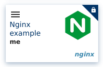

Then click on server and start it on a small machine profile:
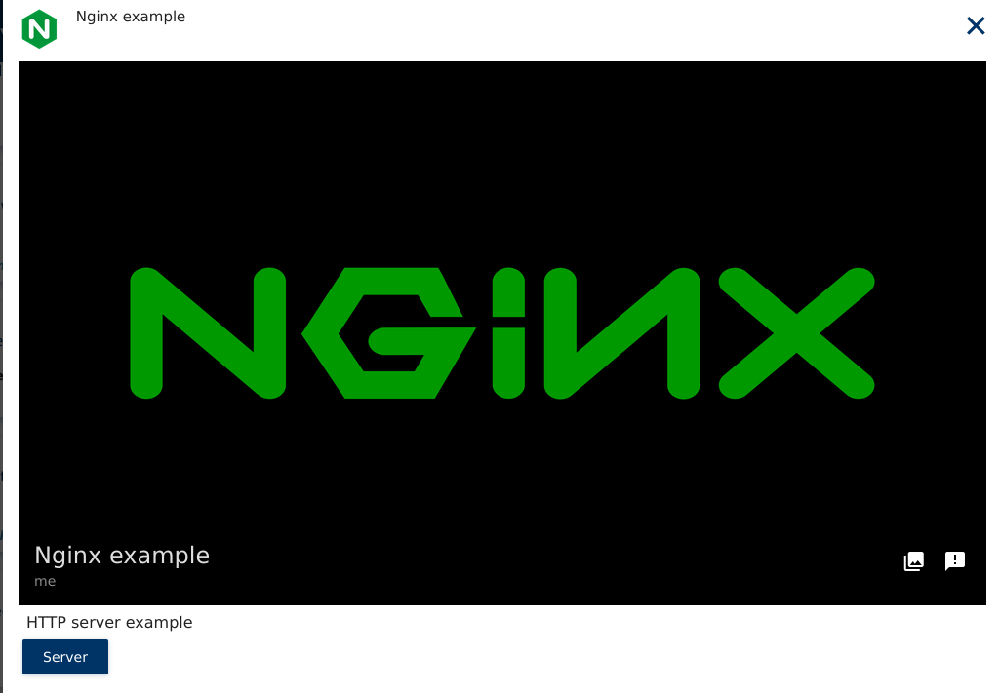

Once app has started, you can simply click on the tile to reach the app url:
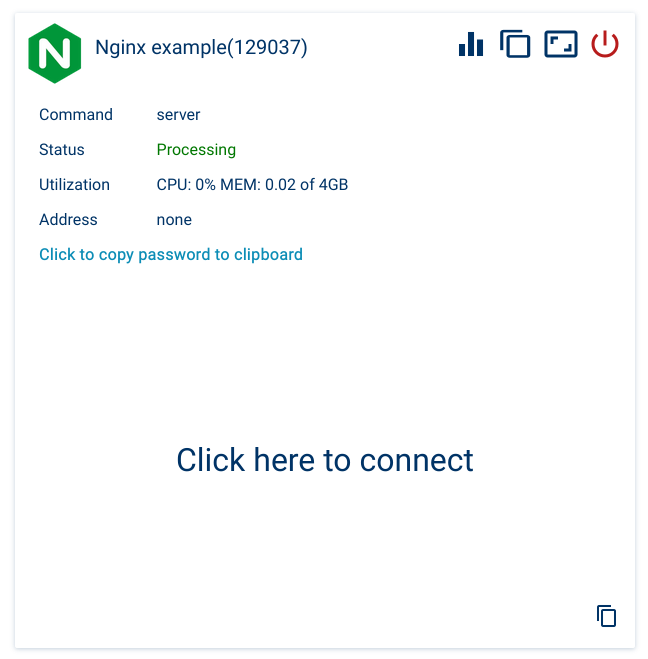

This should open the index.html small page of our image:
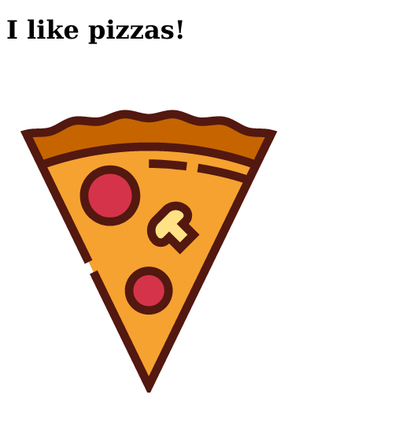

### 11.1.2. Expose using public ip

This method has the advantage of linking a public ip to the job. You can then use the ip to reach the nginx server, but also other kind of services (this can be mixed with an ssh server for example to manage the nginx website).

The main drawback of this method is the cost or the availability of a public ip feature. Public ip have a cost, and not all cloud providers or self hosted kubernetes clusters can provide this feature. Also, you do not benefit from main cluster SSL certificate, and so only http is possible here by default for our nginx server.

Procedure is similar to the one using ingress, with small changes.

First, create folder NAE and create file NAE/AppDef.json with the following content:

```json
{
    "name": "Nginx example",
    "description": "HTTP server example",
    "author": "me",
    "licensed": false,
    "appdefversion": 2,
    "classifications": [
        "Uncategorized"
    ],
    "machines": [
        "*"
    ],
    "vault-types": [
        "FILE",
        "BLOCK",
        "BLOCK_ARRAY",
        "OBJECT"
    ],
    "commands": {
        "server": {
            "path": "/docker-entrypoint.sh",
            "interactive": true,
            "publicip": true,
            "ports": [
                "8080/tcp"
            ],
            "name": "server",
            "description": "Nginx Server example",
            "parameters": {
        "cmd1": {
                    "name": "cmd1",
                    "description": "specify we want to launch nginx",
                    "type": "STR",
                    "value": "nginx",
                    "positional": true,
                    "variable": false,
                    "required": true
                },
        "cmd2": {
                    "name": "cmd2",
                    "description": "start parameter",
                    "type": "STR",
                    "value": "-g",
                    "positional": true,
                    "variable": false,
                    "required": true
                },
            "cmd3": {
                    "name": "cmd3",
                    "description": "no daemon",
                    "type": "STR",
                    "value": "daemon off;",
                    "positional": true,
                    "variable": false,
                    "required": true
                }
            }
        }
    },
    "image": {
    "data": "iVBORw0KGgoAAAANSUhEUgAAAIAAAACACAYAAADDPmHLAAABhGlDQ1BJQ0MgcHJvZmlsZQAAKJF9kT1Iw1AUhU9TpSIVBYuIOGSoTnZRkY5ahSJUCLVCqw4mL/2DJg1Jiouj4Fpw8Gex6uDirKuDqyAI/oA4OzgpukiJ9yWFFjE+uLyP89453HcfIDQqTLO6ZgFNt810MiFmc6ti6BUhDFANIS4zy5iTpBR819c9Any/i/Es/3t/rj41bzEgIBLPMsO0iTeIZzZtg/M+cYSVZJX4nHjCpAaJH7muePzGueiywDMjZiY9TxwhFosdrHQwK5ka8TRxVNV0yheyHquctzhrlRpr9clfGM7rK8tcpxpFEotYggQRCmooowIbMdp1Uiyk6Tzh4x9x/RK5FHKVwcixgCo0yK4f/A9+z9YqTE16SeEE0P3iOB9jQGgXaNYd5/vYcZonQPAZuNLb/moDiH+SXm9r0SOgfxu4uG5ryh5wuQMMPxmyKbtSkEooFID3M/qmHDB4C/SueXNrneP0AcjQrFI3wMEhMF6k7HWfd/d0zu3fO635/QCrR3K9MEgC2wAAAAZiS0dEAKYAlQCVfZnMmQAAAAlwSFlzAAAuIwAALiMBeKU/dgAAAAd0SU1FB+gHEAcYLRZxamkAAAAZdEVYdENvbW1lbnQAQ3JlYXRlZCB3aXRoIEdJTVBXgQ4XAAAM7klEQVR42u2deXgURRqH3+ocJBDOHCCYNRDAA0QQjM7osouAIKDuevCIwqKgOCOokSsoIEEQohBFFp2AF4o3Ch5oUBdUVnsElissWRECUQSXQwIkJCGTdO0fCbA8jwczmaun6/cnpKpr6nu76vuqvuoCJSUlJSUlJStKWPaX59mbAtFAOQ69QgFgHcPHY8jhwBSgMXAUwQSE+MCKIAgLGV7DkNcCs4DOgPZ//2sAG4BsNLESh24oACLH8AJDng9MA24Bon7jr2uApQimIcQOHLpUAJhZLltTJJOAsUCsFyUPAi8gyMHpPqoAMJ3h7fFIOQyYDrSqR03FCCYBy3C6PQqA8B/uo5CyB5L5QIYfa16H4H6c7rUKgPB969OR8nFgENAgAE84ASxGiBycerECIHzm+SQkjrp5vnkQnlgCzEUT83Do5QqA0A330RhySF083zHIT5fAVuAxNLEMh16tAAjuW29DMgW4NsS/QQL5CGbgdH+jAAi84VsimQ6MAGLCqGXHav0DZuF071cA+H+4b4ohRwFZQGIYt/RnBFkgluLUjykA/DPP3wzMANJNAqwEChGMRYjV4e4fhGeHLrQLamR3ILtuntdMOL0adf7BZIQoCNdl5fADwGVrVefgOfjtdXuz6CjwPJqYiUM/ogD4VcPbG4EcUbd235rI0w4gFyFexqlXKgDOfOt71y3fXkTk6ysE2TjdqxQALlsnJHOAPmEW1gVaHuAdhJiJUy+0HgC1Yd0k4D6gEdbVceDvaCIHh3408gHIs8diyLuACcB5WDkn8cywcReQgyZewaFXRR4ALpsGXI1kKtBT2fxXtQZ4CE24gxU2Bh4Al/18pHwEGKLe+LOeFt5BMA2n+3vzAuCyJyLlA0Amtdm3St6pFHgEwXM43cfNA0CePRYpr6vz7tsqO9Zbu+vS1j8MhH8g/Gh4DSkzkDwO/FEN9353FFcheBAhCv2Ztu4fI7ls7ZBkAUOBhspeAVM58CpCTMWpHwg9AC57I6QcQ206VoqyT9D0I7AAIRbg1I8HHwCXXQN5HZJpQDdlj5BpE4LpID7E6du04B0AeXaBlN2RzANsmHObNtJkAB8jeAghtnm7fhDtnSsi70DiIjBp16eUGhVP16bt0cRpvio9FXxdtosyI3zzK6IQXNggkfSENqcnbU85X5buokrWBOqxGjAISV+kvBN4IzAjQJ49AUNupjYzJyDqmZBGZpehXNG2B62aJNf6vicxlwbFh39k3Q+beHP7Cj44UhhWxr8gtjlP2cdzaWoXkhu1OPXvNdJg895tvLTpbZ7duzrQzdiOJrp4Ey56A0BzDFlEgHLvZ6YP5m7bUFIaJ/3u31Yb1ehF65m51sVnpTtDbvwRKTYe7T2eNs3O+c02L3K/xuiChYFsSgmaSMehl3gzfIRcw5MvZ2LvMWdlfIBoLZqeHWy8esNT3Nu6V0jb3jk2kayrRv+m8U+2eZTtdnI63BZWI1fIAWgX04Tsq8cSExXtddmUxok8NTCboYk9Qtb+zM630bFlu7MG97YeN3FBbHMFwEmNTBtAWotUn8vHRseQO2Aag1t0DXrbY7Rorun4J+8c3GbnMDJtoALg1AiQeF6960hJSGRW7yxaRwd3EbJXXCpJCS28Lpee1FYB4G+lJ53H8r5zggpBUkwT4mPifFh9EQqAQCgjrRtzu49Ru1BWBQDglq7X8UyXexAKA2sCEK1FcWfGrQxLuVxZ14oAAMTFNODJ/lMZlpyhLGxFAAASGzVnVu8s2sc0UVa2IgAA5zY/h7f6zaFDTFNlaSsCAHBp6sXkZmSiKafQmgAADOjch0XdxigIrApAlBbF8IzB3N3qj8riVgTgZHiY0/9h7mp5pbK6FQEAaBbfhMk97+PCMNqNUwAEWWlJf+Cta+dyYUwzZX0zA3DoeInPZS9ufSEzut+LOrtiYgByP3+W3T/v8bn8X7sOYEmPsZyReKgAMI9KKkqY/cV8yqt8u+VFExo3dx3I6Na9FQBm1XMHvmbmqqd9hiAuJo5Z/SYxpvXVCgCzanbxB6zY+inSx6G8SVwCD9hH0rVBsgLArBq5Ppf3Cz7xuXz75La8MSCXTg0SFQBmVJmsZvw3uezYv8vnOi5o1Z5Huo0iTkQpAMyooprjDMufyM6DxT7XcUvXQbx42ThLBYcRtRC0tmIfE1fnUHbCt4s8hBBc1/kaHkztrwAwq5YfLiD7s7mUnfDt2HxCg4ZM7zveMhtHEbkUnLtnJUu3rMCQ0mcIJlzl4Ir4NgoAs2rExvm8u3kFhvTtczodktuyZOATXNYgRQFgSknJPeuf4tv9vp8ebp/clmkZY4gWmgLAjCqpqWRo/sR6QTCgU2+W2iYTqXsGEb8dvKnyAE+seZZjlWU+Rwb9L7qah9JuUACYVS8d+oaHP8nxOTKIi2nAlN4PMK7NNQoAs8q173OWF+T77BQ2jI1nzJUj6dnoPAWAGWUgGbFhHm9seM/nOtISU1k88AlSo+IVAGZUtTTI3pjH1n3/qRcEC6+aTEMtWgFgRu2sKWNI/gS+21/km1MI9L+oFy9nTFQAmFXbqg4z5ysXRyqO+QiBYFDnPvRK76kAMKueP6AzIX8mlZ4TPkYGcdxx2WAFgKkh2P9PXt+wjBrDt694RmtRCgBzS3D3pgUs2/yRZXvA8h97NpCMXpfLpj1bFQBW1UHp4aZPxlOwt1ABYFXt9pQyV1/Ez/U4caQAMLmWHFpH1srH8NRUKwCsqhcO6Dynv0q1UaMAsKpG/3sRL69/WwFgZc0qWMza4o0KAKtqV3Upt342iW37tisArKri6jIeXfM0B8t+VgBYVW+XbOb+/Ok+7xkoAAKkGmkE7VlvHvoXC91LIjI8DDkAVdUer8scLj/CsqMFQW1n5rYXeXPDcr/UVV5RpgA4qTeK8r1+s4oOFnO4OvidOHazi6+K1tWrjrKqcl7a+YEC4KRWHdnORi82Yqpqqnhty/KQNP1QTSU3rZpULwjW7PyGz48VKQBOyiMNct0LOVD6+562IQ2Wb8nnmX2rQtbeAzWVDF71EO8VrPR65NrwQwGZ+hyMMDpkcvYZDYNS45E8APg9Jbawcj8//PgtF7RoR8vGv/yplvKqCt7d/BG3rZ/j86FPf6lMVvPWni/5ac93tEloSUrjpDOuuf2lYf/Twi8YtWYGOzxHA9m0SoSYz4o9lWdbwJubQ2Mx5FagY6Ba30aL4/70G+mWegkdU2rv4jtWUcq3//2Oxdvf5+MjhYTjt/1uaNaJXudeTqfk8+nQsu2pNh46eojvDu3ixe3LWX2sKBhvvhtN/DkwV8cCuGx3BuPy6CjEqbTramlQIc2zMZOgxSCoPUlYZniC+ej9CIbjdHv1sSTvfAAhFgOdgSVAwILiGiSlhodSw2Mq41Nn9FLDE0zjVwFLEFyJEJ96W9i38TTPLjDkNcAs4BKvfAkl/70nsAXBvQixDofu0/xSvwk1zx6HIW8HsoFzlU2Cpu+BGWjiNRx6ZX0q8o9H5bKnIOV0YBjQSNknYDoOzEOIuTj1I/6o0L8utct2EZK5QH/Up7j9KQm8jmAWTrdfM1f9b6SFdg1D/gXJZOBSZbt6ayMwBU18gkP3+w5Y4N5Sl60RkruBR4HGyo5eay8wA8GrON3HA/WQwA/TLlsqkinA7co/OLtIsm64z8bp/inQDwvOPF0bNtqAaUAfVCLKL8kA/oEQmQi+9TWsC08AToMQiyGvB3KAdspRPKVCBOMQYrU3y7jmA+A0CE0x5ChgqsX9gx+ABWhiPg49JDlnoX0DXbZ0JDOAW4BoCxneAyxCMBune28oGxIeQ7DLZkfyOHCVBQyvI3gYp1sPhwaFzxzsssch5XBgHNAhAo2/A5iKJpbh0D3h0qjwc8Ly7M0w5CRgFBAJV3yWALMR4nmcetgdPQ5fL9xlT0PKx4GbTRo2GsA7CJGFUy8O10aGb8c69WI0MQRBP+BrzPO1Zgl8jaAfmhgSzsYP7xHgTCcxFhhW5yiG89VeRQhmA0twuqvM0LXmWohx2ZKQZNX5B03CbJ5/AUEOTrepDhKacyXOZbsEyWxql5VjQhzWfYgQ43Hqu83YleZdis2zR2PIvtQuK18cgt+yCZiMJj7DoZv20KD51+Lz7A0xZCaQCQTj/teDCB5BiBfCKZ63LgCnw8ZzkXIKcAeBSVs/ATyJEM/i1H+MlG6LvN24Wv8gh9q0NH9pJYJJON1bIq27InM71mWLAW5E8jDQpR41FQBTEeTjdHsisasiez8+z56AIccB9wLeXAB4AJiJJl7CoZdFchdFfkJGnl0gaYmUM4G//U7Y6AFeQYgpCPYHKytHARA0EKQNyTygO2cug9elYzENIdZawfDWA+A0CPFIeT2SOUBTYDeC2QixNBBp1wqAcAYBGgLlOPQKlJSUlCyn/wEtQjHigmoyNAAAAABJRU5ErkJggg==",
        "type": "image/png"
    }
}
```

Note the `publicip` key set to `true`, and that we requested that port `8080` to be opened to world.

**Please take a time to read this important note**:

**START**

If `ports` key is not set in the AppDef file, then by default the following ports will be reachable:

* '80/tcp'
* '443/tcp'
* '5901/tcp'
* '5902/tcp'
* '8000/tcp'
* '8080/tcp'
* '8443/tcp'
* '8888/tcp'

Note also that '22/tcp' will be exposed on the public ip, but will redirect to port '2222/tcp' on the job's pod side. This is to reach the Jarvice embed ssh server, that listen by default on port 2222. Please see the next session to know how to use this embed ssh server to connect to a shell of your job (if needed).

**END**

Now create the final dockerfile:

```dockerfile
FROM nginxinc/nginx-unprivileged:latest
COPY index.html /usr/share/nginx/html/index.html
# Integrate AppDef file
COPY NAE/AppDef.json /etc/NAE/AppDef.json
COPY NAE/screenshot.png /etc/NAE/screenshot.png
```

Build and push this image to your registry. Then, in Jarvice P2C, pull this image as before, and launch it.

Click on the new app tile:


Then click on server and start it on a small machine profile:


Once app has started, you should see the ip provided as "Address" in the running app tile:
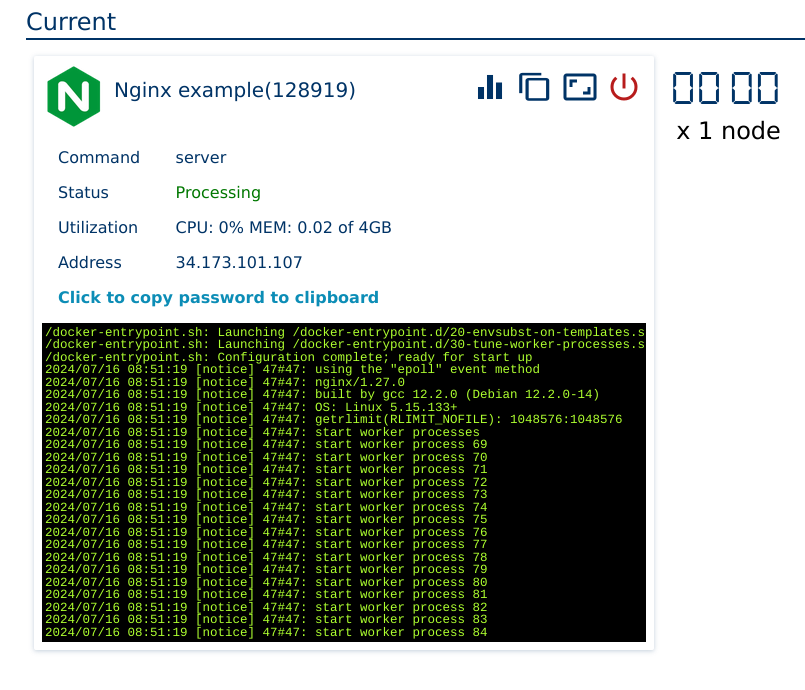

Copy this address, and in another tab of your browser, past it and add `:8080` at the end.
In this example, this would be: `http://34.173.101.107:8080`

This should open the index.html small page of our image:


The same process can be repetead with a much more sophisticated website to host it.

Small note: by default, Jarvice starts at init an ssh server inside the running pod of the job. You can combine this nginx part with the next part, related to ssh server, to be able to manage the nginx server during job execution if an interactive shell is needed.

### 11.2. Basic ssh server

A basic ssh server can be very useful, for many purposes:

* Use scp/sftp with tools like Filezilla/WinSCP or simple shell commands to upload complex or very large data to persistent vault.
* Interactively manipulate remote data in vault.
* Build an advanced application that would need more than what current webshell/desktop can offer.
* Etc.

There are 2 ways to use the Jarvice embed ssh server (that always start with every jobs):

1. Using an app STR field to pass the public key desired.
2. Using portal SSH keys section.

Lets see the 2 ways.

### 11.2.1. Using STR field

We will allow user to upload via an STR field a public key to be setup during startup to connect to server. Also, since the ssh server is already embed by Jarvice, we can use a very minimal image, like an Alpine, so our application will be ultra small.

Please understand also that while the Jarvice embed ssh server listens on port 2222, Jarvice automaticaly map port 22 of the public ip to port 2222 of the running container. This means we will only need to open port 2222 on the application side, and end user will just have to reach ssh 22 default port on his/her side.

First, create image. Dockerfile is very simple:

```dockerfile
FROM alpine:latest

COPY NAE/AppDef.json /etc/NAE/AppDef.json

RUN mkdir -p /etc/NAE && touch /etc/NAE/AppDef.json
```

Then, our NAE/AppDef.json file will be the following (the long text is a base64 encoded png icon for openssh logo):

```json
{
    "name": "SSH server",
    "description": "SSH server",
    "author": "",
    "licensed": true,
    "appdefversion": 2,
    "classifications": [
        "Middle Earth"
    ],
    "machines": [
        "*"
    ],
    "vault-types": [
        "FILE",
        "BLOCK",
        "BLOCK_ARRAY",
        "OBJECT"
    ],
    "commands": {
        "custom": {
            "path": "/start.sh",
            "interactive": true,
            "cmdscript": "#!/bin/sh\necho $pubkey >> $HOME/.ssh/authorized_keys\necho You can now login as $(whoami)...\necho Please kill this job once done using it.\nsleep infinity",
            "publicip": true,
            "ports": [
                "2222/tcp"
            ],
            "name": "Launch ssh server",
            "description": "Start a remote ssh server, to reach /data folder.",
            "verboseinit": true,
            "parameters": {
                 "pubkey": {
                    "name": "Public Key ssh key",
                    "description": "Add here your public ssh key to use to login on ssh server.",
                    "type": "STR",
                    "value": "",
                    "positional": true,
                    "variable": true,
                    "required": true
                }
            }
        }
    },
    "image": {
        "data": "iVBORw0KGgoAAAANSUhEUgAAAIAAAACACAYAAADDPmHLAAAABGdBTUEAALGPC/xhBQAAACBjSFJNAAB6JgAAgIQAAPoAAACA6AAAdTAAAOpgAAA6mAAAF3CculE8AAAABmJLR0QA/wD/AP+gvaeTAAAAB3RJTUUH5wcVDTAaOI6m/QAAc19JREFUeNrc/Xd0Zdd95wt+9j7pZuSMQgGVMysn5iCKFCWRClawZdktWXL7rdfTM296+nl6Zvq9br/1ennG7XbbbrudrWjlTJEixRyKZLFyzqgCCjneeOLe88c5F0AVi7JkS7Lcu9ZdAArAxTln//Yvfn/fn+B/oDU7OwsgAAmkgWXALuB2YIvWeg1QGB8fN/9/v/f7PPzwwzxw/70KcIFzwFeAbwFDQARYgJ28Xwh4yUcBNAFrgK3AeqAFUMAIcAh4M3kfF9CAbmpq+qd+RG9Z5j/1Bfy01uzsrFjypQW0EW/O3VrrHUqpriiKckIIo1ZzGR+f4MrVQVzPEynHMYAGoAdoB8rJs2kDWpP3KwHjwAzxhq4E7iYWrn4gRywA00A+eY85ICARmtnZ2V84IfhnIQA3be5bHmJy8uvLIN6MlcBerfXOMAyXh2GYDoLAFEKIWs1ldnaOwwff5KF3vEMsW9ZraK0LQoh+YFXyHq3AJuLNTRFv7BliTVEBtgD7tNabhRBNQghTxysvhPCAC8nPFom1ieYXUAh+IQVgiSpfusRN34e3CoNI7qkRWKW1XhtFUUcQBOkwDE3f96UQ4Ho10mmTwQunOXX8KD09PVJKkQK6gQ3E6ryPWAB6WNQAHcSCMQmsA/qEEA1KKXtubk5alqXz+Xwq+futQIZYmASxAMBNQvA29/p29/dTX/Jn+u7/+CWIH6C95GUuuW5x0wOs2/5eYKPWeiAMw0J98z3Po1ZzqdSqdHbmcWSRA6/8kPnSvEQIh1gA9gIPAHcAG5P36gYGtNY7gfuBdwA7gU4hhHP58hX5+7//++Lw4cP163WIN99Krqn+Ekuv+6ZrFyz6L+Km+/uZrV8oDbDkZpc+yBxQSD6PiG1rGagR21e15OfTxCdvNbBaa90ShqEVBEGy+TUAalUfy1A8cM8azl+5wJHDR7jvvvtMYsduHbHNTgNp13WNUqkkmpubTcMwzOR6XK11Kv5cGGfPnhVPPfVD9uzZgxACrbVkUXBTLAqsSq65ft1L98FKPorkPuu+QzQ7O6sBfhba4BdGAG46DQbxpncT2+QVxE5aAFwHLhN72BPEXrZB7Hh1EHvm24DlWuuMUsoIggDf9/E8jyiKUJGiWnHZsKULO2vz+ssvs3vXbpHLZe3k70ByEicmJsQLL7zAO9/5TtHe3u5orS2lVD6KIqGUMpRS4tSpk1SrZUzTrJ9ig1gDtCWbaBNvsAdMEZuQKrEQ1P9mG7HpMJLv1X+ulLyHnp2d/akLwS+MACxZgvj09QN7iFXyWuINDoFR4DRwOHmNEmuHtcRe/xZgm9a6U2ttR1EkwjAkCAI8zyMI4sPnuSANk3vvXcMf/+kJLl26xObNmwQaEwFaawxpMD4+zhNPPMGmTZtobW0VQRAYYRgaYRgihGZ2dpY33jiAEBopRf36HWLTsZ/4NDcSC0QFuAQcA64l99NGrLHWA13JnswTO5GHgLPAbPI+P3Uh+EUUgPrpXwvsI7a13cQnRWutO4UQHcmDs4ETxAJzB3FItopYE2SSE0pdAHzfx/d9qtUqVdelOFvj7v3r2LjhCi8+/wJ9/T2kjSyRVGgRYWqbyetXcUuTzM7M4Houvu+jovg9EYoLFy/SnPHYtnEZSkV19Z8l1kStyTPOsqgBhpL7OUfsGPYT+xoDxIIiic3bmuS+6uauRqwxND/F9YsmAHUnKEvsffcBrVrrTLVaNdLptJZSmlprSwhhAn7ykGxitb+WWDDSQggDQClFFEU3CoHnE0YBOgzJmAY7buvmb77wJpcu7WfV8gECHaENTVgpUZq/St+yDENDV9lUuQ1URBhGRFEECM6fP8fa1U1E2LhuFa21AGwhRCvQoLWWybVKINRaZ4QQNrGGEMl99hKbATv5v0BrbQghxogF/Bqxqfupr18IAbiF/c8CzSTOXxRF8sCBA6JQaJA7dmwXhmFkgV6tEUC7EEhgpda6VQiRmpycNK5duyb6+vqIoogoChcEoFarESmF7aQwhEYELpvXtNPTdo4Xn3uO5scaEaZAS4OLp08TRaOsWd3EmdMn2bXvDjIpmzAIiVREeb7G+Nhl9m/vZvDqNJ5bIYoUUgpDCCE0WEIIEQSBmJmZobm52bAsq4FYS3Um95xL7teanZ0VnufR3t4upZQNxCahjdikLI0Mfmrh4T95GHhTmCOJveZW4oxcXmttGoYpm5oaxec//xkOvHZAaq0tIC+E6hdC79Fa71JK9UZRlFVKWYODg+L3fu/3+N73voNbqxEECt+PfQDPcykWS7g1D6UUYeDSkBY8/MBKrl4+zIkT55ifLzM/W2J46AqtLSabN/ZzfWiIc+cuUiqVKRUrVMo1jh49zPz8FbZs7aehIUMUBtRqLn4QoiIlBRiRCuXzz70gvvud7wrP82SymY1At9a6S2vVKIR2xsbHjD//y7+Qr7/xhkzMiEXsN6RYjA7Ej/1gf8z1C6EBltyclWz+Gq11P1CIwshUCrFy1Uo6u1r54t/+AaYoi01b7jCy2XRaa+1EsU2WYRhKIQSWZTE6Ospn/+qvEdJmzfp1hF4N13Wp1VyKxSLVchklFKEOwY/YsbmLC1eKPPfMd9kf3Ec6k2Lo6mWWdVjkmxxq3hRvHnydpsYMhjCYLxV54eVn2L+riZ6uZpobMly6NsXk1CwNTVm0nSIIFE8/8zh/9Zd/wwc/+CHS6RRRFAmttamU0kophBBibnaWP/ivf8hrB99g7979SCkhtvVh8lL/wOf6z0YA6kKQBpYTF26Wh2GYC4LADEOFFAZ7997ODwaf46lv/yfOnHmI+x74NdnR0SJ9P/bugyBAa41pmvR0tuLNneGJJz/P2NQjbFjVh+e61Go1XLeGZQQ0pBWoCmGYwnQCHrm/l+Hhk3zt7z6LlU4xMXKV00c1+UKOSxeHGB3/ISnLpLe/l5MnThG5Y7zjzveQFwb9bQ08+8J5BgevsjbVx9zsHE8/+QxPfv8LzMxM0dbeQhQpfN+PQ1GlBEC1UuUrX/oij3/7m+zZdzfr164mth4ExNHAPLGvo5e8/scQgFvY/jxx/L5SKdUcRZHt+4HwvNjz7uleQaF9NSubjjJ77Rt8/rMlPvTRT9LU2ECtVlsI81zXo6mlmRVr20mbPl/42me4tn03G9ZvJAwjrl8fIvLLNKYVhq7gRSHUBE1Oil/5wDouXHiSC5fmef8Hd+FYETNTipb2NKMj85w5+kNeetGkXJzm//F/uYcNK1tRgUfX8mZCDnPkyGEi5fLMM88wfPlVPvToel57YxQdacrl8oIAaKVwPY8nv/89xodfZ/PGJlatWku+oUCyyS5x/WGaOHpY0AL/I4aBde+/njxp1lo7sVoPhO97+H6AEBCZHYxPRtyzu4m/+u4zfPGLNo+95zHS2Sy1WnUh4ZPJNTE+Wea3fnk918bP8OKh55gam6GhOcfx02fpzAbkU5rQc1GRT6gtlFL0dmT4xEd385VvnGT95jbecd9mvKqiWC0zNetx5NBV/uK/P8veHZ3cf+86pAqJkOQbsyzvbeT5V17k1ddfYWL4HP/6t25ny6ZeXnhlGM+LKJcrBL6LQuMFmtdefonL517hkYdW890nPbq62zFNSyeb7RLH/yXiHMDPZP2TO4E3CYFD7PlntNaGUkqEYYjve9RqFarVEn39azl6MUPF03zkkQZOvv4V/vhP/jvnL12kUilRLBYplUrks3kGr7rUqLFjSxuODhkfOUBH+gxdqVlW9aTpapeoyEV5LmFYJgyrhG6JHVtb6B9o4vvfPUZ5YoqsKNHdmMWMFEODgzx0/1r+zb9+lPamFDoKiYKAjCm5a3cvs+OnOfjqC9gioL29m5PnJxmZKVH1q8zNz1KcL3Hu7GU++7nP8vob3+MjH72Nju4CxZLBylUDWIZZt/0l4kznQiaw/px+mvWBXzQNUM+dm4knTBRFiVqPkzDNre0YTet46c03+Ze/3MO/+pUW/tsXn+OzfzXHPffdQ2trM0pFuL7HpXGP//zHFxF+hQf2Znjo7pW097Twh392is2rc+QyPkEQIJSNFpoojIh8zcjULMdOneXiFcX1K2M0r28lrIYEs7NsXNHFrh2r6eowUNUiWgsiAbg+61d0cvf+AVaubCXrpPmj//ptZko1ZsomszNzzM7MMjs9w5Pf/xaBP8wnP3k3d921mm9/8w0iI0uhuYVkowNiLMEEcfZQs2gqF8rK8I83B/9kAnCLSphFHA9nAUvGeVWxVAgqlQqGjmjrWcaZk4e4Nuiza30bv/0Jiz/6/CG+8oXLLF+5ke6eXs6cPoquubRkNR/9aD/rVjSSz2imSzW2rbfZuj6P70UEUYTEQ2CihSII4Nnnhjh0bJZ8g8Ebh6+yekUBFZZZuzrHhg1toCKiShGpIBICZYLvSgr5NPtvX8NXv3GUdz60kVot4qmnT3LuwjgvPvc889MzuLUJNq41+cB7H2P1qhZCN+L61TmyuRZyubxGaxBCEdt9n8W6QkRsGuqRQZQ8x39UTuAXQQPUY94m4rRotxAiLYQQUkqEiGUkDEM8z8OtuTRlclxWLVy6Nk9PR4pV/Tn+n/9yPd9/YYxnXnuRQ2+YFLIe/9PHVtLZAmbKwLA1pZpGKMW77+vCtCyCKEADERIZBZiWYGLK5ckXL7JmVTP37uni+devsHdHEwN9OaJqFSVslAZDWGip0VhoHSBNA9ePuDQ4zmtvDLJ3Zz+f+p/uZd8d6/jM37zC3331ADlrnl/96G7uvWs7jRkL5YV4kWR8vER/73oaG7JCaYUUhiDWhl3EmIRqsuE+sWaYIgaa+P9YIfi5C8BNJd/6NRSIc+HbiTN6WWLJj38wLrESBCHVmksunSKVbeXi9Qn27YSoJujqgE99sI27djXyxEuTjE34rOqDF9+Y48+/NMM77+3g0ft76GqCmm8TqQh0hJASTZQcOsELr88yOevyr359Ods2NfLSwct87+nL/MuPrUL6ilA4aKGItAJTYeocpg2GafH4U0N8+asnETJC1XzOHbvIt753nAsXZvnVX9rOY+/ewsbVnRgCQs/DtBxqNZeZYo2B3jyWaSAQdW3YRVzf2Mzi6a8S1xKOA6eIIWo+/4js4D+VBlgK4Khn/laT5PKFWMiJA3FlTmtNFIV4no/WIXa6gWsTUK5FZNOasCaxLcGmVQUG+vKMjFaRIiSVEbQ3d3DhXMjfTg3x4fd10dfpEQYSpWLBQoKBzeR8wLOvjrJ7Uyt3726lsaDZe1uaZ1++zEO351nV34DvVwEDgYEONaZRRsssb54o8sWvH2HXpmbKtRzVWonydIWsNPnlD2zjrn3LacylCEOJEhKJQgJezaNcDcAyUEqBRmq0LRAdxOYw0lrXcwMuMei0gdg3qDuIqn64flIh+LkJwC1sfj0t2kZc+aqjbzKeF8jJ6SlsywYlIUoctFARBBEV18UyUpQqJvOlGg35NFrYeCok8F3Slsma/gZKtQqBG7B1c4Z79rXw1HMjfPbLQ+zf1cyWNXnyOYkkwlCCQCjeODqLFC4ffHc/+awgcBUP7O/l8IlLPP70IJ/85XWYZohWEiFMLG0zV5vn2Weu8NRz11m5wuHXP7qWv/7cOeaLHuvXOKxfu4FUugGbCL/mEYkQw7QQWGjA80OCSGFKM65bBAoT09RS54QgBQLDiJWhUipcgjm8TFwkqjuJ8A9IEv1cBOAWCR+LRfTObcRl3J31Gn5xvij/7ktfZmxsjF23baO7r49IR0TKJYxKuIFLzasxOuMzM+8z0JsBoZDSQCmNH4EpfQwp8HxFpVRhXW8nfR9dyZsn57h4YZqxyRk2rWtkRV8DaWkQRB45J+ITH17F6v401UoNEKzsTfMvP76Mp58dZfDKOGtWtxAqHyUC5moVvveDYcZmPR65t4n9u1bQ1WmRzUZMzZYxwzJWyiGoKbQQSMMB6RBphTQstNAEYVyoUoHC9zxqQuAIR1hOygRhlMsVZmbniFRIR3ublUlnBHG2tJ/YdE4Qa4F/0PqZC8CSza/btjzxqe8kRvrsJQZwLAvDMBsDNzWtLe187Wtf4/kfPsHWrTtZsWIVlu1QrZYYvT7J2VMnKRaLzJQaQAuUVgghkVLEPoNSaK3ikNANCDxJygnZf1uBHWubmShWMdEYoYEWEikM9mxrxLQEURSilEZKie/6bBpopOejDqYBYRigdZyUU0bA9u0tdLRatDVkCCIPVVOsXOYwPjFDuVojK0KU8pCGhUIjtAYBofIxtcZJ2WitGR0dZWp6GtXYwsxsieFrQ0xNjonT505w8M2TrNu0iU9/6hOyvzdjsog5tJc8239QivhnKgA3OXwOMdp2HTFyZzVxvX9Aa90RhmHGdV3LdV3h1qrs2L6dxx59lMe//VnK48/yxvArzNeaqPggKnP09VRpzUaMjpeJokaEEUdQkthnQIPSAmEICg0WZhr8ACItsWyfnjYLrS0iFREJH5mo5EhJhAAp4+fpC4GhXJrTabQZonWAUAKtNDnLYt0AqNCi5ldQSOwwxYb+DAdeH+Hq8CSb1jWhIkmoHESkEGaEISRKe0SRwDIEWod85zvfZmL8Mt1tzXi1KsXiCPm8wdWhCSzZxnvf9W56OrvqWUKPWPX7/CNBIj8zAbiF2m9INv0+YpXfCxS01pkwDG3P84xarSaqlQrlSgW3VmPLpo2cPLKOdvMEu3fafOeH1zl+tso79zfw8D3LGR6rIYUmUmA7RnzyUQgtkMLACzRKCbrbc0jbQHkaIVTsfqkYexlvtAStEIuBByKBhUkEjmlhCEHF06AgkzLxiQgiRRRppASdnMGaX6OvO0dfZ4FTp0fZvCqLoSwC7YIRIkWEDA2kKVGBJOfYtDakGbp2knWrBO+8azeNDQ30rVjN2bMjTHzb4+Mf/hS7d21HSqG01lUhxChxNFDvOfgHr3+wANx0updmqm5eS7H6A8Rw7VVCiEYhhKWUMsIwlL7v47oulWqVcrlMqVQiiiKa23o4c/wwqwYkKlK8Y18jH3ykiYaUpKMlHTtI2iDUYOgIUwoQcegY+Jr2nMXqgQZU5Me6sg7bE8mh0cllJ1/r+n9rjVKKjGOCkJy8NMsbh2bxaoodW5u4bX0DGVvjhj4KkNoBFJFySTkeu3c2c31onPJ8SDqjYiFTGhVKtPTQGESGiWM5bFjVwareNlCK/lVd3H7nOoaGJ/j2d4/R3rmTnbv2IaXQoCMhRBEYJHYAy/y8NcDbNDLImz5y00VZxAifPuJET8H3fWdiYkJaliVs214o4lSrVUqlEvPz89RqNZpamhgppfj8d6r0dVv0dKU5P+jR25lioDtFS8FJNlwnf1CAFoRakc1EPPpwJ83NBr4boBGglwjBDXeyaEbrYWc65XBtvMJ3nx3jqRdmuThYJdCw4sVxPvxgB+++v4e2dhvP91FRhJAagYnvh6xb6dDf0wlmhTACRAqkQCDRkYfCgNBEGhbve/c2Nmxay9997WX+43/8Jv/6X72HkycGma+08GuPvp9MNo3WWgsh6rD4CeJCUfCP2fyfSABusfH1BgbJIq697pTECbbFlGWOGKjZq7VuAqxKpSK/853viMHBQVas6Ke5MYMfmWQzeZQOmZ+fo1Kp4dcCtGthZV0evqOVA4cqfPabFVb3ldi8pon9OxvZtC5De9bGMmw0AVGk8AIDx7HJZQ3CAFRkIqRayCzeKKcKrQ3AQOsQUwhSWZvzl6v8wd9c4fEXpylWTerl+ENnPC6PXOO1c0U++f4+dm0qoKXGCwKEMNEKTKnJZ+MKo9ISdAS6htQQaQutBVoIEAY9nc0sX9dNvs3gt//dF/l3//5L+IHg3oceo72zlUhFaG0KBIZAZIjRUh3EEPl6yljX9+knyQUYP84P3aL7xib2QgvEjl0PsX1fQ9yT10ecyWogTma0Adu11tu11st9388opYxcLseJEyf53ne/xezgK1Sm3uTy1QtcvHSZixcvcuXqEOcvDTI2NkwupfBDxdh0wOUJlyiUCCPi4PE5jpyc4+L1KuMzVSamAtAGmbRGCAij2BwIGVuptwpAvAQStMaQGsc2OHhilv/0J4P84JVZKl49/Q4kzqHras5f8Th5bp5C3mZFf5aUaaMCgRAhCkWM+ZDx3ggFRAgtEEImfzP2VSIgDDTdPZ20tTdx4MA5Ll2bwvcCvFpAV1cXzc1NQkopxOJhU8Q+wA3JIED89m//Nr/7u7/7YwnAj8SY3eLUm8nG1ze9I3l1JV83L7m4KnFjw0jy9Vat9dYwDHtc181Uq1Xh+z5jY2O88srLnDzyPbb2jNHZZjIx4zNbDKl6gmIpIKhphNBkMilWD2Q4e6nG9fEan/6V5VgpyblzRWbmPAIi8BWbVzVy9x2dpNISpfQNm35LAdAaLeKfi0LBE8+O8Zdfvc7h8zWkkDTkFVJqPI/4FRroheysTV+n4F13NvLhR3vZsroZz60RRDLZaI3WCsMAwzDxgwBDOphmDmmkMa0chlNAW1lkphEjXeBv/uZF/j+/81Vmix6NTY28612P8OlPf5qNG9ZjmkaotZ4XQpwDfgg8S5wUegtwpH53P0oj/LgmoB7DNxInITYTN2D0AW0amkAXBCK9KPKExKHKbHJhrUC7UsoJgkAEQUC5XAZgy5ateK7i2ee+yv5NVXZsSqOiEM+VaKWQAqyUwLQMpGExNql59fg810dr/MpjPezbXMD3bYJQx+VdoTAtksKaiCX4bU6+hjiJRATa4vkDc/zuX13hymjAQIfNw/vybLutCcuWTM/5DI/7HDw2y5tnAmqeBAKujWn++lsTnDjv8lsfW879+1qxBHh+EB9+aTI9U2N2rsyyzjTKClBBBTslUUYKI/SQ0sYUAaVilYnJWYIoFrC52Rm++c1vMDk5xW988lPcc/cdhu1YhcSR9pJbaCLuXJ4g7h+oa4S/1z94WwG4RQKnDmfem7zWaq1bYo2gbQ2mEEKK+hHTWusYF9+aOC91H8GI8/rRAkzbrVXpW76MSwN7ePK172HZNmsHLHxPoYRHyrIRQuE4JtfHahw8McnwZMiJi/PMVzvJmCBFSDYnEVgorQnDqC4Bb7v5dRHQCAwsJuYCvv7UEKOTARtXpfjUh/p5112tNOQtogiklCgVcOFKhT/83CBPvDxDpZbkCwLFgeMlpv/kLNXKAA/d24VMNIo0FINDZX74yii/8b5+Mi0mIoyY9+bxlaajXZC1M1QrNb7wlTf43BdfolINMWRsoX3X49lnn6JcrtHY1Ch279pmCiEatNZrksfdTOxnnUuEYG6JIPzIauEtfYCbVL+VvPkAcfx+F7BZa92ttMqHKkiFobaiUBsXL10xTp05I2dnpqRShshkMlJKUd94CzCUUqLeoOEmIM1KtUrNrWCkJdOzIWcvT9DTAm0NAUpYSASmJXDsFC3NeUzD4uJQCSEM7tvbQi5tEEbxVqokfFtQXeLt7X68/4IYeSB59o1Zvv30JA/e3s7//NEV3L0vTyYtUAFIIZFopPYp5NI0ZtNcGSkxPOEtnDONZGY+4vyVCqbU9C/LY6gqKvSZKgqefmmagYEshQaBCExGJoucuzxPd1eeVD7L9354id//02e4fLXCsq4WHrx3NVEY0dK+nKbWFoauDVMul9m8eZNoaChIIYSttc4KIRqTA9pInGLXxI5h3U7pt/ML/j4TsADUTE79vcAWpVRL4Ad2EAaGF3rCdyOOvPEazzzzFWwxgWNa+LJb7Nj7sHjwwQfJ53IL6lhKiWEY1Gv99Xjb9yOkhuUr1vDKyxN8/ZmrvO/+PL3NJqapsG0ThEkm4/D+h7qZq4W8eXyealUjmwWGlCBAqejH2/gbdIDEjRTFmTLve0crv/y+AdqbBCqIqBY1kzM1Lg3VODtYZGQ6YG7eozgfMDLpLWaAAIhQWnDuapX/8jdXGRqr8N77m2nNp0k5JtK0OXGhSEebSShNJmYqnDzrsmNrHxcOXuGP/vx1zl8u0phP86sfvY0PfnAPf/FXr3D4rGZgzSpOHjnM008/QW9vD7/28Y/Lrq4OJ+lAyhFHBhuIcwRvAK8T9xdO8SPCxbcIwE2q3yF28LYmp3+TUqrV8zynUqlIz/PwgoCLF87xyrOf5/4tU2xfn8V1A84PnuPAK4OooMy7H/soGcdEw4IA1IUAQCUmQXkRMvIg8jl40qfqzvDxd7SweqWNKQ0sw0FrTSEteGBvJ9VKBZSGJPlTV1r1960LwttufJL1USqEQPDw3ctIpwWplMl81efcpTIvvDbLK4enGRx1mZ2PCILYZNRF50ak1uJXY7Mhf/uNcY6dLnHPvgK3rS7QVFBcuVKjuD7AN+cYm6oxNe9y/tIEn//mRY6cnAYimppM5ko1/ssfPsnhQ0NcGq5w4cJZAq9GuVTiM3/710xOTPDxj39Mbtq0ybIs0wRSWuvmpHcyT+yLBcTOeAlQtzIFNzydm7J7JrHjto+YEOEOpdSA53mpSqViFItFarUaxWKRo68/ybr2I9y9zSQIQ4Q0MA2LoUnF9w/YbLn9t9i773YMKdFaL/zezMwMExMTTE9PMzk5wdTUNGfPneXw4ZewI5eKp9i6voFfe7SBtgYDJ5Uil3VoSFloYTIx79HZksVJBYBESonW6sc+/VqpeNuUIFSKyfka5y+VuDjoMjIe8PrxIueuurh+4k9JgSFNTNPCsixs20IgCIKQMAzwA5coDBPBih+hQNPWKLlrZ465cojQmk++r5mUjHjuqMuxCxGdbRl+8PIYs0WNQGKaAsPU+L6Ko5h6gmrJtTuOw46du/nIRz/K9m1baW1p1i0tLco0zUBrPSqEeBN4gjhKGGEJsHSpENzKBNRPv00c4m0ANmitO6Iocmq1mlEqxejbSqXC5YunyOnT7NygKFcDghAMUyGES0+b5J17bV47+zj9K1bS291DAm64YZPiTQPPDbh69QKbl0e8Z083YyXB4XPTXLnq0r2zk5RtkXJMDFtgGhEDubi0Gp96kaR6xY+dGtPEzaMSg8k5lz/620FeOFhmZj6i5ikiFEJLDGmSyqQoNDSRb2ykkM+TzWWxDJPADyiWipSKJUrz05RKRVzXTfyQEI1kYi7iey/NYUjo7TY5finEAQ6dqnFqMOTouQpzxfiKNBEKiSksGhqymJaNUorAD/C8Gr7vorXG8zwOvPoKly5dpLu7h57uLvEbv/FJ484770RK2URstpcTm3CDRZ6iG9bb+QB1pE4XseffpbXOBEFguK5LtVqhXC4zOzfP6PBF9q8u4lYtrlyfpbM1TzptI4SmXIbeNp+2octcOnmYttY2TMNI8mk6KdnqOhKGqekpZmcnuGdTjq6uiGWrcyzvbUMKg7StaEhZGCYoJCEWKlKYRoSQMQ2PFnU1/KNPf131L/382vUqrxyuENgdWOkSZW8GtMCUglTGIF/I09HZQ66xAduxsS0rToMaFqkwIggjPLeC7cYNKvF1aAwiIgSuF5+r6+MRj79YgiBicMxj3lWQOK3SlKQzGZoam2lubieXzSOkoFwqMTM7w8x0hO/XI7/42icnJtFaMzw8RGtrC9u2bROFQqGer8kRm/G3hf8vCMAtsn2FRIKWAY1KKSsGZfpUKxXK5QqjI2P4pcvkHcWBIyNILWnMO6goIp1ykCJCB5IVPZpnDz9Pd/8a+vtXEEVJy3bStq0izczMDMdOHMMRLs2NKZ56rciUO8Xa9kYaGjMcvzRP3qwipKal2WJlfwvSXmqF9d+78TcLgdYCIUzQgun5iIoHzV1ZZoLYs5cIJIKUk6OlrYswCKhVygidjfPf0kCgMQ0DQxoYho0hDXK5PGGkqFZKRFqjFzq6BOWy5uSF4kK5ur6ZhmFQKBRobe2gsbGVXKEB07bwajWy+TxBFAt6c3Mzo9eHCaPYrxMCHNvG9z2Ghoao1WqiUCjUU5AGN3IO3fKk37zq6r+FGLDRrbXOBkFgeJ4narUqlWqV+fkiQ4OnyVjjnD43zdFTRaZKmsHhOS5dm+Pi1RlKlRAvCGhv0RjhWZ5/+vvMz1fxfRff8/A8D9/3KVfKHD9+HNtK0duzjqmZkKqrefmA4qtPT/PywVFeem2W4xeKzM1ZOIaDIUO0liQ0AD/RqpseFSm00mhCWgoOrXnNpfODTE1Nx99H4ytF1/KV7LvrfoRl4tZqqChER3GeQUqJaRo4jkUqZaKlZuPOXezctw/TNG/SufFXkYJIg17yXSMRIjQEYYDr1QhCP4lsYr+mt7eXnp5epDQWdjSKQkZGrjM+Pp6wn9ywj3/vejsfoF696wIKSimzTrTkuTVc16NYrDA7cYVMocgz50pcGwwpvjrM8m6Tvg6H/s40lmWSzWYpSJO+jhJPv/kC0zPvJVewqdVi0qZKpcKVK1e4fn2U3/jUbzLQP8Dn//L/S0fTm9y2JsvknMeDd/fQ32XS0GjR1JAhbWpQgggBhEgpkFIkpVzBDV7AUmdQLz7yuD4AUaRRaNb3N/CbH+7m84+Pc/RsmBTZBUIoxkaGeOH5p3ErJXK5AmEYEkUK04y1jmma2LaDbadIp9KMDl0jCqMb8hF/34qiKK6G1moYpoNp25i2hWUahIHENE0mJyeYnZ6+wYRBLCBtbW3ccccd5PP5OmikTkZ1S9v/owQAYg3QBLRorVNRFMl6+jYIPfwwZGZ2EhUWuTTk8urREq6XpbFtJedHikzMlrGEx/pyFT/IEfgwsMymfySgOD+NNgtUKhUqlQozMzMcPXqUQqGBu+++kw0bN+Lh8dd/+DsMTV1gYtLlxPkim1Z3YEoD3w8gMDAtgZ0OUSp+AIYhMQyJroeFLJqGmw+DUgqR/IvlQuI4EQ/e1YHhWIz92RWujUvAB62ZGhuhODtNa2srUSpFEPjYKQelNaYhMUwD07IwnQzpdJ6p8XFK5TIqUrfAaglSjqS92STyFWOzAZGKI5LAD/E9F9+pEgYpVOSANHAcB63B932EiMPoKBIL0UZ37zI+/vFf46Mf+RDpdLqeBJonZjWtU8vUH8kNl3MrE1Cv9hWIK3mmUkokLc1ESqHRzMxOMjI+w5EzRTw/x4Yt29i/bxe7du/FybfjZB1yORvPDfGVoqUpzUCXwbXLp6iUa1QqZarVKlevXmVkZIQ7776b/oEBDMPgkQce5mOf+F8ptG5ivmbwzBsznL40T6XkUasEBErjBj6uq1ChBG3ELVpRHDbVP+olztLSUxM/BU3chBF/3w18PE+xsifFql4LUyjqaWIh4kRT4PsEnovve/hBQJiEkdIwsGwb27Yx7RSpdJaU4yDFUkGMycMKWZO7dhT4yMNNfPCdTXS3mgvXGAYhnuviuVUC3yOKwoWoybJM0uk0uVwWx3Ewjfj3TMti67YdPPyud9Ha2lqvwcwSF4iuJIJQDwH1rTb75rWUnNHSWkullFh4iEJgGhKv5nHlWomxKcXKNetYv2Et6YxNoamZ5pYulJYoYhuplSJtmzTlA65ePkq5WKVaq1Gr1ZicnKRWq9HV1UU6nQLASTl84APv43f+4//Brp17uD6uOHLOJQygUvEoVjyqboQXKGquTxgqtBaxyhWLaJ66Saivui4QSRZSJnUCKURyqiJStuC29Rma837yOzppSgnw/TiFHYZhrGmS7wkhMIxYTVuWiWVaGIaxGObW1aqp2b4xw13b86xohi0rTdb0pTGSn1Fa4SdsZr7vEfgB4RIhsG2bdDpDJpNZSHY1NTWxe89uWlvbYlRMfPongPPAVRZRQws///cJQF1SIkAl/LdL0rgmtmVhmhYVT5JtaGLdxjU0NGaxLBMhDAyjQKVq4ntxhk9rjVARbU2SyfGLDA0OLZA1NBQK5LJZnnjy+xw7dgKlNZoA25bcc8+d/PZv/9+5bdsOjp7yGZ6qEYQhnhvgeSE118fz488DL0IpiBbsrkapuh1OUhuCGIRB4ggKueAimIaJaZqkbMHaFVn6+1JIkYSXidkIAh8vYRoLAp8wjBY0i2EYmJaJZdtYtoVpmhjGAqEpKUuwdYPDvi0pGrM+lmHRkJFs35ihIWcsaIEoDPF8j5rr4vkeURgljqaJ4zik06m4TT6Ki0UbN2xk04ZN2JaFlFKLWABmiJM/MywBi9xqLbjQv/3bv83ik1qgW90AdEZRlPTqxxh2rTXXrl3jwoWLrFy1gj17dmMYZmxbtaJY8ohqw6zvl7Q0p0mn4odhOXDy9CzjszlyjQVK8yV8z6NUrnD4yGGGro+xcfNm2ttbQINhGqxcOcDadeu5MDjDyTNnacpH5BwByieIIrQ2kEKiowhpCIQUiQTHdh791tTwQhSg6hVThVYQhgoVKbJ5G1/B2fMuNT/+vtAaoeOEkzQMbMvGti0s204aN0Ts3UcRQeDjei5ezUUpjWlKNq/O8ti9DQx02OSygnzBIZuz6erMMV9SXB7yiRSQmK7YrFikUmksO2acDYKAyakJJsbH8AOfluY2Pvaxj7F71y6ymRQpx9FSygpwETiSaIBSogFuWRG8lRNYVyNzwKwQwjUMI2sYhrRtW6TTaQBWrlzJhg1r2bLlNtrb2pmbmyPwQ1ARlmNTKco4hSpiNalDScGWbFql+fxTB3ByaaRhMjlXZHxyHEKX44ee4A/+c5p/82/+HRvWr05Ops0dd9xBS0cXX/vSOp575av0tY2zcYVJT2sGGUm0DkilbCIXrNDAtCSmKVHJZusgBpQIGZukesbQMOSCENTDOUtCzlLs3pzn0IkiLx30iXTSlhtFBL6P78ZhbBCERFG0cNpTtkVgmURhgFep4YeQdmDb2hQP3Zmnv12QsiJyDRlMO4VhGbTl4FO/1E7gap49PE/VVQReSHFuLm6IrXgYUuL7HtValVK5TBTEiaaG5haaW1tJpQwcZ6G28nZJoFv2D95KA9RNQzbRAr3Jm5kJ5x2GYZDP52lsbGTlypWkUqmYhs0PCAKPkhsyPX6VTQPQ15PHsgRCGJiGIJWSvPDaIG8cHmJ4ZIKhwZO056e5baVg35Yc02MXOHzsOv0rVtHW1pagDiNaWxvZvmMnze3rOXOlxonz45QrJVJOFKeetbPodWuSFA5IGedC4mYOtQgO0XHpuO4Way0QGIQqNiVpU5LNSS5fqzJXjIgz8rFukYaJZaewUylsxwYgCAKK83Ncv3aNsZFhPK9CX6fkof153rG3wEC3STZrYacchkfh9RPTHL9QplxWrBloZ/3aNBculZkraVIpgef6uDWXammeankO3y9D6CG0QkrYvLaLzpYUQ0NXmZyap629m6amRqSUihiIM0rcPDrPkmrgzWXhmwXgZv+gIIToEkIUhBC2EEIahiGllDiOQ0dHB6lUKrGPQezB+h7z8zUmxi6zfoVgoLuAZYJpSZTQZDMOWcfi4sVhRkeu09/h8d77mtjQn6KnWbBqucXF84O8cOA0TraFZb2dOJaFjCzSjsmqtcvZvvNeGlvXc/zcHEdPXMN1PRqzilTKQkexFQsTPKohJIaQizDwRPULacSQraWgdg2BClHE2cG2FgfTNLl8rUK5Fh8krXTcTBKGBL5HqTjHxOgI1wYHGR66ytTUFI4RsnNLll96Zzt3bUnT3mKQSmXJ5XIcvVjlz78ywvFBRaZ1NaFs5tTZMU6ensHONPPhD99NZ3sTF6+Msa4/xT27Y9KJh9+xmQfu3sjO7X1EUci2Lf18/Jf3c+rECV589SDZfBMb12/AcRySDa+w2EBaJ9bmZiFYMAFNTU1Lq4FhIjkXgdNCiAbTNE0hRJOUUkgppWEYmGb8667rYllx0kJIAyJFtepz8YpPb7PFmpUtOBkbrX2E9LlnTwv93SanL81iokgZLieuRPS026xanuK992m++oOX+b3/4zrF0v/Go+99iFxGx5k3bdHb3cr73/duNm1ax+e/8Hle++GXGbw2y+5titV9BRpUgK0czMimFoZYjsI0JNKQqAQpFUUqLkkLEy1DhIoQBjiOjdIRWksyEt5xewsV1+WbP5hmfEagdIQfBATz88yX4r6MOCIAS0has7B3e4ZH39FJV6ONITwM2yKbsahWDZ56cQ67sYlPfexOHnlkD9mUzRPffY3DR8/wmx/ez+oVK/hP/+e36WyR/Nv/eTP37l+Dk8piOzlMK49Km/T1NfKZL7xCqeJSdZt47NEP8q6H30s2m61XcZsS/81PNr7+sc42unAabsij3qQF6hmlei7ZklKmDcOwDMMw6tCvKIrwfZ9arUatVqVarTIzU+T6tcs05Dx6u226u9OkUiYCgYpCEBEN6RQNDQJEwMRkhXPXAtpb83S1pcmkYKAzy/z8BM+8chwtc/SvXEYmlV5o5JBS0trayuYt2+jsWcflEZ9Dh0cZHJlBGh6NOYtUBrSI8AOBUhLTqDuAS/oDRHyrWoORaIX4v+NClS01/T152pototDDNAU6ikGiKVuTTwsaCwbLOjNsXZvi4bvaeGB/K71tAsuUmI6FbZkU8hmeemWUi9dT/C//5n185H07ac+EZG1FU0OafMoml7b49vdP8J3vvsk797XyK4/2U8hIotBDBSFeJcQwBMWyxze+ewad6uMDH/o1HnzwQXq62+PcgLiBOj+X7OUkMTCkPr/orRrgFlogII4n30ycwTFg1jCMTVLKbiCttZa2bWNZcdgjpYkQGqVDwkgghYljC1KmRKrE1iqLKFJUawHF+QC3qshmHe7ZmiabUwgZkknnSaUCPvBQmtcOjfH1v/kPjAxf5tc+/gn6+3ri+D0Jv9pbG3j0sfewZ99uXn39IM888yTfe+15jp6ZYtvGDJtWF2hrABH5eK6BZZkYFiAUkQKhdYInEfgBoCMcR2BZNo4VUakFNEvNe+7qYO/WAmPTNYaGXYrVCMcSFLIW2YyktaWBQg4aMhqhLYQRYtgWAk1TxuL0ZZ9DZ+A3/9U7eO87V2K6M8xNVzl2foYvf/sQr712BaRmeMKnu1XxgXetIWuEVEoumDbokIPHLnDiYoXpUkQoLHbt2cdtWzdjp0y8wEdIiZQxV6YQoiERhAoxVvBCotVvyE+/XSq4fvprxPFkKZGgOUALITKmadqmaQrDMEQd3aOJmzIxNJkMrFvRyKb17Ti2k3THhCgliEJNGPoI4YMKcKs+ZVdgWRpL5HHSAiksLCvi/r1tNDbM8fiTf8Gl85f4jU//Jvv27CDl2LEQaIEhBb3dXTz26CPccfvtHHztIE8/+S2+/dKLHDw2xu1bHdauyNPanCUMAlSUxO1m7ANoQ1OrBhw4NsOODU1kczbDE2XasikKeQfXDVChZll7mt52h53rLcIo7vKVSUyutUp6CyKkYSCEgbQEjqMJfckzr09y7wN72buzk8Ovn+fKxescOjzIsweGOHOlRBjAyn6Ljk6N8jVXr1bYvCqPQdwDgfRoawbfLXH50ix5y+PiyVc40t1Ke3s303MzzBXLGJisWjUg9+7dY9q2nSau6bQmGmGhMliPCN4iAEu0wFK+ujq4MEdC5iClbDEMw6xj+4QQcdOENsmYeZZ12OzcmKWz0aHmQiR9UJIoVLheQK0GVVcQakktgBeO+uzdZLOsN87nZ3MpUrbCMnz2bMmSb5B8/7kn+J1/f56HH/0VHn7Xw6xZtRzLNBc8ektIutpaeOSRB9m9ZwdHjh7l5Wef5nuvvcCTb4yzcfUc+28rMNBWQGrwIw9hGFjCZHjSZ2SsxF27Oxm8XuWFVyd411299DWnEscRwiBKWEUiLIOFyMCyDLQ2MCQYhh0/YVPRYDmYTsSXX54kCJtJO1X+z//wbQavTuF5LjPzPoPXPXxfg6lZ09PAp361i8efm+HPvj5Ic7PNHTtbMZVLEIWsXpllxYpNTM2HTM4EzBUFgX6Dqcvw5LNneOXoFZxUAx/88IfYsXOHsG27bg7etix8Sw1wkymoLydxLhpJWsDq2cFFhI9ECEWgfco1xeBQhWXdDrl0GqUEnqeoVl1qVY9ypcbUtEetBq4nKVUjan5I1ZvDDpqJVIjlGEiRwrFstqwxaG+yeP7ANb78V7/D88/8kF//F7/Bgw/eTT6XWyzsoDEMQWdHK+988H727d3L6TO/xME3D/HaS09y4stH2TBQZt/2Jvp60qQMwFMMjofkslmclGbwepHx+RAnF6dEpFG/t/h+VRQt/K1Ix3mAOO+/WPyxLRtpmvzwtRqf/c4YdirP0NgEnW05Pvq+HgaWNeJ6Gb7/w2G+9fR5QulwaShgZDDit35lHV/49kX+2xcucGW0xiN39tHaqvAiHxnZDHQY9HQVOD8c8vqbVzl2YpK5is/d99zPPXc/wO49u0mnUnVGsTomsN5KfsP6cWDh9YEH9Tl5e4hBImml1MIsnnK5TKlYolqpMDY1RXl+iGUtEa0tBoWcg+spSm5IrexRLlUoVTxqvsb3JbPTPmcvu7QWLJZ1mKTSGWxTYhoGpgmmFfsTadOkv9diWafFlcvn+M4TLzBbCVjeP0BjoZCkwqP4ylUC5kjb9C3rYev2jezYfQep3AoOHBnnh89fZmy8hG1L2lsdDh6dR1qKtQONHDhU4fpMhbv3tpE2LEJVRzSDFBphCKQhkAZxdJE0pwqhECIWQN+Dbz13jd//6xFGJmvcvbuV3/jYRn75vavZuWUNy5b3sHpNP9v3bSSVNiEIGZ+ucfT0FP3LsvzK+/owpcGTz13jjeMlMpkMXa0G2ZxFqQR/941L/N6fvcqBQzVkajXveu9H+fiv/Tr79+2hraVFCSFCrXUx6SB6jbg2sNBNXE8I3VIAbkoLpxI7clsiAOuJMehmFEWiVqstdvSWipRLNWZnZ1jWPMMHHuyhvTVDEEaUqz7VmkepWGNoTHHohM+FIZdIKEwHzg4qmgsmyzvNJKduYQgwDIGoI4nN2K62NmiW92SZmZ3lhRePcn1slubWFtpaWjBNA0SCDhKLMDFDGLQ0NbF23WpWr9mEr5o4dmKcY6fHmZytcPZ8he4emy2r8rz02hTDY1Xu3tNB1jEX6wsLG80CE8niaxH2nk47vH58jt/7y6tcGHHp6WzgUx/fxr37VuCks/hkQMdjAnLNedZsWEY2m+LKxWGyOY+52SI9nRnu29NOV7PJ6QtFXnpthOl5l0whx5MvDPK3X7mIzK7gHQ89yjsfehc7d26jvbUF0zQRQoRAWQgxBBwkhokPEXdo3RAFvEUAboKF15FBK4nn3+wBusMwdGq1moyiCNd1F/r558tFyqUyc9MjrOme4d4deYTUzJV9imWf8nyFs1fn+dazJZ56vcSJiwHXRl3cUDI1G9FUgLbGeKNtx0JKiTQMTBmDNwwjzsNLEdGQNVjZmyFnlzl44DBPv3iYuflqgqdrIq6WLtb868u2bXp6u9i+cwfb99xNvm0trx2b4eDxEUzt0tfhcOjUDNPTEfff3kbKVkRKL2wysFBJTLzupJq4WPxxHJtT5+aZnPB4572NpA2fI6eL+LWI3p5WsvkCUse9a1EQkcvZdC/r4sSJKwh3jk3rmzhztkgqa7FtYxM7NzZQyFmcOFvmW09e5Vs/HCI0u/ilX/oV7rhjL51drWSzKWzLxrIsJYRwiTuHDwHPEVPKLS0L31oAboKFW8nmbyRuCtlHDBDNTU1NGS+99CJRFOE4DqViiWKpSLk4T2W2xNjIFdb2VdmwIkWlEjFf8hmfnGN8yuP14x4vHqlhp1po7eigXDMYHHQplj26Okx6O2wMA5yUgWVKpIw/CqkxTI1lxKGcaRmkLYPu9jTLugRTI1d5+rnXeP2NI5hmmu5lvaRTcd2iXrGrp4EFkHIsOrva2bx5M3v23knfqrVcuR7w7CtDHDlbQhiSfVtzNGRSsW2/qba/wEag66c/ySskbWmNBZM7txd4x75utm3M4dfKPPHcMCdOjdHUaNDUaCB1mSj00V5ANm8zMlHhy187S2ODzb5trUxMTdHalKGx2WbVQJZt6wvYpmJoxGV8ysO0UrS0FcjnCzQ2tJBJpzBNUwshaokAHCZuEKm3kS/4eLf0AZaofkkMJ16ntb5PCHGH1nqd1ro5ipQ1MTEhPv+5z3Hm7Hn6+geIgoD5+XmKlTKXzl9h+Oph7tqRpb+rQKnsMj1XZGqyzHRJ88rxKqWgkdtu20jfsmU0NTYQKiiWajTnNAM9aWwZ4WQkeTuF5RjYlsQwY7trJBU/o47EMUxyacGyLoeGvGL8+iBPPf0qg8OTtHZ00NLSHId7yeYvaAUdC4JpGjQ3NbBlyyb27L2Tls61RLKRYsnn5OlhJmdqSMMkl5ZkbYgPuYgJHhZ6wiRx+6Nc+BuZtE0+b6IUZNIW61fkWdZlc/jUJN996hLlcpWuViikanhuidOnB3n86dO8emKCc5drNOcD7trVSXtzFkSMd8hlTDaszrB1QzPzcxWef+UEpy9cZHJyClPatLU2k8lktBCiPmvgMnCSuHP4Laf/BgG4yfGr05TeLoS4X2u9IYqiFs/zbN91ZXG2yA+ffZHnn38GRURjcxvVWo2zF87z0ssv0ZGb4X3v7CCbgqnZCtNzVcpVweik4tBZj+5l61i9agWO7WBZFplMhkrVxS3P0t8V+wBT04qulgLZHFiWkXjiIIjLv1JKLNPANIyEHUzT1gB93YJ0yuXwwSM89dxrlMoeTU1tZHM5LMtkASe0yBcTS7wQNBRybNiwmrvv2sftt9+Psvo4eLbGs68Pc/7CBOWSjzRMnJQmZQiETnIfSNAx8CVecYN0GCmUjnGHGmgqaFavzFEsBvzg2UHePDnJzMwsP3jhHH/wmZMcPjzGqr4MkfaZLytsEVIoWDQ3ZjF0RBTFgJeuFpvbtmQIvQrjIx4j44O8+OIBPDfgtttuw3GcOtv4IPGIvam3E4BbhYH1noBuYL3WekAp1eR5nl2r1aTv1XCDkFw+RUdzwPHXvsuVC+cxnDwnThzD9Ed4zweX0dPhUCkF1FyfSjWi4iomZzUqytHXt4ymphbcWnVBRTe3NDA7Nkoq7XB9KsDz4fYdPpaZTlq8YwFYYETUcW3ANgT5nIVhpsmnMzTkyrQ1V1i73OfN4+f4/J/+Dt/55rd58F0P80sfej/Lly9HLqR768jcRT9BCoOmhiYatzSxZv0AH/jgoxw9fJKnfvgUf/XDp0k9fY01fZL79zayZW0rjYUUiDCu5RMTWsZooIRvIFLoBKGtsWnIBrznngZW9zp889lJ/sMfj1NxFUEg2LLa5KMP2pw8Kzl80cdJGajAQyVEVDEAzcANNJ35HJ/+pdWUq+c4PtjM7nvuZefO7di2Xc/fLCWV/olAofWewLZECPJLx69Wq1X80MOyTQpZgzXLHF49dIgr4wGOFfHRhzq5d18bUge4Xpzyrbk+1ZpBoHI0NKdpa2khl82CVslUr4hsJsusNCm6MDxRZf2aFjLZBHsvY7UvhIip35TENH1UJECCKSCbtbEtjWHGcKmUVaE5L2ku+Lxw6ABf/MwFhoav8aEP/wrbt22kkMku2PC4MJB0FuhFn8ExHZYt66Knp4uNt23k+Zd38Morr3Lu2JsMfn2YnRtq7N/RwkCvRXPBxDAtlAaVFId0AueOs4UxhjCINNqEtWsyPCpbqbgB5wY9Opsddm9Kkcto+vtNjlxwOXnBY89tXQjCGP4uBEqAlBF+CO2tDls3FJj1l/Oe93yAvTu3YhhGHc9RTMyAt0QA3gIKvRUewCQO+7YCe5VSPUEQOK7rykqlQqlUplaqcO7iJa5eOcWe9Q737MvR02Ty8D0tfOyx5bQ3WMyXIubLAfNFj2LZZWI2xanLAYXW5WzauJ58No/S8QBGpTSeFzIyNs7EZJllnQ7vvbeLjsY0pm0ipUrYwDSIGAbu+zE4VRgx1EvK2D9wHCs2LYaF46ToaYe1AxZNWcXhNw/z1DOvMTExRz6fI9+QSyqYieKr4wMWPLrEREhBc2MDmzdu5I477mDP7XdhZLo5fNHl6Zevc+TEKEMjZUIVN5ZmUxInYReLlEBpiUiAq/EgS4NatUo+E9LbkWJlj2DP1ixdrSa+J2gqSLpaTQ4cLfPS4SmyOVizshlDRKhAJ+3sEZZtEHmKSyOa3fsfobOzQwshfGIswDHiOs4FbmIT+1F4gHo3SWsiANuVUu1BEJiu64pKpUKxWKI0X6RYKeFVR+huculsMnnormXctbuAA1RKgloQMDdfYnrGo+xLJks5rk2YrFy1kbVr12BZVlJJDAjDgJpf4+rwBDnT41881s+GFXEtXppisYonwLEsBkddXjwwTWOjRVODs0AEIY0Y+WNIgWFo/FAxM69pa7YY6JCs7gO3PMnTT73KD587xOjoNGWvSj7XSDaTXuDkvUEdJuZHJ00gmXSa7q5Odu7czt59d9LZs56RGZsDx+d57sAIh46OMz3tI7WmsWCSy4BjaqSIBSxcoKgHISGX0nS1CBwzdvQ8ZTA05lOqKcqu4PVjFa6NlhlYJlje1ohpagIdEoYWKdNkbKbK4fMBO3Y9REdHh0JQIWYLeZEYFjaaaATgraDQWwFC6hpgE7BZKdVSF4BqtUqpXKQ0X8QNBHNTkyxvDehsk6jII5WxqXqKkudRLFcozteYnQuYLUecuOgxWUyxd+9++vp6CQOFH3hJM4TL8LXr4A3z6V9q465dTVg2SMNBSpUgdsCQkrIHn/3aEFNzJe7a1Y1ji0Tlxic2CjVRJAkjzfHz87x6eI5tGzvIZyGdMlg30EBXh+DVNy7w4stvcOjNFzh5/CzlUpVUJksul8VaSO0m/sYN1jH+YBkGLU05Nq5fwx133M4dd95NY9tqLo/A82+M8+yBUU6cn2V0sornm+RSBtmMjWObGCh0JPAjI4akuwFBYCCloBJ6XBqsUSyFmCbMVyTFoInjp30mp4qs6G+ipdEibUtCIfnGk8OcH2nlwYceo7m5SWlNUQiOA68QRwF1MskfCxO4gJBKVIYSQuh6tktrjYoUXhggdUihqZdjFwdZuVyTzzYwOeMThT7Vqs/0tMts2adSVXg1wcSkz6ZNW9i0cT2GGdt1aSj80OPK1WEmRi/ykQdbePjeTiypEcKMOfx1vMEiYfR8/pXrjIzP8y8+sIKGvKRcDeP3kiBUXPcvV1zKlYCLg2UuXCuTSke0NzWSqUQUiy5rB2Bt3wxzZ0o0pSJmrjzJH//ec3x52W3cee+93L5vNwMD/bS3teHYdoIgk0tEoN6uHSet2lrbaGtrY8vmLbzv0fdy7NgxDrx+kDOnTvD1Fy/yzecn6W322Lo2y46NjSzrTdPYlMKyXCo1B8cCzwuplD0y6Swd+9LMliNePhyyY+8O3vOBjzE7XeLpJ7/Ctb+6zEN7snS2m7xxapYnXgl552Pvoq29Ba21SkLAcvK6FWnUjxSA+ubXiQU8KaUyTVObpili8GMdfBiRyeW5fCnDUy+PsrKzRC6foqlg4Pkhc0WfckURIThxuUKheQP33nM36UyaWq0GIsAL4NzZS1w4eZjH7jP54Hu6sKXE9VwM00KK5NoDgZmJODs4z4uvV3j0wU52bWghEj75tEUY+gSBAmKsQc31mZ8r4sgAFSiOnJqB0GZkMmRsVjBfEdRUP73LLbCK9LR7bN8QcebyS3zuT1/l7z7fxaq167nj7ge4+467WL2yn1wunZBRLoYiInEe0TGgxDQMlvf10LesmwceuJfp6TmujlznytWrHDlyiheOvsQ3Xz7Nmm7N7s05BpbZqMBgfNLHNME2LQIdce5KmeOX0qze9iE+/uv/gts2byZSmvvuv4v/8vu/y//6B18ik7GBRh567MO8+70PkU6nlpbw6wOnlw6b+rEEoC4EdS+yDIRSSl1n9jBNc+GVSqdobO2h6JcJjDKVapUwMPCjgCgyUViMz0ecvyq4/+EddHZ2Jn11Eb6nuXxhhOsXT3Dv1hQffdcy0mZEsezHVxyEC4yuUhkUi5qvfH+YQ2ddVvZL5uav0dSYYnmfTVdrBqlNwkjhe3G9HzRWSnB9Cr78RI3WjmW0dC2ncU0/XblWTGkQRBGzs2OMXXiDxvAS73tngTXnixw4epXjr13g0Ouv89T3n+KdDz3IfffdxaqVA2TT6QVLsPBkF2hnWWjiyKTTpJel6V7Wxa6dO3joHfdz7vS7eObJZ/nWN7/Ci4dO0t/jIA2L6fkaaQcKGRMVGoQ0sff+D/KJT/8ma1f2I5FYCFobCwglqYaNLOtez979O3nvow/T1tKMQNYdwDliIE/5HyoAdSmaAqaEEDXDMNKWZUnbtkUqlSKdTpNKpchkMrS3LWPo/AjjMyV621LUwhA/1LhuyNhMxIGj8zS3b2fzbRtRCvygRrlS5sjxExx782ke2B3xvgfbyad95mckkY4W2F7iNj+NH7i8cnCaQyeKSNvgyRfmUdYszSmDpoLJlvVpHrq7h5SlqXoar+YxPRfxxmnF+p3vZf9dtyNJUZqfY3Jmismpi5Tn56mUS1hmmrLXxoXDZxlY5vDI3W1sXe8wOgmnzlc5eu55/vj3D/Ctb27kzrvv4479u7htyxba29owDXlD95FeIgxxJBghdYQjTNoaGmjZt4NNG1dRC2b4r//lNIHK0tzZidWYwwsDTly6wtZtO/jUpz/NvffeQWdT4wKH4fj4OP/tj/+QJ5/6Pjv37+aD738/G9asob21A8uwtTR0CHoOLS4iuEjcHub/QwRAE4NAxogzSZuklHnHcYx0Om1kszG6tc6CoTog8HZx7MxrHDs3StryCcOAUlExPmvQ2L6Od777XTQ0F/B8n2o55NAbxzl+6Cnu3FzjPQ90YqclJddHhRoVQamqKFah5oaEKoRIoxU8dm+e1iYbrXRcI7Bt5qua0A2pVQLsgibEwAt9Dp/3EY372HvHA5w9eZzzZ48SRZAtNGGkLexUgUxLF6apSUWauZl+Dp68yl07mmnIW/R1R6wfyLDntgonz5d589TrfPEvD/GNr7SzectO3vvYe7nzjv10d3ZimgKIEMQNHDHLOKDrWIwYyigEOJkMpmVhmCYDa9fT27+SMIw7mtxqhTXrVnPPXbfT2doao1CE5vKVK/zRH/03vvC5zzM/P4+hFJ2NTRRyWSxbYlmWFpgBiCkE51hsCKkzib8tTdytfAASyRknxpJtFkI0mqZpplIpmc1mheu6CSGjwDDAspaTLTRw5swJzl84TbVapbGhhe17N7Fnzz66+7ogiiiVPN448BpXzj7Bo/tN9u5ox/MDRsZDSmWPy9fKDI26jE4HzMyHMV4gDDG0YP0yh4fuyZNPh2gFlqVxHOjtSJHP5DGNkLFhn+lKRMlTnLsioCnF4z/4NsrTNHesAgO82hw6KCHkPF7NYsaHQmsHG27bx/SlCYJQ09aSwUkFZLM2jQ0W/V0Ztq51uXitzPlro1w49jX+46EXWLt5L4+8673cf99d9C5rI2XZLOiDm9rSF7RE4kgrpRaYROpsplprrly5wtTUNF3tbQghGB2Z4L/+5//KFz7/t7i1CqYUHD18kNPn72HVurVYcUtYfaZQxGLm7wYE0NtxCL8dLDwiziJdII4p2w3DSDuOY2YyGaPeHhYTJZmkUmUaCw0s6+li7969aK3I53K0trXg2DZaK4aHxnj5wGucOf0ym/sjxmZT/OVXRhlPxr6UXYkbWETaxgugOFcDpSikBMt7LNo6LIJAMj0TN33ZDthmSIuKGJn0OH5ZMVlMM1cRzE9d5/xghbblQ6zfdBvl+RlGrh6nvTDN7nWSNX0ZWptspooBX/j2EIPjG1i9MUtjoySbiesLmZSBZSvStkU2FZHPpelqsbhtdYbrUy7nr3qcvPQUf/S7r/Kdb+5k/z13c88d+9m0YQOFQiHxDRN+4iWpZkNK8vkCaJicnKC3fyWGkYoZU8KQWq2WHC6YnZ3nL//mv/P6y1/irm3Q1lTAMgVjswGvvPgNVq3s5/aYfKtevW0jrt5eTQ7xWOILBIkQvEUTvJ0JqPsB9RFl7UDOtm07k8mk6lM9bdsm5aTIZPIEvh8TLsneuPs28ZCDIODYsWN873uPc+HiBQSKainDiYyg0NiFZTk4TYKc5ZDOpNBaMTR8jUqxSIRm1YoM+7ekyecFFdcll7LQ0iakghXZlP2IHx6sMultIdIRM3NFLHstVnqYFSsH8NwaLzzzBLdvtvj3n15Lf3cmZgS3NEQwNDTPt14TXLt8nF/ab5BvMAnD+NpNA8y0EatZ28JxHPKuT2NTjZ72KhsG0py5UuXIhWf5yz9+kS9/bjl333c/H/rQB9kd5+VZqDzVG2yTdLPSipmZKcrzszS3dBEELkEQdx0LFRGGEU8++X1efvpzPLQHBjpy5PImjQ0pZCrHS4eLfP0Lf0oYwN7b94mGfMYC3QpiW7L5GeJK4EUWu4Pe0h72o2Dh9T7z80C7EKJNCNHgOI6plLIAYVkWjmOTSqcWp2InbeT1l+vOcenSZXw/YPmyFeTzebq7u+np6SSTzSyowmq1GtPHlYqUKiXCEJAmESFaKFQErpKkUiZ5M6LmCY6P+1QDn4ujWcyUz9XLR/EjzT33PUypWKVYKbOsdznZTBrbCmltsrCMhPRZQy6Voru9heGrZ+ntCtmxZQ1oQaTizluRVMYNQ5NKRTgpk0woSKXBcSwy6QqFgqKv2+La9YBXj17gc395kcNHj/Db//bf8uB99+OkLdBh7AvounlQSBRBpcLli+eoViq4lTLluSkMGXMkXBm8wDe+9jcsa5ynqwEMJJEyCAOT5rzBB+9v5svfG+Yv/ub3GK98il965N0ynbLTWutuIcQO4npONhGGiywCe/9eDXCzFhgmziu3AE1SSjOVSuWllGYy7EE4zqIA1Ikk6uFeU1MjDz30EHfeeVdM2qA00pBoFVGpViiVSiilsCyLIAiYmZlFufP0NAsmiorRUc3cCkUhKwiVwAtcgsDm/GAT50bSjI5P0z2whraORmZmGpmddxkbG0UHc1w+MRbvtE5x7fo0g0M1UisaQKk4njc0nR02TYUa77unmzXLU6AVljTiLFikki7jhPlbK2xD0pBPk7IjsimLlG2Qc3x6mqC9WXLwVI2jZ9/kf/9//29c/cQgjz76CF1dHQtdVBAPmexodUhJn7G5SQpNrUxPT1KpVUinU0gp+f73n+Dgm8fp6zCZKAoM4ZBKheScIu2tAesGAraub2Bw4jrf+eyf0GpleeChew3HcbJKqV5i7maTOJyfI04KeTf7A29Jfv/u7/7u0sKQSiSoAtS01oYQIiWEcEzTNCyrTphoJ4LgYNeZMpJcgW3bNDQ00NzcTFNzgXwhh+1YbyVzFAbXR0cYvHCae7c5PHB7BmGFXL0ekTIlvR02SgekDJvj13yOXhFkCiaSACvXTqlUprm9l3XrN9KY9mhPj9OSKzE1cZVqrUgYKVI2ZFM+He1NcW6eKkoKTp2bZ+e6Zlb2Fai4ERoT2xCAT6QS6pnI4OjJUTxf0tKYwzYVwjSo1iKcjIFhQc426OqQtLeajFwf5ZlnX+HI0dNEWrKst4d0OkMUKY4cPcXwlQOs6IWZao61m3bjeTXm52bYt/92CoUGPvOZz5PNtdDeu55cy1oyDSsxUt3MBq2cH9GcuKC5MqKJIoOr10Z54cBBHCfFihUrhOM4lhAik5gBjxgRNMWSmsAtO4NuMgX1iMBNfvl4AjacEUJsF0KsEkK0SClztm07URQZURTJKIpkGIYiCIK4Yzghhg6CgCBwsC0fy7QxpIkQMnGUNNevjzN0+Sz3bTd55x1NzBdnWdGZ4ajlc/qKx6reLN0dJrVAMTYRMnxtEjOapbt7NWQzXLvwJjkEVipPRs7T2V3DMh22rdZMlQXHz7k8e7DI6l6b2zYpVCTwA4uWRou1y5v4zONXOXB8hvmaTyFtsm1VI/fe0Uw6ZeKFPhaCo+eKpHPQ1WmTtizeODnPlYtTPHhPD1knwhIuhq1JpRSdzZIT52scOvJ9Tp85yrHjR/joRz/C+rVraGpuQCmTUjnCMuLOZdOySKfTFIsl/vozn+Xq0DDveMcDLO/txkn8j3Q6vaBJDCOekVitVtk4M83Jkyf5xje+zvT0lPjVX/1Vo62trT6RdYAY3HM2cQhvGDL1tmTRNwmBR9xfdjQRhsvABiHEgBCiD2iTUuYty8porZ0oiswwDI0gCEQYhvJmYbAsayHs0VoxPj7BqaMH2bB8jo1r8zz12ihnzvvMlVJYdivlUpWzV8o0NKUwjIhCLqKpIYNOr8RqXoGMptnUX6avw2Bqdo5SxcCtQqlSoebHxaSZWRger3B9qp2xqXnKFY+B7jYytsFAv8GffbXMS29UUUIjRERHYQovWs6jD3RQqfo4lkEmHY+kLVcyDM5FPP7DEfbuasewNDrQWI4ko4y4zO0Jdm1wWNZp8+aZab76xT/njQOv8dFf/mWcdI6QHIMjU8iMg2HE3da+H/LsM09TqVTJZDOYEpqbm7ATTWtZFvVEXDabJZvNkslksG0bKSXnzp3jwIEDXLlyhba2tvpQ7gxxV5DBj9sY8jZCECROYS0RhouJZC0HlgkhuoFOIUS7EKLRMIysZVmpKIqsIAiMOsOI53kJ737cfDkyMsJzzz3HtWtXyDo233hRMVtuJpNrpL09T4fWXL54mWJtAi+AvGmwqjcF5Gke2MnZs+eYGjrFuj7JoTmNLzpp7liDkU1j5zxmJovMTIxTrJWpBtOcHZxl/YUswghZsczHFBZGpFDaJNARIh7fy/WZkCdfmWDnxgbMlCYMFem0RbE4zfi4wTMHJilkJbettqjWIkKt4/khpoUjI6yUJNTgmIKU7bFzncmlq0f4nd+5SO/AKkbG5pked+leGVcBLctC6YiZ6bnYCYsCRoaH2L9vL7lcFtOM+ZdNM+YothNmknqKPpPJsG/fPrZs2ZKw+iwUhtzkAP9EVLFvJwT1ThOfONM0kmiDVpKhUMCAEGKZEKJTCNFuGEaDaZrpIAisMAyllFJorRecxAsXLnDu3FlaWjowMr10dvawOpMmjGqEgcd8sUoqpdg8kCHjWPg+ZLMaRxY5fuhFRifm6G7rZbTkcvX6OI++/yE2bdtOoZCjt6OVUEVMz0wxPDjMD374FMevvEbH0TK7tjagtUTjMTVv4PmJ2yMipBYoJBeHXc4NzjOwLCbasM2Iaq3KS0emOHqpyLtvb0D7Lm5komREELhkTIdMOk3RLaIdg7FShWsjIQ/szdHTbvGt5yZ588AUgpi7yDQtTMPAspwY5+gIlrc5DLSblGbOMTYxzra+rViGxtJZDFPGfROJRqgX6IQQSmutc7lc3YGv79EEP4Ir6McaGbNECOqOYZ2AsEYcY44Cl4jbxjqIoWR9QogVwICUcplt262GYWRIGkpinyBg3bp1fOxjH6O1tZVUKpU0mRQplSQ1ZTE3NUJrvsjGdQ6hr5krengeRCrD7EyRrFWikM8zPB5iWBnGx8eZf+F5bMeiq6Od5tYWDNsEw+K9j36IA6+28a0Xvkcq7fLw/vVUAzh3pcbyHsXEtMnMnE7mAZnMzSmuDlfJphS1mo+KHJQ2+dYzo6xclqK9UTI1U8GUEtOEIFIcHgmxbElzVmJHDrVKGduOSSUb05JtG/NMzc7jehppWDh2KhYEw8Y0TBoKDnftKHDXdovxYsTFY99nzYo1rFy9Mh5uIUk4EY2ElcxSlmUp0zT9pB+gPkWsSJwQOkYcyS20hv/EAnALTQCLaccgEYQisX8wTOxwNJJMExNCbEtey7TWhSiKrFQqJaIo4rbbbmPNmjUUi0Xm5ubQWsdUsn6GcrlGrTrG/VtzNGYVc56iqdHBdQVCNrL3zl1MDB3l7JmzTJcM+gZWMjc7xdzlOZSKuJDPUWhqJFvIE4Uh6UyWzp5e7IZ+Xj40yAN3T3FxEC4PzfPgnQXOnPN5/qBHEAIovFAwNFqhuTEeRGFYikgqKp5m3Yo05YoLQhNEijCCVDrF5WvzHD/ps3VLit2bTUxDkk+bZDKCjKlY3WNxss3myrCHlDFzSKQEtp0ilcqgtMfpYYepoqCj0+XqtaN8+xtf4hO/9Zv0L1+OxAQEUkplGEYkpfSklFUp5aQQYjjZg1Jy6geJE3nDLGIDbxCCn2hw5JIMkl4CI18KIIlYDBtniFORVxMN4QKhaZorbdsuRFFk1tOf9QaTuoPj+i7VcsDV4Uv0dLncs68Rv+qhlc/F4YDLg1XOXavS7LbTmO/DSbs0m1VMU8Z5hShiZHgYL/Rx0ila2loZWLmGrq42rl8doTQ7w/XZKv/md85hSklvr4GjTdoKEY5t4IcJiwhQDTRVT1KuBlTciLGpmO/g0jWXE+cMym7ATMmjXNOs7jV5x+4GTByOnHIpezUqPhSyBilHYZvQikV7k8OV635M/ZbKJqTVkkKhkb7eDWzftYdIBbjlGXrNeS5fHeMrX/o6H/uVX2X16pUkM5hqQoj5RMVfF0KcJk7bj7BIDzNP7LfVvf8fa17ATyIMC9K0JIO4FJbss8hP4wghTCFExrIsZ0nIuBAhuK4b5xGsNGNjF/Fqg3zgnY0M9DRw7Mwkzx8qcfBEiK9MDCfD3MXzWMKMa/BS0tzYiuu5NDQ00tDYyJnTp5ifnqI0PcnotUE8L2Dt6vWYAmyh0VHEyuU2vT0miAgjJbBtBdXY2nme5tSVkJHpMuNTNebLUCrH84KHxqqxt680WhloJSjPh9y2MmT3bRkyWcmrJ4pcHQ5ZO2CQcmSMWjYEDWm90F5mWCKeKWhAKpWmraWJnds20tzcTDabJZVKUS7HrKoNDXktpYyEEFXi0bH1Tb9CXLe5nmjiOhy8/vEnoon7RwnETZohSk7+BHFe2gGaDcNosm3bjqJI+r7PUpYRy7Iol6tMTxzng3c57L+tiRcPT/G5r89zfsyktW05Xd1d2CkLz3MZGhzi2tVrMV2bbbN8eT/192xqamZ+bhZNRK1a49CBl5kZG6Yh47FzXY72Vo1jmJSKmvlyxNCkT81bVGpRBGcu+UgRxt0DQiClhZAxhFxKjWPEjOVRpPH9gLFJxfIuj+XdJk66wEGnijBC0pamvckEbdDbZmPLCqZt4jhmzOlimJiWxcTkBK7rkk6nKRQKNDQ0sHz5cm2aplLxQKSq1npYCPEq8AKxuZ1mcVJYxFtV/U9MFv3TFIQ6ycRocrEDQojVhmE0GIZhLmUYqWcGL18+T2/jHO+9Y4BXT8/xJ18epxYtY/PWTlqa2nAchzD08W0bY3kflXKJ0dFRrl27iuu6rFm7FqUU1Wp14d4lUKsUOXfmOCt6M4xNw9mLHrWaxPWIgSShQiubGNGtUTLhE6w3g948jUQn+X2hkFKhooCy6xAoSVgzaCso3n1XPu46ykbYjkEmnaavR5PLzqItG0PYCWGVJOU4jI2NMz09zcaNG7Esq45UjpRSHrEqHxdCnAAOEPf+jRLb94Abc/36xxkh+zMbH39T5BARh4/jxD7BlBCizzCMlJTSqKeFDcNgfr7IxPUL3LvF4pU3p/jCC7MUWrexdfVyMk6aKIQwDFBhzOtn2zaZTCbeHBUxMT6K79ViZm/lJ5j/2MaaQmJIycQMTEwLIp1bKNYJy8CxQoRKaOeFQosInTSMaJ1svk54mERyyISOeaukJvQVU2WfWpBicLiEDg3W91msXA522saysmRSFiuWa7raLCbLDoa0YviQADudZXa+xNjoJJbl1AVAJc2e9Wd3hjghdyz5vypvjfF/rM3/mQrATasONC0RJ5HmkiRF/EyXMHlfvnyJmamrvHhcU5o36R3Yz/KVy3Fdl7m5Oebni5RKcTu667p4Xo2ZmZlYg0gTQ0o8t8bY2CimZdLS2oppmMhkIINcaPpIuHmjmPZNRRE6kqgwQumYaFokHEQ3AMSXsIotosQT6llMSiVFWFNkTItXz1Z441yJu3Y08OC+VhrTBpm0YKA3S19HijnXQAgbkGgF6WyWUGmOHT3O+973GC0tTRiGEQohZont/SvEp34weY4Vbkzt/tgb/3MRgJu0QJ3K3E1eN5QmhRAUi0UOHjzI5WtVdHoLO/bsZnlXgWtD13n9jTeYmJjA8+L8QYw9EAtZtKamJgzTXoiPYx4BA9NcZO0WYpE6fmnlUkqBVovM4UovxfgtnTggllzvLW5YRnhhhBKC1maDlCM4diJkfGyWYhE+/r5ldOUtpudc5ss+ppPCdMyFVrJ0Ok1bWytnzp3h0qWLrFjZr6WUmljFTxHnWs6xWNhZYMb+STf+5yIAN62lLORLp10vMGuUy2VqtRo79+5n3949NDbmKM65HDl6jAsXLqC1xpBmzFjuJFkwKRFJYkTI2JeI+YBFHYdB3RWpD6+8WfCklGgZE01pKRFaJdSx8seeQJZIAFMz8PyhKpNzAcVqlrXrBjAdixPXSnz/pSk+/aF+Lg3Pc3lU09zbgjRB+QntvBa0d3QxMTbKCy+/yJ133SFs25bEufxG4pZ9mTy7f/Tm/7wFABaziH4iBLpOhW4YBm1tbTz22GO0trZiGAa1Wg2lA5SKFnLeApm0WYGOVGKbFVpIpI7iBlIVj6GTC5PEbpwlGHMIx+3cWkoMbaBE0oEUtzwkP2uiF1rq3jp55C3bLwSzxZDXTrgMDKxg/x1baGgooJSmXHQ5c/0Sf/31Sc5fnqTiplnd3BZD2HV9LoEk19BMtrGRl195mXPnz7Nr5y6Z8Mn0AatZ7Pd/22mgP8mS/9g3+AnWUpBJCfAMw4hM09SGYSyo8e3bt9Pc3Bz/gl5UjTdIkYpBlUrHUz+U1gtDIPXCXKDFSOgtQyQT3LlYwnBm1DWHEAnPXzKSZeFtbr35dZNSd2K1VjQ1NXH77ftZs2Y1jY2NZDJpsoUM2eYVPP2m5oU358g3tJDN5xIS68X7cuwMrS0dDF8f4dChw4RRKFns1l5JXG/J/LT27uctAHXiglFgxjCMwLIsVQeRpFIpUqnU0gJHfJHJxNGbo1utVNx/nwhE/HW0MI8QxA0O5lIJuJHgKeEeqgvEDUKzOBnkx1mGYbBu3TrWrFlDQ0MDhUKBXC5HOm2TTVlk8s34pGls7Uaa1lvfVxs0N3cghcFzzz/LyPURkSB7CsRaYCUxXV9de4tbUPr92OtnLgBLMoZ1+z8LXBJCXJZSzlmWFaVSKV3ffMdx4pk4CfDhhslbglili5jnI/483njUoiDUS8313136kOO2No0fBnhBQJRkEYMgoFKp4NZq1DwX1/fj8O7HHEANsdA4jsOGDRvo7e2lubmZ5uZmGhsbyWfzZJwUQmvS6Qzt7a3YpoXWImEfi98jiELSuTytbZ0cevMQzz77DGEY1rl/u4jNQCexVvjxL+5t1s/bB4iIkxmXiIsUy03TzAN5pZQRJPNyYt5huaBeY9VaV+f19qvYwVM6Tq+iVdzAmXj4AH4Qoj0WHELHdnBSDkEQUGhoxDRNZmdn8T2XNWvWMLBigLbWNgzD4M033+TgwYMoFS4Zcatv6UTWl9aaTCZDW1sbzc3NVKtVXNdFCJF0QceT0vL5Rgq5QjwdRIQILRPnIxZsIQSdXb2MDl/liSee4IEHHhC9vb0mMVNrJ3H3tsUtCB9+0QWgHtKMAkeFEP1CiA7LshyllOP7vqynhBdDN0E6nV4AkdwwjEnrhSFRdXSRTEgYnFSKjrZ2WtraaGpspKOjg7m5OV5//XX27t/PI+96F4VCgQsXLvClL36RjRs38slPfpITJ05Qq9XYvn07QsDLL72EZS1o27/XFxRCkMvlaGhoWKjZR1G0MCOxtbWVUM0uDLq+xTsgtKS5qZWGhibOnz/PhQsXRG9vb528I0V8+g3+uWiAm0rJEbEfcJlYC6wBGs14ybr9Xzpevp4SrcPOlz5sQZ0fQGMIQMRgk/Ub1vPJ3/xNspks+Vwu5jGcL4KUPPDAA5w8dYqRoWHuvPsu3vXuR/j+977Hzl27ePXVVxkdHeXTn/40A/0DvPTCC3FuIJk1+PfFAvWOqWw2u+BTBEFAuVwmlUrR2dnJlatDjI1epa2rjzjS0IuypWOSC9eLx9LYdibxQRcZ0n+a6+etAeorJC4XXwFGhBCrpJRZ0zTfUhsQQiwgjOuqPd79+ENcSk3o37SOfQGtSWcy1Nwah998k51bt/Hkkz+gsbmZTRs3Uq1WePzxxxm5OkSlWuGxD7wfYZgUyxU+/uufoFqtUikXOXr0SEJNwwJLyELn6i2WEIIwDBeqmvH1xZO+0+k0juPE6OiGBi5dOEc6lyff2JIQTNWJ1hWmhJnZKYqlElt3bKV/xYq6I1Ovsv5I4qefZP3cooCbkhWK2BTMEGe1qkKIqB7rL/249POlo+cXnhiL6r/uEyAEly9e4iuf/yJnTp4E4nL1V778ZSbGx3FSqWTDoFarLVQia7Uarlvj8ccf5w//8A+5fPnywkbWf+Fmm3+zFx9FEcViEcOIJ37atr3w0U5Anct6ezAkTI6PIpIB0AvBqxC4Xo3J8WFyuSx33nUXHe3teskzW2jb/2kIwc8zDFy66rWBInFSoySECBOUC0tfUsoFW1p/6De/Uezx6wXvXwDXh4Z59YWXKM0XyeSytLS1Mj09zYkTJ2htaeXOO+9ky5bbuPvuuxdqCcuWLUMIyczMDKdPnU4mghkLoWFd2FQSbtbBLPUQtZ47qFarC4Me61FNKpUincngOA6dnR2sW7OauZkpSvOzC6ZOCIE2JNMzk0xPjLJj107uve9+bNuuJ9DqKJ8JbmT/+gevn6sJuAW20CWuY1eBsJ6Wrav/usNXxwss9cLfUqAREGmFUAJDGqgoIpXPsnHLZpYP9PPII+9meGiYkydP8d1vfYu777mHB+67j+mZGb7+9a/jui6HDx8mDEMmx8cwpCDQEPjxgKi68IVaLQilbadQUUTguTFTeUIY7fs+WuuFxph0Or0A5c5kMmSzWZYPLGdqZpapsRHyDY0xAaaEwK0wcm2QxsZGHnv0PfT1dMW3hq4IxDBxq94Ei5nAf1ZRwNJV1wK1RBCiOh9RXe2/nQao23y9NNNXp2pRca5AE2P0MpkMTzz+faYmp+PhTlrz1BNPcvToUfL5PJOTk8zOzCINyRe/+EUC38exTDLpNA0NBdKZLLl87EQaUnLbli10dHRSKBRobGji7Nmz/N0XPodXq9Z5ZBfGuNeFNgiCGza/UqlQKBRYMTDAyVNnqZZLpPNNaBUyfPUSxflZPvKRD7Fv314sw9BSiEAgZolP/yA39v7zz6kWcPOKWESxRktP/lJfIG5CdW6UHr3YU19Xw4aMB1MFYYDWMHZ9hD/7kz9NwseYyLGhoYGGxkZUpJiYmKChoYGNGzfS0tKC1prXXjuA73s89uhj7Nixnbn5eXKFPNNT00xOTnL7/v3Mzs7S2NDAhYuX2bB5E+lshmq1smBPXdddaJ/XWuM4zsLm119KaXp7exkbm2B2coJcUxNzU3MMXbnC6jVreNcjj9BQKGCaZp39e5JF9V+vpv7zMgE3rXpm0E+EIBJC6Jsdv7oGSKVSbxkBW59XGEVx8UcbYJnx8OZMNkNTczONTU3Mz88zOTFJS1srH/nwR1i1ZjW24/Dqq6+STqd57LHHmJ+fx/d9+vuX85nPfoZIK9o7O3nyB0/SWGikp6eH2ekpHv/+45w/f56777mHr331axTyBWquuzCyHqBarS7kLJLeSVKp1MLm53K5+PvSoH/5cs6cv0AYhUxPTWIYknvvvYfe3l4sy9KGaUZCiDIxwHaERdo34B93+n9RBKBKDGzwhRB6aQhY/7xuS2/45eTkd3X3sGXzdlrbGjl/7hyjo2O8+9H3MrByJbbl0NvTw5EjR/jC5z/P+9//fnbs2cWRY8fYu3sPfX19vPnmm4yPj/HCC8/j+z4P3H8/hoZnfvAUu7ZtZ8+uHdSqHt/85re4fOUCWmmammNq9nJxjiMH34h5BZcIZ61WIwzDG4Y+L0U9xxogFpC+/l6ujlynPD1FuTjP7j272L9vN9l0CtuytSFlHQtwhRj0WeXvoX775yAAdeclZHG6pUfCSyilFDdHAo7jLFboiO3swIoVfOLTv0lDQyO9vd2cOXGKz/zt39Lf38+atWt58vtPxpCxbJaNmzaxbsMG/uov/4oXnn+OO+68i3w+z6lTp7h27Rr79u0jUhFHjxxlcnKShoYGlFJ0tHdx8eIluru7uXz5EsND12hoaCSfz7Fx40ZGhobxXBe5JF1db5Wvh6xLe/ry+fxCsshKGkL7lvVy8I03KTQUeN/7HmPFihWkUiltWVYohJjXcEHEZeAhYp/pp5YR+kXwAVwWNYC62Qmsv+omQCUEzFpr9uzew+b1G/hvf/JHNDW1knYcJiYmePLJJ1m5eg2379/P0PAwf/EXf87K1avRQnDl8mVUqHj99dewrLgKWW9YtbAIowjbtsnn89i2zalT5xgbG+HXf/3X8f2Qmelp7r33HlYMrOCDH/gA168NcfDgQWxjcQR8HbEEi4CTejSQzWYJgmDh/4QQrF+7hueffYbt225j29atZOJwUUkpa8CQiPF/Z1hEAv2jvf9fFAGoJzdqdQG4eeOXCoBpmvi+v3Cyjh09yrat23n4Pe9BR5qhwSFS6SwT41MIBRPjk5TKFbZu38Hc/Cy1WoV3PvROvvfd77Jx02Yy2SyDg4O0trXh+yFPP/0U999/P7/2iU8wPDSMFoK+/j5SGYeDh97k6rWrCAEnT57k0qXLzM/NcW3wKpYRj67TxJlI3w8Io0UtvVQLZDIxK0rdNMT5h16WLeth69bNNDY2kEql6q1edTj9cWL1X+FHYPz/OQnA0mJ7He7sAiohpRR1bN9SAbixKihwXZdjR48yU5xjed9yPviBD3L50iUmJycRWnN18DI9vb38L/+3/yv//b//KV/90pf41Y9/nM2bNmHbDi+99BK2aXF18CpCCM6ePcfQ0DCpVIqRkRFOnzmD77pUy6XYSQx8tIZXXn4lVuOAZcZ1Cp3gXaQUVCtVisXiDUmremYwm83eIBAQa41du3axYcMGMplMXfXPEeP/3mSR5yf8aW/EL4IGWGAg4RaRQF0I6smg+tJaM7BqBR/52C9z+fxFmpqamJmZYmx0mLVr12JK2LR+HVMz03zja1/h9MmTnD9zlunJKfr7+5mZnmVkZAQpJX83NLSQ4Kmrb6VUnNCJIlQULhSD6htpWVaSd9CLNYIEVDpfnGdoaJgd27ctdQ5VsukCEPUIASCfz/Oxj32MtrY2bVlWZBhGLenzO0R8+uuZv59K6PeLIgBLHcGFHvYFhE59IteSUNC27RuygeMTk1wauko6k2Zw+BrPPPUUJ48fZ3pyktMnT1KulJkvlShXK0Rh7HVfuXyZoWvXsMzYK7csiyAMF8I4y7JiAYhigYiikCgy4rRvGJNWyoQMMub3g3pSqs4PWKvVmJycTBDHkuS+Aimltm3b1FobUkphxgyTmKap29ratGmaSkrpJ6f/EvG0r+vJ4ViwKT8t9f9PKQBLoeI+sQmokPAS3xwB1E/LUpVpmiaXLlzgP/67/9cC05jnefEmX7uKunJ5oXhjGAaGMDASp08YEsOU8ahboTGMuKegXlwyhIwHRIo616KIJ4EgQVhoohgvLHR9VEHCExyPpw8Cn2qlVDcB9Tb6aSGEZxhGIZVK5SzLsqMokskcAmWaZmgYhiuEmNVaXxZCHCI2AbP8lNK+vxACcBMVXT0dXCYuCAV1E3CzENSTKXUBkFISBgHzCdtmvWwMLPze0spdvZxbP5ULIBI0URTTtgkZc/glOjouz0qJ1nFHkVJxx7AQ8RQRtCC6oTglbsYU1nMdJeK2uCEhRKuUsk9K2WyaphP/qHCBeSHEOHBNCHGWxXFv9b7+n5rj908qADetugBUEiHwgVvWA+p+wM3ZwKX0a8ANTmL966UpY4wY96+0IlIKGUUYwli8mviXE2JHFgZGxqYoqTgmIL63wsMg1hYxKEUv1vBrxImcF4np2waAbiFEnljeisSbPZR8HE1eN2T9fhbrn1oA4MZcgJeEgtowDLE0JWyaJqlUamEzxS02IN6Et2L26j6aBnQUoREoEaGEJBLx4ApUhDRi8oU6olgh0PWh2FLHs4skieMnFhpHtYo9AC0EwhBEUUS5XF4aBUTEm3mF2KE7RtzokSa+tCpxqXcu+dwlqY8kv/8zOf3wTy8A9ROyNBmklzp/dS2wNG6+Ge17K0G4YS2BW2mlUUIh1CJRlVYROkEL121+DM5c7FheOiNYShl7ZFpjGqBkbJKEaWA7zkKkcNM91n2BKWIhqFOJC2JHOOBGtM/PTO0vXf/UAgCLoWCVxXTwDVXBm7OBN0DDfqIlFm2/XgR31AEeUppIyQ1l5oXWMa0xYoKehe8p4uZRCTiOQ1NzEx2dnTQ3N7N27VqSvr66H1Df4DpxRnxB8VrKsvJzXf//5q6gtW0YCn+SLNlynNgh8i5eStlpl0Lz/4+7bIWdtsNgsMsYpYWNde1K2sRSD9JzFTX0tC5+YJJgSILfs/T8vu997yABsIckSrWANWOsD6AQ2xcAUils7u+ffGfKFNq7KoSs3VoL7kIv4JAMPnYV0epjrfV07TAVtIennlFTqVISs9kM8/kcxhisViucnJzAGIOu65wQgoL7Bn4LILm25yL4xe/62MawAtCj4F+EXncaUUNkUOLs5XkOITOvqO0QhNa8xUBRagOdCy4MoXSA6wHfT4Jtz2GZgMUGbrsJI2oZetuD2S2Ys5BSoZqUKIoCdV2jqiosFgscHx+j6zo0TYO2bWGMQV3X0FoTjk9IXjrEYeca/E+nxzaWACDtgGvG2EYI4agCGOPpWmsoKbHzSBw5Ps787dAeFv1QQikHwiNjJpEF/l6pS+Qqh8r9b74yCxizQFVVKMtykG6hz0T0oNcg59pzzm9DNe8zgPfwVC4a4Agc0OmxjSEAaJn8A58Jr4kcSs7XWqMsSzRNg7qu8fPiEpTau4gMui85HLqKw3t6mijLEvP5HFVVDcFV1zVM22JaVZBSheKTrxjGAtjEUKJ2tvjQWvdKqTVj7BzAGYB38Fn/d0RSbWNwPjCOAKAV4Aqe9nTNGGullC4eUjWZTNC2LY6WR7i58rRrhOTMhj2ZAoFw9ul0CmMMmqYZHBg3oZLzY4EqcnI6IS0+R9sRNbUGbMAqpayU8o5zfgngE7zzz+CZPE+EmsdgYwmALfwFugTwm3O+ybIsl1IyUskmHH11eorXXbfTORTXBag4RM6hCWcxsphWGWMnpyhkHBwpSTWcc0Gts+ec3zHGfsFLtn2EX/7P8YxO36FtLAFATaM/4O+WN0IIrZRiWms2nU6HEm5RFFgul0MmTs4fevuT+kFaU4jv8PhI7/w0OKLvcyFHcUIIyznfcs7X4f9f4NH5H+CTv2v8IzGHl7CDBcCeHoFb+AD4BuBtlmWzoii4tZZbaxnhAbQS+Knju6SLeK9PO4xih+4Dm5IjhqQJm7CccxdYS33ALahT5yL896/wCN4X+D2fRBtHte/H9gClKbltzCfPVAAAACV0RVh0ZGF0ZTpjcmVhdGUAMjAyMy0wNy0yMVQxMzo0NzoyOCswMDowMAaE7fYAAAAldEVYdGRhdGU6bW9kaWZ5ADIwMTktMDQtMDVUMTg6NDE6MDArMDA6MDCuaV/gAAAAAElFTkSuQmCC",
        "type": "image/png"
    }
}
```

Now, just import application in PushToCompute as usual, and pull it. After few seconds, you should see the application with the openssh icon on it:

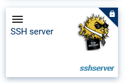

And when launching job, user can set his/her ssh public key to be used to authenticate.

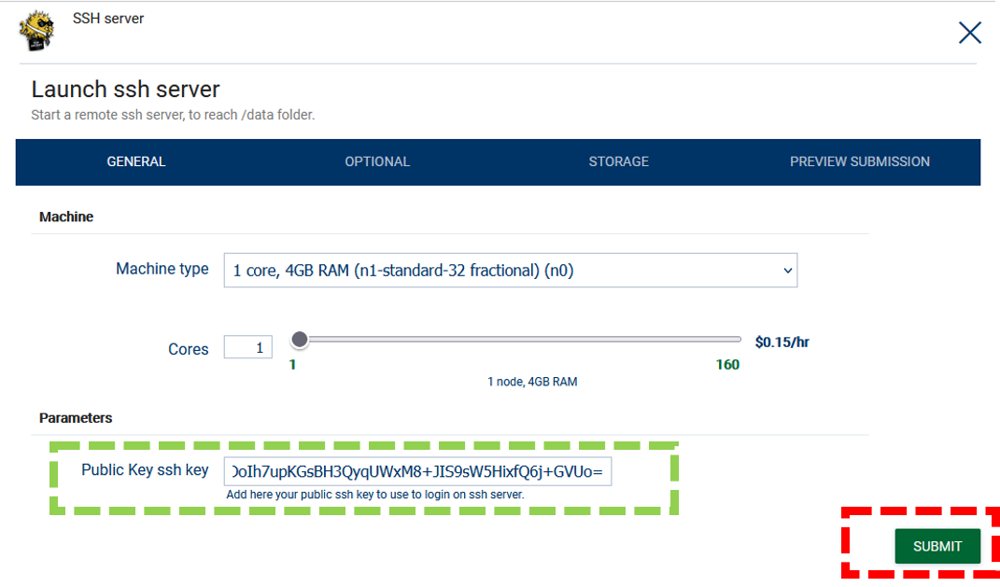

Once job is started, user can retrieve public ip to connect to, and remote user to be used (which can change depending of administrator settings):

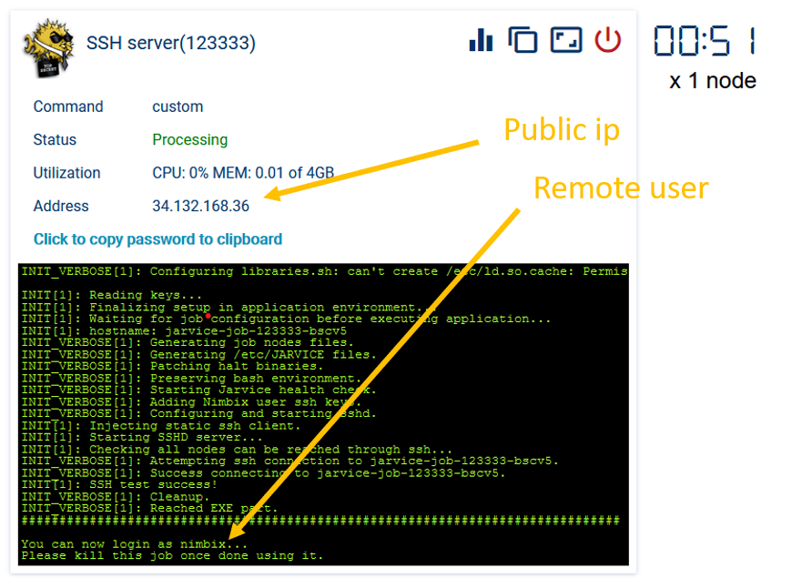

It is then possible to login via ssh as usual:

```
$> ssh nimbix@34.132.168.36
The authenticity of host '34.132.168.36 (34.132.168.36)' can't be established.
ED25519 key fingerprint is SHA256:P5DoI5PL4wHUFSe5b3kzhnOsJPdctf7Zf6Ny1UUBZhw.
Are you sure you want to continue connecting (yes/no/[fingerprint])? yes
Warning: Permanently added '34.132.168.36' (ED25519) to the list of known hosts.
Welcome to Alpine!

The Alpine Wiki contains a large amount of how-to guides and general
information about administrating Alpine systems.
See <https://wiki.alpinelinux.org/>.

You can setup the system with the command: setup-alpine

You may change this message by editing /etc/motd.

jarvice-job-123333-bscv5:/tmp/.ephemeral-home$
```

As expressed in the logs, user have to manually kill the job once done (this is a server app, not a computation app).

#### 11.2.2. Using portal SSH Keys

You can upload a public ssh key directly in the portal. Note that legacy portal only supports upload of RSA based keys, while new portal (Bird based) allows more formats.

We will use the legacy portal in this example.

Connect to Jarvice portal, and in Account (1), click on SSH Keys (2), then click Edit (3) and Add (4).

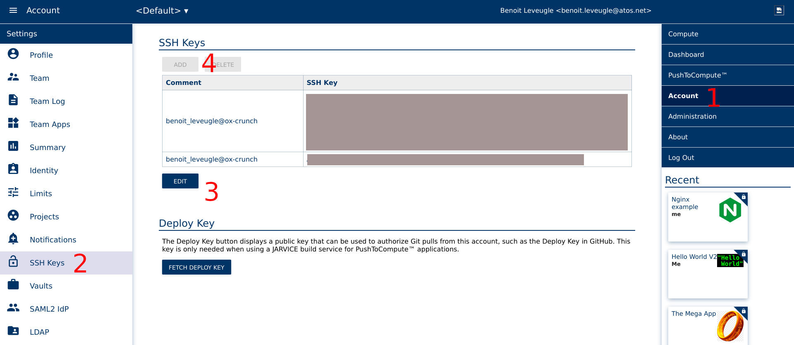

Add your ssh public key, and save it. Now, each time you launch a new job, this public key will be added automatically to the nimbix's user authorized_keys file.

There is no more need for the STR field parameter, we can directly call a `sleep infinity` command.

But we could do more! For the example, lets combine this ssh key usage with the nginx server example from above.
Edit the nginx AppDef.json file, and add 2222/tcp along to the 8080/tcp port in ports list:

```json
            "publicip": true,
            "ports": [
                "8080/tcp",
                "2222/tcp"
            ],
```

Upload the image, and start the nginx server.

Once app has started, you can now ssh into the pod running the nginx server (on port 22, remember that 2222 on the pod is mapped on 22 on the public ip), and modifiy things, like the nginx configuration.

Tip: use `nginx -s reload` to live reload the nginx server (and its new configuration) in the running pod without downtime or job termination ;)

#### 11.2.3. Quick and dirty using portal SSH Keys

There is a very quick and dirty way to achieve ssh access, and this is an interesting topic to understand how to easily do tests on Jarvice, without having to create any specific image.

Since the ssh server is running natively on Jarvice, we can simply use the default ubuntu:jammy image from docker hub, and inject our AppDef.json live in the portal.

Make sure your ssh public key is registered in the portal (see previous section).

Then create a new app in Push2Compute, call it "ssh", and as image use the raw ubuntu:jammy:

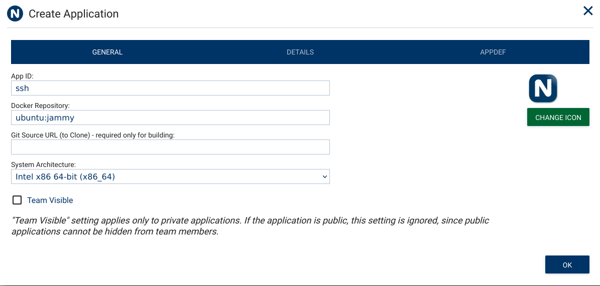

Then in the APPDEF tab, load the following file:

```json
{
    "name": "ssh",
    "description": "ssh",
    "author": "Benoit Leveugle",
    "licensed": false,
    "appdefversion": 2,
    "classifications": [
        "Uncategorized"
    ],
    "machines": [
        "*"
    ],
    "vault-types": [
        "FILE",
        "BLOCK",
        "BLOCK_ARRAY",
        "OBJECT"
    ],
    "commands": {
        "ssh": {
            "path": "/usr/bin/sleep",
            "interactive": true,
            "name": "Start ssh server",
            "description": "Start an ssh server.",
            "publicip": true,
            "ports": [
                "2222/tcp"
            ],
            "parameters": {
                "infinity": {
                    "name": "infinity",
                    "description": "infinity",
                    "type": "CONST",
                    "value": "infinity",
                    "positional": true,
                    "required": true
                }
	        }
        }
    },
    "image": {
        "type": "image/png",
        "data": ""
    }
}
```

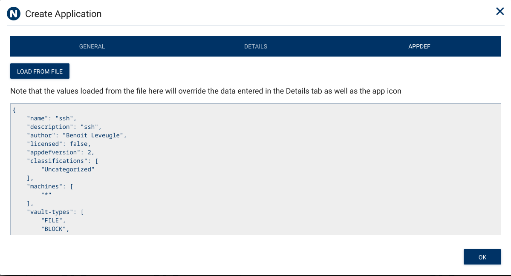

Then save, and launch this app. Be careful at launch to select the storage you want to be mounted during job (persistent, ephemeral, etc).

Once job is started, ipv4 will be displayed in the portal:

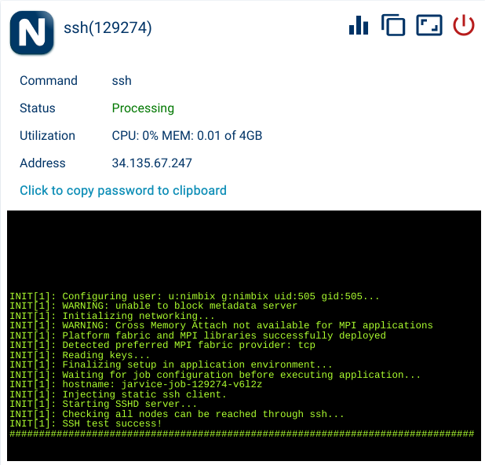

You can then ssh on this ip on port 22 as nimbix user:

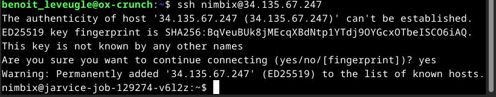

Remember that you are not root, so you can only do standard usage, but this is enough to access and manage data or execute a script.

### 11.3. Minecraft server

Minecraft is a very popular building, crafting and adventure game. It is now owned by Microsoft.
A Minecraft server is an interesting example, since it uses a non-standard port, and also since server administrator needs to be able to interact with the server, to configure it, allow new users, etc. It is also very simple to setup. This is the reason why it was chosen for this tutorial as an example.

The architecture schema is simple: server listen on port 25565/tcp and clients can connect to server to join the world (if allowed by server admin whitelist if any).


For this app, we need to combine the server with public ip seen before, with an interactive webshell, so administrator can join server shell anytime and interact with it.
We will also store server world (data) into `/data/minecraft_server` folder for world persistency.

Minecraft server needs a recent Java to run, we will rely on OpenJDK. Also, we will create a small script to start it. Last part is to download the most up to date server file each time application start. We will use a small script from https://gist.github.com/ntoonio/198c14f5915fc9aafe54eba0fc1f4163 to download it at launch.

First, create Dockerfile:

```dockerfile
FROM ubuntu:22.04

RUN apt update && apt install -y python3 python3-requests tmux openjdk-19-jre --no-install-recommends

COPY start.sh /start.sh
COPY get_server.py /get_server.py

COPY NAE/AppDef.json /etc/NAE/AppDef.json
COPY ./NAE/screenshot.png /etc/NAE/screenshot.png

RUN mkdir -p /etc/NAE && touch /etc/NAE/AppDef.json
```

Then create file start.sh with the following content:

```bash
#!/bin/sh
cd /data
mkdir -p minecraft_server
cd minecraft_server/
rm -f server.jar
echo 'eula=True' > eula.txt
python3 /get_server.py # --version 1.20.1
java -jar server.jar nogui
```

Now we need the script get_server.py that will grab latest version of server jar file. Create file get_server.py with the following content:

```python
VERSION_MANIFEST_URL = "https://launchermeta.mojang.com/mc/game/version_manifest.json"

import json
import requests
import argparse
import urllib.request

rManifest = requests.get(VERSION_MANIFEST_URL)
manifest = rManifest.json()

latestVersion = manifest["latest"]["release"]
latestSnapshotVersion = manifest["latest"]["snapshot"]

a = argparse.ArgumentParser()
a.add_argument("-v", "--version", help="Version, default to latest", default=latestVersion)
a.add_argument("-s", "--snapshot", help="Use the latest snapshot", const=latestSnapshotVersion, dest="version", action="store_const")

args = a.parse_args()
version = args.version

versionURL = None

for v in manifest["versions"]:
        if v["id"] == version:
                versionURL = v["url"]
                break

if versionURL == None:
        print("Can't find version " + version)
else:
        rVersionManifest = requests.get(versionURL)
        versionManifest = rVersionManifest.json()

        serverDownloadURL = versionManifest["downloads"]["server"]["url"]

        print("Downloading server version " + version + "...")

        urllib.request.urlretrieve(serverDownloadURL, "server.jar")

        print("Done!")
```

Now create NAE folder, and inside create the AppDef.json file. The Minecraft logo is embed as base64 encoded png:

```json
{
    "name": "Minecraft Server",
    "description": "Minecraft Server",
    "author": "",
    "licensed": true,
    "appdefversion": 2,
    "classifications": [
        "Middle Earth"
    ],
    "machines": [
        "*"
    ],
    "vault-types": [
        "FILE",
        "BLOCK",
        "BLOCK_ARRAY",
        "OBJECT"
    ],
    "commands": {
        "custom": {
            "path": "/start.sh",
            "interactive": true,
            "webshell": true,
            "publicip": true,
            "ports": [
                "25565/tcp",
                "5902/tcp"
            ],
            "name": "Minecraft Server",
            "description": "Start a Minecraft Server",
            "verboseinit": true,
            "parameters": {
                }
            }
        },
    "image": {
        "data": "iVBORw0KGgoAAAANSUhEUgAAAIAAAACACAYAAADDPmHLAAAABGdBTUEAALGPC/xhBQAAACBjSFJNAAB6JgAAgIQAAPoAAACA6AAAdTAAAOpgAAA6mAAAF3CculE8AAAABmJLR0QA/wD/AP+gvaeTAAAAB3RJTUUH5wcUBxwRI0b2aAAAVltJREFUeNrl/Xm8bdtV3wd+Z7ea3Z3mNq+VnlALprMxEGMcwHEhhRib2KIxRghcpqg4VU4l5cIu24mT+qRCHGyHikEYE4iNkGLkhIotY4yEMRYWBJtWxkjiqX3Se++2p9vNamdTf8y19l57n33uu6LxE6qpz9U7Z5+9115rjjHHHOM3fmNMwf+fjL/xQ1/NsZ7KX6s/dj3Psy8glX/E4v5wCGCQP5Z49fbM6n/1lcnvvv+R9k74D772u1/sW/63MsSLfQO/neNN3/c1XFdT+Sv62Wvndvl7am+/3AX3B5VSr06TZGqyFCklwXq8dYvg/fu0lz81EulPPPrII7988OrHz1bPn4X/+Iv/9ov9KL9t41NOAb7r+7+WmRrLD+m711eh+rwG+7oW92W1a17TWpv74BFCIKUk0QlKSXwIBAJGaA6SMceTg2I6m/2a1OonJeIn6mX5nvDexRlj6f+TP/2/vNiP+Fs6PiUU4Lvf/Cd4dPKE/NXy12+sfPV7mxCF7oR/lSfkgYBEooRESUkAnHe44AkEvPd478lJePToBgezA4wx1E3N+eJieffs/tPOuncnQr/zUI5+4UvGr753uzn33/yNb32xH/03PX7HKsDf/ntv4NGDJ+W/nr/v5sKWX1CH9rUN9ksd/lWekAXC+glFEBihSNMUqSXeedqqpWhKWm/x3hNCQCAwSnOQTxhlI+bFkmW1wgaHRJDqpJplk6fHWf5TCeonxiL5xU83L7t7Ut71b/yaH3yxp+Q3NH5HKcCb/rc3cnN2Qz59/pFHlnXxhZVvXlsH+yUW9yqPT0GghERLBQKs26xyAIlECkHbttS2wXsfX5cSqSSpTBilGSo1IAEXaOuWsqlQQpFnKTLRcQtBVDrID2rkP0/R7xiL9Bdek7387v3Vbf9Nr/87L/ZUPfT4pFeA73/nn2YynqjnL+49WtjqCyvbvHZVFl9S+uYVFpcKBInQ5CpFKonTAS/jZ5UXmKAIAZZNQe0afG8ZPEgEQggCgSCimvRbBYS1bxAEEEAhSbVBZZ2CEK1LrwyJUO9KhHnHWGY//2kHT909W933f+or/scXewofOD4pFeB/+OffhNJa1XXzuLfuC8u6fF3pm3/X4l7uCAkuID0YoUl1gtEapRQB8MFjg0MrxSgdkSRJXPVNy8Vizv3lGU4EtFYIJeMMuIB0Au8d82pF1dT0zqJSCmMMidAkSYIyOgp/z8yJIFCI2gT1gZkZvWt2ePhOoeTPCxHuEIL/j77ok08ZPmkU4G/92DczSnN9tzx73Inw+6SSrwuCPxBC+DTnnKlsTWlrMp1wOD4gTVOUVAQCTdPQNE0UVJIgpUSI+GjOOeqmpmwqirZaWwGBQAtFrlPGaU6WZEghqaqSk/Mzbl3cwwmP1jpeD4EWklQnJHmKD35tTYQQEMB7jwmK4/EBk9EYbUwt4IPeh3edX5z/xPnJ+S+8NLt5635YuP/qa//hiz3l8d5frC8OIfD/eMsf4KXTV+iL+uJJkckvanCva3FfHEJ4KhHaJEKDh6IuWVQrVm1JqhOuz445nh1iEoN1Dmstzrn1ao37vKW0UeiNb3Gh2+89jEzGJBuTJVn3fkkInrpuuFjOuT8/5byY4wkopdBKkyrDYTblcHJAlme0tqVsSlZNRdXUlFX8rwxwkE85mh4wGU1o2obT+Rlnxbxprf2oFvJnEmHeOVX5//5yf/25+/rC/uVv/LG1wn5KK0AIH+bbfvCNvOrGq83TZx97SWmrL26cfV0I/ovSJH2pSRMtjST4gHMObz3WWSpb01oLgJaKzKRMRxPSNCERhkRqCNDalqKpqGyNDR6pZDTZgGstdVPjWsdhPuX60TUmozEBKIqCi2LOvFqyrAtaawkhoITEGEOe5oyznMN8xjgfYbQhEGiblrquKIuS82LOoi6oXIPHI5EYpXHe44Jbz4GUEqO0TXXyTIL+2QT9znFIf/bl6vrHf0U8035n+i2Ir/7GTx0FCOHn+La/9//kc1/yWeb5i7tP1b794so1rz1fLn7/qi5e0nqrIJrRRBsSncTYvDOwgt57l2il0IlGqujlBx/w1uFrS2stVni8CPFDIf4dHwjB0zqH76xA/13TdIwQgtI1OBwCgUKS65RJOkJrTRNaWly8mwBKSFJpMEKjhUJ12433nqquOKsWFE1F0zZY5wgElFRx6zBRcVznXAJopMtV+vE8TX9WI9+Zon/mSX34zLuK97X/3ZNv4Ma/+2d/5ynAr/zqX+e7fv5H+N0HL0/uNGefVgf7xVKJ12LkFzkZnvAEFbynKRtWVUGQoLWCbi8VCKQQKBnNr9IK2TtsPuCso2la6qamtS3Wx4nWQjHJxkzzMYtyxaJabYSOQKsoCCEFXrAVHuY6YZZNmI2njLIcZTQCaOqGs/kZp8UcoeXacRQIpBfoGAXgRMDJEBUwBIQD7SUigJMBpwJIAT7gW0ddN4QQSJMEmWqEFIiAU148R+3+d5rwjhzz7ifF0TP/tP315tuvfxWv+Kq/8smrAD/5s/8Vb/vAO/jM8cvSu835ywvf/IE22NdZ/L/j8I9DkFoo8iTDB8+yLKhtg/Nu421rg5GaxBikVkglOqUIuNZFk9vUNLbFeb82tZlOOBzNOJ4dMh1PMcZgneV8fsGtkztUtiHPc5LUIJUihCgE21pGKuXawTHj8RitoyCCj47lYrXgfDVn2ZTY4BDELSg1CSFA3TbYzrxLIeK9JwmzdMzheEaaZogOjyirkrPlRdxinMV5F8NOEZ1RqRQAzlls8FEZgnzeBPkvE/Q78mD+xZMcfORd7kPNXzj4cj73q//bF18B/snPfBs/efvXeOXoZvb8+b2XL131JQ32dTa4L3T4Rz1BCiIKl6uUkcnIkhQXPPPVgvNyQR1apJQopZBSolEYrTGJAeIKrJqapm27SYur1kjN4WjK8fSIg8ksonxSRhPbWpbFiotiwUW5wHpHog1Ka4QSBOdx1tE6ixGKg9GUw/EBeZ5TlAXny4sYDrpm/X191KC1xhhNAGxrcc7ifUCIaGFMYkiMYWxyRklOYhLqquZiOeesnFP7lkB8fwgRhnbO4V2nSN089JGMQCARXgVxywT1L9Og3nGYzd71yMsf/3BT1a0wGX/mi970b08B3vO+H+E//amv52tf+vXZmV+9sgntl7bBvbZumy8om/qRxrcSYoyeq4RRkpGadLO6QnTwqqbmolyw8vV6z+4eFi0VSZKAgFVRUNbVlqWQSpHLhMcObnB4cEiSGEIA6yzWWpqy5nxxwcIWNMHiBYgO6l1P/ND8q4Rr40OODg45n19wsjqnsDUev54lGeIKN0m0TkIIDIqU6As4Ag0bfyGEELcxFE1VU7UNLjiCYD0H/b8QwrZQhFgnrJRSCBkRTCMUh+nUP3J04/lsnL8beAfwM2mSPjNfzpvPeOWreN0Tf/m3XgE+8KE387lveSN//fPfmJ/Z1aubYL+0xb7W4n+vwz8SsTKBCgLtJKYHTZRCyLivO2upm4aiLSlsTRNsXAmAQKKlRGu9XqX9zSkUBgUuxFje1jii+VRIxjpjNp7GbSNie9FBdJ6yKLizOqMRFinltqJ1Jvs4m3Ht8Jg0S9c+iLWWoig4X8XIoF+10KOBCXmWMdU5Rpv4OcBbx6oqWNgCoSRSKYQEhCBYT1PWrJoS6906/wBxG8h1xjjNqW1D0VS03q4tT56k3Jxd49rsmDzPoz8Uh/PeP9fU9b9qrf0JJeVPG6M/UpZVff3GDf707/2u37gC/PKv/ff8nr/yf+e7/9QbRheueE0d7JdZ3Jd3Qr8RQAQRPeMEzVilaBVj8H5ChBB46zhbXLC0JW2wW+CJEgqjolkVSkaErYdclWGc5IzSHGMiuOOtoygK7l2cUrgKZfTaOZTEFWmCxlvHRblgUa9o+z26U7BEGVKdoJP4nVJEKHmWTpiOJ+u9GIAQaOqG+XLB/eUZFheBoc4CSASp0IxUhm0sZ+Wcwtc4PBIRIxep8CF0vkvMP/TrXQvFJBlxOIrhpdYaHzx107AolizKJcfjAx65cZM8H62lFXygrRustfjge4zDA7eEEP9KSvFOKdRPa60/3NR1NTk84M/8O3/r4RTgO97+NUgp09I2n91iv6zFf7nDf57DX1sLfa2b0ZwpJJkwZCrFGBPBE63RWhNCYLFccLI4Z1GvQMa9UnfwrZD9U0EiNOMkZ5zmpEkaVxCCEDzWOqq2pmiKuEKC25oQbyMgZJ3DeYf1nXl1AWTcW7VSXbIo7uNKa1Id9+txOiJLU4SU6/txzlI2Fcu6YNWUcUsQm/vNhCGVhkQZvPeUdcWq6Sycb7HO4p0n+E3YB5DICCodjKfkWbb5TiB4T1nF7yxsRar66GRClmXUdc3p4px5tQQPI50ySrKIgCoVI42oDHeEFD+vpHynK9p/cefpO08ro6q/9n/7Z1vy1rsKUEuHwH/hUtT/iw3ukXUyZC100T1MIHTmVAgRs2lpQp7lUXC9WfSeLM0YVxllXSK1jquv+3vvkFlrMWZMPspI0wwpBLa1FGXBxWpB2ZR4SQzFOqUJbVQM23nVPtp3pBCMdMY4y0h1QmNbCltRhxZPwHlH2mqmOmOSjsnzPG49QuCdp6oqLpZzltUKJzxCq7gthQgoNXWNtRaSMclIExQopSNIZAyqXrGsy8g0GmQj15MuVRSaSS4hgN4H6rahcg0Oz9KW1MuGpq45nMwom5pVVdB4i8NT2oYzuyQtDLmOjnaSJFIZ9Zit3R89Py3+yO2Pnd++OC++Xgjxrl15X1IAHz3UicMfxwkVazMR1kKPzpMRipHJmY4m8WF6wXhPVdUsiyUX5SKGUd7GsKd2KAvTyZS2bbkol7TEv9XunOXtFTfHx2RZxt2LExa2wHXOmESQtIYkS7CNjWHkwFEjgHeeici5Nj0iSdPu9cCh8zS2pfWOVGm0NnFbCYGiKLqJrzvIuaIN3f0GSNuEo/GU1lruzs+obEMAVnXJ/dU5h9mU6WSClT5apkQwMiPyPKOpGlZ1fP5+3y9sxTPntxgtM65PDpmMxigVFVBpxeHsgKmbdOhnwCiNUhoE6+vWdc15vYyK4h0lDaVtuHAr1EIilpLFacP5WSFa568LGO3bAi4pQHTnNm7pUPgiCBIUmUwwSiNlDFm881gR8fhVuYpEiiZq6TCMOlAjjicHTMYTkjTBe8/hasnd8xOKtmKajhmnOcYYPJ5ZPkHVkmVbEkTYchJVqkkFtNbS+pa2tWuP+oSWyjUcjKbMRtOIAUyiU9pbpbZtsW1LuSo5WcbtqXYNQYDSCqMMmUo4nhxwOD0gz3ICgeODI07n55wsznDBx20jVRSiWU+YIIaaTd3SBoc2GoVah3zKC4wxmDShMg7rVhin1gijUorxeLzOZLrucxF6rmldSyVbVK7JvSJ4j20t5arm/H7Bxe2SZuVIk2x9P1eNSwrw4LCg91olUioIUNc1Z/NzVlVB0VZYIgYvpIzX6i4oAkglMVmCTqPn3DpL1TZUbU3TNAQdTX+/JyqjSEWKM+BF2PgLgFQCmSdobzCNpvQVtfPY4HE4lrakWrUs25KDNiZnRvkIpdT6n08S8KDrJTRsnEmhyZOUUZozyqNCChEjh3HvjGlBE9rN/i3W07P+XUqBDAIf4nXHZsThbMpsPCVIKJqK0lY03lKFlqKu8K1DozhopkzHU9IsRUpBYy0XywvOVnO8CCit0SZutU3hOHtuxf3n5hTLBu8DxkSL0WcqH1oBQtj4OduKIQgiUAdL61YkXuNbz+nijFVTdd595xCGlFmWY4Oj6vZdT+CsWbC8U3KYTVBKcffiZONcIagX91k1FY8eXicIWIWoUKju+33AOw8hRE9cCpCgU8NBkqC8ABso2praN3gRqEPL3eUp56s51/NDjo+PYyzfgS2TgymvmIyZLxbcOb+HlR6dGIQUWDz3q3POqwUJGhGgwdGKGM8LISEEbOGoFi1KS9KZQSYRMtaZIQ0JKYZxMmIyHkeAq5vgcT6mLAtOluesmoKqabDEqGWxKNDL++Q6Q0nJqilpgl1T3Khb7Klnebfm/HZBWW5C1f2reL8W6D2SvtIW9DG2J1CFFjQkWUaDI1jPzIwilp7mMaRx0aOd18toCrVCakWtHQFLNs4RSuKsJTcp02zCKIufJQSkl1SuobYtTdtsQahKSBJtyNLoBY/TEXmao5WKW1FRcHJxxrIuGJmUcUcOqeqYqNFakyYJ1toISNkKOdKYwXSJAK5xlG3V+TABJbpoQitcFZg/V7E4qWhqh5CCbKSZXks5emLMwWzCLJuuUcrNIgu0TcOiWsWtEotMNblWOGtpmgaLp8XRtqvN1iLiIqguGua3Sub3a5rGbuTTO9YhhufRJ3JY65B+10RdpQDh0g9XKgKA0hKjDUJBmmSkSYrSukdx0Jkm1zkK24co8XNBMkpTrucHayx8yyMWgkQmGGXIhWVpVyyDwwKK6OUf5TNm0ylJmm6FkwBSS9I8xesQfRYdMYMeZRNSRgdXxHhdInBXPm83+QFsiIkcXzhs5akbH7N7IRAc4ASZSDnQE6ZJl18QA+e4qVlWK5ZNxEW2pz5gbUxb2+A3ELmSBBsozqLgl6c1rXUbxdizWL331GUdFTcE0mAG0dyDFCAakitdgWFIE7eFeBNeBM7bJUtbMlYxLnXK4wgEGbp4PmBbi7CBo2xKnuQbpQgRSaubBggRB+gh18RwZA459DOsd6RJyijP17n+fnKbtmFZxZi98XHrQQlWoaaoa5SFSTri8PAwRgiAUorrScKoKLh7dp+KdrO9iOhsKqOwtaWqK0rbbOBbA8kjkF3XjNyYo/EB0+Mck0Vns7W2A2siEFTZBiscTm5mWCBIVaScnSzPWBTLmAwSnbNaWdoLz/Juw+qiwTnfaeRG8KFLVa9fEyICSi46phKBCEB4GAvQX/0K4Ysg0Egcg9x7v/JEXCEXdoV0BUaZCLH6QFVXVHVM6vjgWRRLDrIph+MZEsGqLiNlK8S9LCsTpmbEZDQmySLA1NOztjTdeYpqxaIuKG29zs6tLVUbkbXWR9TsvFlyUs45Gk05mMwIAc4XF5yXCypXR6WQCqMiXuFdFzF4h5esgS5rLTIIjqeH3Di6xmwyRSuN9x5rLW3TrPGEs2JBaSsQxOgiTUmzjFGScZhPGWcjpFJcmx2zLJbcPz/lzv0TVicNy/st1bLF98KTg7A8bCKsNbm1o7sFMRBM4EqDvtcCPGhIYKZGeBEoXUMRtpMZ8UbAh2jO0hA9bVtbmqbFhUi8sM6xakrQ8ebLNgovFnEIfAgbGtcgW7jvfq21NG5D+1JIEqFJZdzRF3a5Th97AqWtsEvLsi0BKOrNHg+R3OGFj3iaC3gfGcIRZJLr+9EoptmY3GQdk5i1pStszbxeMm9WnVJHgTWuRTaSxCQoEYku/bxprVHWUDxnufehglUxyEbueOYhdBlIGdPoAGVTbS3jtTTF1Sb9kgIYlSCFCKm3VKFZP/jWPtMxaowyZBhUK1jZai3A9Vu7CEQayeRwilhKVuWKkckZjXKkWUOX5DrH1i1t23KcTpmMJkgdmT9N09A2bVQGJcmzHKVV97vi8OCISTtlvpxTNRWpTtGqI5gYSNKEg9ZS1t3WoCDoSAqJ353hbYy1AZTWay6CMpKR19jaUtRlDEc738HieH55j3urMw7SCYeTKXVoWbVxLjAwPpgwsiNC68CDUBKRSJCCla8oVzVmqZGF5Ox2wcc+fIezxXKzRQwdu7Uw42uJNqSd/+Nau7bChB7PAdECcw/O81BOYGpiGnbKmMwmVD4iTKhwKaYUQpCmKTdMwkETUbSlrdbOTRjuJr2v4AOlrQk1jPUY4eig4I7ZIwLztsCXMM5GKCmpm4ZVU7BqY7g5TjKOxoccTGcopajbmlWHnTsc3kFKgpEd06bzI0xiCD5gvY3RRWjX25g0KirkjjH0zkVOQlVR2xZE3CKkligRrZJQgpKGpjrfel4RBKk0TKcjxtkYrTTWtqyaklVTUFQ1y9OKi9sFy7MG23qqst7E7+ya+biN9/kYIcUWNjJc/qIJhHsOf89BFbAH0BnIByvAxm6A0QaNZvn+JcVpRfbqnOTIbGlS6G4kzWIEMGvbmBJtixjTiu0bCwSss6zK6MwZqWibhjZsyB5VaGhrR+1btJQs65KGjcc8r1c0TYtvLFmeMW+WlKFZm7s2OMq6RthAIk2XUdTR65cR6BGOiOljUUZ1UUH/UAHbOuoq+i1t50n3DxxCYKJHXJ8ek2hD6evN/XfQeb+VTUzONJ+iO2Am1Sl4wcVzK2595JzFRY3zPVdx4NiFjelXUpFoHUPAtrkkp33D33W4j0R/SipJ8B1H8qEUYD0PMZPmTizLn1tQvrdg9OoRh39gAnpolrqZk4IkTUiShKmdsLhYsnq+Qt8wyHR7/445q4DIFJnOydsQc+bBIrVCdduDBTKdoVuLbS2J0EzTMVmaobSKFsGMSJyh9i1VE8kX1ltc8AjA1AvGOmOUjBDQZexKms5hVK3s8HaF846qqqnbGuu3A0MlFbN8wo2DaxzNDqO1JNBaS1EVXFQLKt925lfg8JzUc5a2ZGJytDPcvzXnuY+dcH6+Wjt26/194Ev1JNje6RRS0Fbtfjn5EKODLQ3Y9vxCCHv1ZS8QJLqVQqc1oYky9nNH9eslyRcnZKOMpm7W++baGnT7kE40qU249c7byCNN9uk57prfeu/6jiQkieFgNMEFRx1ayrBJ9AglMSrBJNHnyEwaJ6WbOCklWZpxpBVVWXGyOOOiXvVcXppgadolFx2o0mcNe4e19Za6rfHOx6zijlNrlOZwfMDNw2vMxtMIVA0mTMpYTrYbj4uOBDq/KHj+9imLezVl0V7p2MVnEaQyifUKSrK/XkCAiNhD2/lNPTF2fQ9hj4HYowGXFGD+9Dzeey5Ib6QILWNOfa0cccKTJMFow2qxZLlcdpW3asvkhxAIdaD5SEXzsRr1uQnms8yABrW9lSBBS4MOmtDCylebBxIQpKCkpbEO06pIRBmNGI/HayKHSRIm0ynFasXts3ss2mJTBt5pZ++pO79Nyxqa3f7nw3TCSx99CbPpNBaQDO45gi0VZ8Wcwld9JjXeqw2U5zUnH1uwPG0gyAcKvh8mTaJBveo9AkQbCOeeZtzAqLvXPgnFOgEa2U9SoLUkSfTDbQHP/JOPryUyfsmIw884wNeOjYs5+I8QtN5ya3VCXiXMknFHWep4+2EAK7kAFRiToHXkAEQrsA922l5LKog1OBK6fPnStnjvSUvDYTnjaHpIlqX4EDGHRVsgMsnI5NjW0rYWG2JtgO2EPqRlbS2UwWurpuLWyR3atuFgOsMYg+uyiW3b4pyLhSmk1KGltY7VSc29j15wdm9J01jSJCHLssuCDzG9vnb6hOABugFtIDxvcXcdofCo1yTI0cYSDlO4EtBGk6eaNNOokX44CxBczLrZwnL+3gvmH1xAPoLRFKpi27MnAjFeeJa+oqhqsjphmo5i1uwKAEJKiTQyhmRlIDEG1GUPvH8YFyKfDmJjB9uTLASsXE05v09ZVTxx/VEqW3NazddJFaTApAmjJMcExaJcclpf4Hb2956E2Rd59KXjjW+5uzjh/vKMcZJzNJ4xTmN1UB9hJMZAKVjcLrn1/DkXJwWLZRG99T0CDSEymNrWRo5DnvCCQwAXHvvhdo0BsPFLN/BdEwgnjnQhmUwMUooHpoQfkAyKP/vWE7IUZseQl6AKXLGpsBkKyhMoQk1ZNaTtCrnaffKda4dAY9tY26csSdCMsnwNjqwfLkTBtx2IJLo4VwXJLB1zNDlkOp6gjSbxKWmSsKhWFG2FlpF3N8oiW8c7z2K14N75CafLC1pvkVqi1QZl7Fm7tisRCyFE9LJesahXGKmZZmMORlO0M5w8P+fenQXLVR0BLB82EhksAt/T0a3F+QgRJ8rw0GPXhHffIzxQefx9j7/n8IUnTQ2y2x4+IT5A6PaRXZ0IQkAywoWUD/3os1z79Ak3Put6x5OL7+odwECIIJK9TIfqswk9fNkLubA189PnmSQjjkYzguqVMWw5jEFs1+vPsgkHk+k6LyCUIM9HZFke4VoRUbtN8kpxODtklI84mh+wLFasbEnd5w4GaJ/Weq0IkcwZJ7P1jnv3z3nu5JTyzFGsarIs21DdhsKn8xWqmtZtrvMbHv08hAAthIUn3HX4E0eowpXXfmgkcDxNQEJpA21lL306AMWdktWzZ9z5hbskTyW4pzzymoSONxfD4e3sHGzIFkPEcKid1jvOykjFfmx2g4PpOCKMHWVs6/0ievcfv7jN6eqc4w4Y6mlgQkTWzdbchbDeuyMH0XA0O2TmppR1yaJeUXTFnTCAZ1Vk89jGUp23lPctq7OGptl43lfu3SI+V0+J20rihE9QEbqVEItQJNx22I+30Tfov27gwF5WgYdwAl/1+BFCQjluuXdecDYvaHfRps5C12c19VmNeFoin1CoVxnUTQWKvUNKST7KoxlsW1pnCWv8ZXNzLniUUtw8vEHd1CyKBbYcVAaJjQXxBBa2ZHlRkS9PORrNOJweRqdrwFFsuzz7sBCjX61KxTDSq4Cwan1vw24i7Xng/NmKxVmFtRsfZOvWO2fXN379Wk+k6X+Obw+Dvz/8EAgSo8kTTWoU56ua0Hb2VLzAJ69gBl1SAN1d6SBJmF03rA7GPF94LmxDK7ZXVCz6CITS4z7gcR+3jL5sgnnKYL3dj1RJ0Gncb8t/WeJ1QD+lCfme2xaCLIupZYNmvlowb4p1xnCT/oyTWriaYnGP+8tzDvIJR5NDkq5O0PaCH8Cs3nmsa6lCSxMiy1YaRWoUifNUi5rFacXqvqU8q1msNo7d1ioW0Xm29xrq5yqcdPCU2tRHdEmRPh8vQqSXaaVJErNfDQbUrFB72nsN8l7L0ThDyn5vX7+ZDSa3XxOG9LwHKsAa8YxFAEyM4UgXmOqESmZUIqUh4LqH35i/GPPLVsVV3lpKWdGwfwQP9rbDP9vg3q9Qr9SoV0iccHv0RqATw4E8YGLHLKsV5x3LaJ8i1KHlbhErejNpmKRjxn142lX+RJNfdKRNhTZdcQpgS8fybsXF7ZJy2dJVmccwtJvJoRXRXlK+b0V7r8W3HnUjkkC7aenoYyB8gBrScYLJks5DvyreFwQbaJ6tqJ8raeeWcWqQo3RHqtuCv2pb6TGCF1SAjap03H9inlkGz9gVjFQF13MuloJiFR29LQZJ5wiqRGNSw9beMwQ4wuZfOHWED0sOP+uQVrSxfmDrATvGDQFlNGMxplExjGoGSSTR/a/PQlq6/P/qnLHJmeUTBCI6fWHDWG5bi2pbRKsoT1rm9yqqYsBoFoNn6PbhIVQrW8HioopzsfXW7vMOwtzj7zhkC+Z3j4blXVsQSy9EIQQUjvKDK2zt1s+0KyqlJONRQmIUpxflBrS7QgleUAFi+jeaF7XWzs0uLQXcnI54fDrmvGo4WRTMlzVtbXmBbQh3ZmlvN5ibJl7SbxRDCJCJYjRKyJoMrQ1t2+7ArpsZE1KgM4NymqqoaEI7mKRN6COEiNXIzYpFU3CQxzSzdNF/CEC7dMxPaspTi202pVuXcvBELmKsEN5AtaFn6QzfG1ibeft8Q/tMQ7ABMVbbFxSAjFuIn1swAjXW62sMpp9dFZhOMtLUkBlNYy1nFyWXbpjIoNZaXQ4j9ynAaVlFKS8cI63JU3Ppi0MAIyU38ozHD8coI/no3Queuz+PDuAeh1MA9lbL+T86JX1ZRvJUyiDBtxXqiSR28yyKAqU2JWaX1SAqguwcnHUuorNavQCHnrFUknSUYZyjLhpOPrqiOLVYu8lT7NtHhRBkJkGv6xGvVndBzNUnSexHsKqj8Pc5jcF67GlL/VxFe9qQv2aMmuxH7YaTJYRgnBuM0ttfPBjSCEZ5ymycodJ076UuKUDVRPKmKFtq37AwirpzoPQ6bu/WWQhoKXh8OuGx6ZiTx495z/yU6uM1yWPJAJQmwpwh4FeO8t+sqJ4u1w7UHqhg/bq1Lc5ZkiSJnMKuV9B2FiFsfTDVyRry7e9zS9EESK3QQlOduij8B6BlEBNSiUpf2G0PHc+v60p6SXH77cF3TKbnKuqnS3ynIMFuZ3H67SBNNXmHGG4lfQbS719RUpJPDI/fmDHSGpA0Qu699UsK4KJ3hwZECLjGUtQtq9qSJYpxbnbkJda18NfzDP1+y9l7FmRPpchDvRFN9yDrRdD6zt3oVucgGbOLRgLrYlPnHFUlMS6a/X1oszKxFYy3nrKAVrYdtHsZJukXsngByT4ogRP8TuotbF9tVwciNa6OSaraRjZx/wE//DkwyhPGScIoS3De0VyREgYwWjEyhjTRTEcpudaIIDrSi3g4UuhWmnYtIHDOsyo9jfc8ci2ssYDdzwYBofJUv16iMsWj16esljXLolk7KEMUsBey9575fEEuM5I0QWguhVs9MDMej0mThGUV+wA11FuRQH/fMaRLaENXMWztJxZ4P2CEEItUrLXYst1W3itWfZRv5AUGvXO//W078IWjuVPDvZYbszFGdu1jvLt0Sd9nNa3jIE+RYhAiroW5X/h7FUD3dfody7Rnt6wfYIdZ4kPAEdBdmDHMSGkET0wmyNmU87Li9umSVRFLl3pT2c9BCMQa+kWDLjS+tciJJL2WXqI9RYpXwpFJmGQTVh8qca1DPaIQ5rLj1vcCXiN6tUWbK9CqvdJmLahhIieCRR6xM7f978EF3FmLX7rt/b/fh3aGQFDfqaluR9JqajTiJnveFy/RWhcbbdhNR5Lhe0QfssK6S8oLKsBnPXUDIQWracXd+wuKor48GYPr1LXl9vmKaZ6QpXpP8UHASMXN8QgdBPfkiqKx1K3FuV4RNoINBFrXcu+9Z8yfuWD2yilHv+uQ7NOyvTOhtSY862l+tUA9YdCvMoSXB9YlPut8Qsz22eBwdYluFTTigb7W8HtCiL2H+l5FfuDbXHKSbaC9VdPca2hPGnzrNyZ4OH+Xt3HaecsLj2gXXTOgwO+JWFwI1NZSWo9IPPse9pICHOXR0blxnPD4dMy9ZcF7PnIHynY4nxuB+UBVttS1RSex3FoqcYl80C+iVEnSUULrNEVjqVq35YFvZiLQXrSc/OIp8w8saL/Kcf3lx2Qm246h6eLsBtxHW/xdxyIL5I9lpFuebw+ZdkoWYnOnS7OyE5P3iFwIgbKp12niSzn4wbCFY/Fri80crHmCA6KGD4QLjz9xW1cZAjob1zZQt5amtTvukdi2LIM/ts5zsqywNt5/qs3eSGpvaVh/o6lSPHEw5UOjc05Oik7Z+74+vSXrdmkfaGrHSGquTzOK1narY7+pS5TC5Ipx6ikbSyEd1vUhG1vOkC0d82JFu3DkMmVqujaveY8nDPArF2jalmbZYooy4ghKbDl5w44Hmx87R6kjnfiVQ6YdhXtH0r0S9ZMuEX2XgvWiGAqzFyh0gr/n8EuPv3Abv2jPe70PrKqGqrasyprcaKb5IBLp5LGdZe9gbg9tB9JJKdYZ1BdWgF1lEJc/VdQNqVEYNeDBiQ3YmEjZOXJya18abKRrxTGyKxl3ltNfbuFlAm6yMZVr/Dw6UEtfcv7BC+yvNFz/Xdc5evXRehKGeHcQ0dlqvV0XcqyLS4aTsUF91nt2/VyFPW+ZfM4MtVaAjcD7dLbsMo4ayVJsQO99sKyUglQrEq1YPtsOmMB7lEQIEq3QSnLvdLW2OmEorQHbqqemu9avnb09O/FDQsGAeIGNcVXUtK0jzwzjLCHdLezsH3rnNhwBzwBhHAhYBoF41hNugbgmoB4+RRg8mMA2josPz5l/aEF24xZYj9Ji7VwOBdGTO3zXREHdVqixQt6QlyxU83zF6n3LiOeb7br/tZ4EYOkxxpAex+0o7BDuh4JXUpIZRZ4YjJY4H1h2odxu6rZXkjwxJEZhnaesNz7BdqQZ6d7axEZbLgScba4GkMRmDh+sAJ1QXiha8taxXDqKsiHrFUE/GMEqreWkqBgnhkyrAdTc3yRgA+J2WBMjt/atXhj9vuwD5d2S6ThhOssoGkclHLaT65oN0yWJgg/4DzrcHZAv0cgnYjfy/tq+8p3DtjPj3dbCeSy08CcO82kaeVPu8LE236mVJEsUWaLRcsjuHYBSXWgrhSDtlCTR8oGYQ/dBEAJjNEkHlfvgrn47vewfIhewb8jhA66F0SF7zlOsasqyIU0NmNgcwTt/KdoJIVDXjrbxGCPJk1gTr3dr/uRO5sND+XQJY4W5YTbbAhF3kFKQSEWSKWo8J083+KcEXAfMRiixuDWmV90HG8LzDp5iJ2IY6FuA0HZp3mdL2rMmInZXKLkQgjTR5Jkm6Q6oeqFhtOQgT9HqwYI3RpEmai0DwX5wau2Xra3bUAoPYQH24RjjzHA4TiibLvzZqNSg9j1QVS0vu3FMdvMgxvxVuzWpvscVQqBpHE3rWSlBnuo1nr91I2ycqvK9BfUzNcnLM0IWtoU1+FkFEB/z8PEANyW8TCAeFZBuHq5XHC4heEMdFNjna+oPrqLg/Y4lGjpiLpCnhjzPGWfxMImmbC9HFHuGlhKjtzGJjS8Aaao5nGY8ejShri1n83JwqzuYbJdQ01qhpdpG2cVeGGD/FrCrWEoIJolhlBia4MmmKa52uNZ1LVg3I9WKJ2YTbk5G3FkW3D5ZMtIaoxVuJ38dsf3AwjUDbd52oPpCTLo8QvWvV4RpjpjeIJQLGFTEbo02wLMObgs4FvCUjIqwGw5vA5IRTh0lTPKEs7sFdafEl7pvEBHP9k5Ne7vmRjYi66p0G9fzB7efp7GOorZbhSf937auL0AbxUGe87I8YdwdgnGvLdZXHLL/fPBY70kyg5Fq45g/BMjx4C1gaL6Jib5xanjNk9cgCG6dLTg/L7GN3d42AxghGWvDclmxBPI8oXV+ax/finl3ijL6qp0tRei/wStCeoBIptAWiLBkHTcOF6oU4ALhboD7AaYC5QRBg18Xu0TlcnNL2gqOb85IjSYEOBPFWvhDXyTJNOLcMb91jl3YSOx4ZHfqRAdxd2BMbWms2yoHC3sUwaSK2SRjlqUkSu24I0OnJOC8p/Itro3EmDxPt3MaYujQP2RpWNm2cVIaT640agDDrsEcqThMU67lGRfXGm6fLzk5W231qwn9V4aAs56lrTDBMx0lVI3F2m2h744kVWRaUTaWtt0UcGxhNEIhkinCWnDFnpx8X8pNDBXngfE4IZ0qVo2lxeNOGoq7Jc3dhoM8JZtFbprHr1HNYUbu+uGIRw7HPHtvweKivLKKx3lP1dh4/85feta9WUIBs3HGjfFo9+WNsg6ka/uCncC6v/L2JWNfA2dbmjY8HBBU1RYhBcvzCikF4zzB+XBpK4vkCMFxlnL0aMLieMrt+SrGoyFc8vBFCGghOUgTxommso4mRBTRuR5c2oQfSgimiWFkNLV1FI2laV3ciwfI2pbDEmJoNDvIWC5q2sZtWRN6j1sq0kxRtC0fee8JZdGRSXbQ5li1EwV/PMt58tqUcWK6ZNbiyv3dWs/pssK+gOCNUWTptgj2BUZRIQN2WLM4yNpdyqaHaB2si0miIECkEPzl+vD9nMDuX1s7zpuSut2tohkQeros3CxJmF433FqseP58ycE4jQUSe55MC8kkkbz0JccEH/jw7XPunxXY1m1hELErl2BkNJlWNM5TNC2NlFguj5j4ETx1fIA/DNxbFpycFzR133l7W2YyRPBnnyADkOWa2TRjnCZM0oSxSS4lx3YFBV13lE74+wSfJprjgzw6dk3P5Nm/YbsQqKylaBxlYzeO/Rbq1StCoKwb5kWNBHITiTQb6/AQYaAn7LiL26nE4APLumVskr2ADgHKLjeABJ0YnG+24NE+js+N5snZlJcez7izKPjwnTNu319SV3ZjEXphCUGmFamWlN5yWpxAMgWdsJvSEQimiWZyfICSgmdvX+yd30srpzOZ1lla6ziY5KRCdz7KkIixce8Srcgzc6maaf3zIE2cp6bbQiZMkujY3bXFXsFb7ymto6wtrfVbftIl5RMC7wJ3T5eUVYtznmmeQHfsTe8aPZQPsAZZ9n0RkRfwwWfuc/9gxaPHU47z7FIcLzpFwcP16YgiM6zKhra2l8xQCIFEKl56MOXx2YT7j5d85O455/NiawUNhSu9RSxOQc0hG8c4fivm2axRJeSlzw/vcz0RHWxdVvXaQZTJNiK24WkEtJIcjjMyE9vJbN3mDhqZZ5pHjifcnI3JE7Pt2K31KT6A9Z6LuqGsLdYNENAXAIec8xRFcznC6P7vqtTVXkLIlaVL3d5rW8f9+0tOzwuOj8a89PoBk8RsOYx9IYIWMEsSxonhtKgoFuX6hjYTEVeYEoJHJyNuTHLed/uE27cuELvJjrVyCrAWVhe4SQpmw13cR5fa/G375cREqtV0FLuZtV1EE/a0XrEhZuWKxqKEZJToqxeLgFTH6tzHrk155HCyNcc7+Rxa56hbizAKZ8UDHeR9Y61MYfB7x4uURqLNQ5aHX8U3gw2iti6ssJ7Foua+WjFPNOPcYIedKvrESSdcvdUtkxgWMYBru/uTQmw5kUIKdKqxjd3qVbB35n2gbFp0KjBSIsPVE6ik5JFr07XS1M3VufjWOU6WFc6FNRYQn20bOPEhwthH44yk65eguvT1DmqMJ1A7x0VR07QWFwKjcbpX8P0iedghRKTGaR1rHoxOL+Us9ivAzmYhgGmaEFygrluC87FX7QCOJUBTW5rGclHXBBsYZ8k6W9i/fZs1FfjYrXMWZcOjRxMOsxQtLkOnoZuMlz9xjAhw62RBc77aux/2qOH8oqRMGkZZivXb3bF2mpGipYxKu+UniUvX9T6s0cCtDF43aT4EattiWwcukJqe2j2o2+v+O3Ts5kVD2bT0TN/L8ogefWujR/9C6GKffBqNU7I0ibJa064ewgkMvUQHtiTXmnSqqEaORVlTdF7mpckHmtZRLmtWZcNolHCYZzsp4c3729py586c+6crjo5GPHX9gGliIoa+I99UKm5Ocm5MRty9VvD086fcub+gaRxyTwawrS0XHXQ9yU2Esd0LL6HeMjXOkaQaOj7eXlMsQCYJcpTTrFaEdlMON6zF6yObxjuWdUttfcwpAMGzzlPsE37VdkDPAzgGCIE2klmekmiFkl0dABuLLrZRoasVgBAIw32te454CodGjODW2RLhA6NEk/ZvWn9dHM46VlXDNE+RV6is6BNKreP0rCCVimWWMBklOO+3IoE+/WCk5MnZhEemI+49UfLhO+cUi2qbOzAIvZQQHGQJo8RTWIfqEyo7IaoPgaq1XKwqmjY2fj68UkkCIjMkR8fo/BCEoCo+3CXpLj9r4xx3lysWqwZrHVmWoGWP/w8iLLadXh/CWvjDaut1xZEUJKmKvH8huHu6ij2dwhCGDgOj9jAWYOemdj/WRwJ1FeFNC8zGKVnfFHkXaH+hhEgHxQoiTt/Ty05XFYumJTcaI7Yh0dCBSo9Px9yYjPjXH7vD+ekqXmNocgfFmYlUmETy6KOHjBPDndMl80WJD6Hr6esoyybWRQCKB5jj1iKPrpNMH42CsvXwTWvCSO+nLFb12m8Qcjuy6MNLrSXjUUqWbApwdy322jFUgiwzzMYpkyTBSEnR+S+brXEDltngwbuHdQIffngfKKqG+2dL0jRyArbM7O7FdlLD/f4eV/oQJ4DKxv2xUJYsN1TODfCPjYVSIoZwvUMWRDy/yO+gcH2SZWQ0Lzue8djBmI+ezPnYvQvqqqWv4N03GbHtbWy73l/X7Gm6GIXWN3SMfZWHFLGt63ZzIZXgaDZiOkojCxixN/ztAZ3RKOFglDJOzHaIu6ssBFoXu5EEIEnlQzqBkQf20ErQH+RQlU3MnO2X96VPBQLnVYPqAKHdDG+fdrbWsyoa7p6vMEIwzRIyrdd+xSWFlYKDgxH4wKqsaRu7JYDeSqVScTxKuy7ae242xFqFpm1pewj6Kje8g0ZlIjFGr7t8b33n4GYDsWlEax1aSqYH4218Yg95BCDLDI8fTi5hG8ObFkoix2OCd9SrItYoanlVXch+C/BC4r+0z3Vw8O6K8z7QOIeRct/80lpP0ToKZZmMEo6cQ8mujdtWNCnw1rNcNqyKhjwzTEdp9El2Yl8hwChBbkzEHlYlxbIaXGlwDw80d4GmsgQlt2Pyfg/uZepbRL0gM4p49rig9u36GiFsQCJPTIxRt/FUcx/WPsnlbw/bHAQiT2ao+FsLBoE+OESODlHphPbsDm65jTLuk+t+VrC4mvUiEcwygwiBunGDeHzbbAkhsNbygVunHIxTbkxH3USKwWficM6zqhruna8YZwmjPMEPiZ4DpfMusFo1FFVLlmomeYLdTVZ1197FHvo/hd4h3n3GnYrtSyhc718IEKGB4gRRLsC2G7xB7KCNXUq4ai1VY3HeczTJYwHOFYJ3bhP2DdlMu8KMZt5TtJbSC8zhEwi5n94kxLCF/IMU4EHq0o1MK0ye0qQeVAfS1PYyS4jo1BWrhvvnBVlmSIUg7btx7TxUcI5iVVFWDYmSTGcZq1W9dT+b8wYDZdFSVnbtuA0fdt/jBGBeVNxPDLM8WQszzTTTcYo9D8xX9aXPDvF8nSrGowQRGuy8uiJVuz2Jy7phVcXysatoYn2JV9u69WGT8QqDBSM27206wddNV2Cjzd5vD4DzXXLqobKBOz/sc0j6kUjJbJrxiievc39ecO9sSVW0W63J+uYKbeNoG8dKCtIktmG5bILFut7+cDziJUdTTouK01V1aeK2yCRDUxmg9Z5Ubvvx/fw5G7iYVyyLeC7PzWsTDBIjJSfz7fr6NSGlC7em4zQSNaTkvIyff2B3qO4a3l+dyAlAYy3OOvwLcCR8gFVrqRq3SY33gt7BuAMx/KwaR0vgYKQu9xOGqw6M2DblVVeSnfZ77mDILhV8dCPliaMpdxcr7pwuKVY1od0oUr9/eh+6VesYZRqn5CDdPPjuENPGN8cjro3yTRi4TyGHCKMPnJ8X1JlhkiWXPPAeNHKtp/WOqUlw1l/e8QIICdk4hlvTJFkXaV7lOmxAl4cfvvU0Qz7/7nYzeK2xjvNVs270sLEOm99DcPh6xWp+xtmywvuATuLJpw/VIWTfqKqWeVmT57EVyTZUvIn1R1rzsqMDHptNuLcq+fjdC05XVeThDfIIvZbnRpOmkso5Gj+si97egdTQ8REC6z02BFIl2aKB9cCSdaw6yroyqssjuLXC9l/Q76ODzoVrokuWam5cm3B9nD/A6+6wgeBjb8GHSNwYtXmfGLrm+wTfsaOHrerXmMklrzrQrk6xxRJfrGhW1ZaFkEoQHl4BtjNnAQjOUywrygFlO7AuJN4IKMSSspccTDBKcrYoKcqGuu2g2J3lI4Qg15qMnb/tNHUYJlEa6zlZrMgSwyhLtt35njsYAsF5VGa4Nslj+VnVbGMRO08tpWCUGMapwaSKcdrF2ntCIxcCbY8NBE+WJ8jd/nidnIQQGK0iDT7RkUM4uN9ekfrPKK2YjBKSRHFyVsSmEcMb3sFThBCR9rW4HVv97pbkidj9XTzMgRE2BIIHRSw3DoAVg71miEmHSFNqvY/VQTtao4Qg14qscxgbAmVt14SP7bna1uraOkprSbViXxDpradoo8N4ZT62m1QtBLM06ehcV41AnmgOxunllTz41XpPYS3Loqaumx4n34t5+RBoWodRkklm9jqAQzzfJJLJKGWWR2S1cpbTS7cSX7DOEQ+T2C5d20lTrVlSusMCXlABbp2vCALMKjA2hjzRW6XQu9eoW8ft8yXTPGWSGRI5WAWDjGEiJS959IDrsxEfvXfO8/cXa7LmWmCDj1V1Q9Na0m4vH4I//dISIVqmtULul+t6qMFqi2HRtu70VLctJ5a+qYOnaiMty7rugIawPyvtupR00TGBD0bpld6/kCIygUcp0x0m8C6NJwSo2pZlUVNULdcOx4zTTaPptaHqPmOM4miW88i1CaPj0brG8IEK4JwHKWiqhmbVsEgUtXUw6BG0O5racdoULArFOE+YDuoFRYT415r46GTEzXHO2WPHfPTuBctFFffnoXM3qDoqVzVV1ZIkOmIESSR+iLXePIzLtQ2eXFXavfu7D7BqWi6Kmqq1mL707YqvbG3Mli66hNJV/YEQ/THxljw3PHlttrVw9n2FEIKybJiXNdb6dZfU3euHDhq/OZ4wG8WoRWiBVRL2KOHlyqB+GSAQwePq2COoaCx5qhkZvaUI69OpgqBtHOdtyaKomeQJrQjb4IPoG1zHyOHaOGMkNUVrWRYVbW03q3xgbYLz1B3UvEj0ejU9DGrZtJZl0zBOzHoreVBou1aXAPfPV7jW45yPJ4rrTep2AC4TQuD8omBVxvMCto7RGwi+P1OorFuKujv4IlEYsec4HViDYf2wzm96Key5/SRVTPKEaZ6SabV20B+EeO5RgE1uv/e6Q4fJL2xDZRyPXZsgAth2AMD0CFgIuNZz0VbIRPLSx484OVuxWFR771sLwWF3lPxHzldkWpGZdZ/N7RUbuiNS+u/bw7jdRSOXZc2dixWHk5wbsxHTdEBmHfj/uzhb8BEK3q8dO0rtAvNlfanku0949e3stFbx1PBlQdMdmLFPNpEw4phXzXYeY8974yFcniACjx5Pu65g/d96REBsa+KDFEBKgZBslXFt9QgKMBtl5EazrBssXcn3+r2bbJhE8MThlCcPJtxflpQ4au/IenM3xPCJZJKqdhgtOD4YkUlJOyg/u9SBvJvgbJLGk0QGzZrW0HGI9PZ79ZLTecGjxxOuT0aRMt1dxgZPudOp5DLxIqx/ts7FrqB7xjDMFUKQ54bJNCPrsneNv7qK13pP2UamkLX+0qFVW3JC4K2jCg3WenQi0bu9lOJNrMGohyoPl6L/vwePREqO8oyLtuHeYsUkS8iNiatrq1gjZt6ePJjw66fn/MpHbvPY8ZTDSbYH3RYQPE0bOJyNeNUjR9w+W3JysYrc/j0oWQBuHk547GjCnYsld89WEYRakyg2npqzsZL5xHqSxCCMZF41FF1xiruCMSQQ+BC3E2djODvcRrYTTCEW1IwSbh5NuD4bUbSWqrRrpR3efAAaHxWwamykp4WrfRslZVdKrpGeByqJ7yxJ6RwuiIdVgAiIDDvXSC0RcjuvvV6EXSq4qVqS1HA8yUmUuvRlIcT3LuYVq0VNNjIcjnNSuT8bpqXgeJRymCcsr8+4u1hF3nsRzeIuvXtiNONrhzx+OOXesuDO6ZLlstr28tm0Ta+rBlcGVkXk0W98n41kehy96ra6cbrB2y/T1TcNHo4Ocl528zD2SwDK4VaJWDOH0lRhjOKkQ+y2UNOdawOkRq87h2y2mY00+md1IXSWJJbVIUGa/d1WLymAEtunUYYQuHEw5vrhhPsXK8o2lo714U/oF5gP1FVDmZuoAJu723qSPvSrihaXptCnQ0X/x4HSdEKbJobptUMeP5hwb1nw/L05xbLem9rNlOIlB1MemY45LUre//wJy7Id9CgcTLIPe7uhhM6/KKqWVdVgnSdPNKRmL1QrVd+2NQpnlG7mYJdlLYFRZkiTSKDRSq5JNA9sRtnVIuyOPk8YiHhM03qKJra+3T11dJ/DcVkBpIh+wOBeUiE5muRcH2fMmzZ+kfeYQVgRr79plgTgXOC8rGICRW/i28vJCwgqIUyvQTGPJd8DmLtP3+Za89TRjOACH1rV2wBgrwTdgyZS8th0THG9pVjUlB0Zc6BZ2/Bifx0lMUYhleSsqNY092GSrOcDKC0Z5wmjzHD/vMA1l4+D2UVOlJTcOJxug027cxFigUhr7XqB7ct/9PehjSLLDfOiwTu2tsotGHnP2G8BLiFh0ZHQQjIxmrunSwpRMepy8VtwyMCMBb/JvI3zeNzadln0ADaUErIDgpkQmhVWGVwI3Za0/eC7LkrjHG3wG1p5n54IsVllphRZLmmDx6QG2fkDu2641pFHr4Rcn0S+O4IIGKOYjHvETmF94EQU28Lv7qFxjtZt9/O7ap37EOLxMoOUcO/IXRK+iEmeWXcfAThd1Nt4yrYmPpwFSFMTSYd5SunrS5myvuOubz0LW8JVj9M7Ml1YOG9rRmPDK5+6HvfnotnPPBMakR1Q2IZbZ0smecI4NTs1A9uEi1XR8vzpknFumKQJyaB7mQobR81IxcEkY6Q1q7plsaoHycdwOemzlWIQJKlmNtmD2O2YeQ8UrWVRRnq8VIpE7U+7BFg3trbrfMnVW8LwpJCDacaNUSwlr+zVzuCDxqW7ykw86iSZ5NQmYVU3CC3We9kQBFmXKA/i6tpabDIU2CYsNFLy2GzCo7Mx94qS+xcldmcrWU9LxxCuastFoph2ihARxl6ka9ICbeM4aywLXTPq0Mhc67Wy9HZK0fUTymPLtrvnK+IZ13smuxNCqhWzScpj16bdNfcLEgEm0aDgufvz2HAKSEZqz/sj5at1sdOK956rnECI/QZCiK18163vH7JsbCOrh1CATmYIokOVjjPuFSX3FgXTPMUP8P1LZTYhcPv+gvu64MbBmONRus6hb548FoM+Mh7x/L05F0UbaV1m0ACxB+kFa0DmpLbMTYSaG+uGTLQtKdjWM28rVkXDKDdUwcU9o3O01MDsyH1OwGDkiWako+edJRqjrk4Lp6nmYJoxyxJWdcudRbOZqK3M5nalT99pfGs+Bw6m85t6xMzoWPW7ERP7f3n4sUcBBs0Xuv/3PlB1mLw0ksY6NGJDoRvUx3kXuCgqFsuau+OEJ6/NmKTJpTxCH0G0teW8dQTVMMFRyByL3uSu+2YQ3Sq/aCuKev9JREP6lOvqFk2meMVLr3H3dMlqVV+xzvddK5Zz48K2IzW4QI/Yla3l2nRE3nn+Be0lHl+P2Flr47a6S+pYT+XGsVNacvveYk15S69ocN16x7JutpJYv2EFuKrliQBwnsY6TldVrBRK9Aa23cG/gw8URcOZWlGkTSSTjHe7YWzat0hrOWDOWBQUMkd6vZcUuk9mtXW0u1FJ52waIXnscMpjszH3ViX35+X6vUHwggz4S30KiZSzalC7LwTMsgFGsMOoct5TVs1+rt/Od+kkbjcHeUZlLc/dm19xZ4LGOe4tCxarmtZ58iy53Jmlr7t4WCcQGXGAveuiM/PBR++2aRzXjkfcvDbhYl7SNjudRPrcdWOZtxatJLnWTNMkdthkx9kJAR0sM7fAryT3bIyVM6MvN5UcCOXe+ZK78xXXDyJ9bOgE9tdNpOLmZMSz9+ecrxrGeYqXD06UbAmH2P1rae0WYgcdc2fHMZVakKWxzO18VVGvNt1Bd4fvOohVjeUlBwfcnIwRQG3t3nvpcxcXF9VmC1H756d1jqq2GOMeDggSkXx+tcoMHjV07J/PfOIGixsNz58umT97AvUelm4I2MZyMa9ZqoYkVZ3jtK8WPrJ5yqKmqhoSE1PBeWI6MGT7Ya0PFKuG5bLh/qTk1Y8dk6k9jlcAfGyzPrdlTKf6h9MA5wJny02JV3+/a6pbP+HeE6Tg8euzeGKHgEXXcn9dOje4/dY65mUTs4g7Ctdvk1svdgKIXIj99x6IbKVFUbMsamzwTER2qc7gagVQD7aLu4okheA4y5g8lrAoam6HEPvZhG1R9QkmZz2l9RwkKeZAUlTNuoKnpzOtjYKPZelNY1koSZ4lW8yodbatu7Gq6hoxdwrgu399PCC6mxJ0E3iF/MPOg/aFLvIK01272MiqaCxGSWbj7BK5ZDtNHF9rnafuoOIhArvXPRXbP++7rnUO6xwXy4qLriBGaRmLRt0nYgHYPzcxHlaUVQ81bodZRktmiWGcaErrqL0n6x25Tlz9jRspOMhSJmnCvKxZLMpLufqtVLB1tMtyiziyBu13lKL/7Mmq5KyseOxowjjZ4c4PZ7l7gCEYwy4WtGMUB0lJLlbN2joYJbcc47Ufo7q6xc4JvHSq2YAc1TjPsmq5xC3YUbz+A0II6rrFd1vTpVL4SyHTFQqAiRTifc5kCIFEK77g05/goqj4yO1z5I616J0qLSSpgpNlxUpGhzEJCZvlt7kxJSJat9h9uAFqtttUchg2SbG55u4jNq1jfl5werpiPElZVc1+IomIq6du2ktgzK4j6Idx+I7wLs1ZfCMm05FRBJS25qrROM+9ZcF8VVOW7Y4Sbq94IQVSS7RWiAB1pzD70MbI1bgs1MtdwkYStLhFKt+LC5+FD9siFvFUkZcdz3jFzSNOqopV2zI2sYnzvpLmuvHUrcMpQa5jzZ7u6wV3Uvz9WLUW6wOj7lyCqzNlgllq0FKs26hdengBrnVcnBWcdd74KDWYHUzZeb/O8+87/dx3XIDWWrRWpF01zt7DHogFH0VjEUhSE/sLuh1eXv9RrWLz7HLVUK3a6Gzv7LXrxSAFysQDLOM8ivUReZcEbFSbTcwvjA+zjz2UD+BekcNXvPQ94m++9yvFSftVvvDfGArxeXQ9tUNPpgwwMQbrPXfPVmSJJsv1pqZvD+GurS0XFwVLHffyPO3axg+cqN44tM6zKltKJcgSzdE0izH5bqeMENu8zNKEkdG0xP0403orr9F3yAhdTWPTerSRl7pqrd/bC7PLDCKhqrqTz0JYdw5ZK8kAUq6s5WQVYnu3PZ09tgQgY2eP1MRMYp/k2VchLJRApwqtFKoT/FW8OJ2pYjLK3z05yt9y86UHP/4D3/dz937wx/8U/+gd73+wAvzZ/+DNAOH7fv6bn/07X/B33/QNb3r920JdfgVWv5HG/34kozWXvf9uH3sDlpVlrAx+7GM/oXbHNEZPDdc6Fm3J86cLssxwYzZCbyd3N0iYC5SN43MfPSLRktunS5bLeuvY2eFkamA5L6mTlnGeDKDrXX5C2G5otXWPgwnXCqM1LkRe4n7HKB553+P5QgkwyX7B7/xq9E638IFz179gtCQ3Ora57SzJpWIJAAnKqFM9Mf90fJC8efz4+F0f/8U7y0/7gy+F7/s5vunf/zuXFYUrxrd+wd8F4PN9df+w9D9kXj77B/5e+aVaiDdKI/4PwBFsd9IQIZCr2E+oySNgdL5q4mEGO4mVEAJNbZkva04vSiYjw1ipDt++zCPIjebJwymPzCZ84O4pH3n2lEypS1Rv6OHjlqa2jA4zbtyccX5e0O6Gp+yRZ4jAUuMcRwcjMhPNfLCXq3QDXQfwqkEJYkOmEFBSbQQ5WKHWudjJw4dtivsVQwnJwSjFdD0M5boGIH5s6AuoXD+XHai3pwfpD938XTd/6QPvfbp+69/4YYR4DT/+rg9c+R0vWBr2XX/2HwPwwfDmxdv/67f+aPLk0T8Vc/l5bcMblOWrEOLxgWQj/RtBpjWHeUo5ySJHvq/gHXqj3X7tWseqCIwm+WXS5UYuhK4cLDOa81WNkXLNVFZ7IgcfAqlSfMbj11hdm3HrfElx65Sythta+fq+A3VjOe97BAnB0WxHWwY/1tZyUVSsygZnfWRCGXWZai6ipVmWNfNVhbWe40kWj7IfPNwWz7gj4koZt79ewTcA/Rr88SpVH9Bj8/eTo+Rtn/YlL/n12x88tX/9L/5YvM4PveaFxPtwtYEArxRv7H+s3vr93/Cz54fyX127Hb6nDnw9mfwaGv+K4Pr2imItSCMFptufTW5ItaIsmpicucJzFsC4K0hpOnRxPf+DFdW0jtZ61CT2E95M1PZQCA7TlINHEh4/nPCRexc8c+ecVdGsa/GtjbWE6x5BD8q0CcFqVbMoY05iHYXs6Ir18brni5J5UceIR243IRg2fJJaxlPEe4raFUNq2apM/YqemLeMbuT/8HP/T5/78ed+/rb/C9/www8rzk9cAYbjG77lrQD2e//+N/wb/fkH/4V4t/0fxbn946H030DtPzv4YPr+gNEhjCbvxuGYl9885N6i4PbpkrO6IbTu8nrvEMYkl9SJp/YeS4jHwzzAZIbQ0a+NirC0D2yzCAQHacrvfvImr3zkiKfvnPJL732WtrYbc71n+K451FC4D8IPW+uBaBnioVW7yi7WpA4hRVdzEB27qu5YPYNnih8RSCMLM0venUyTN08eG73jO7/jn93/jh95A9/y2X/zNyLG37gC9OM/+tq3Avgf+PE3fPT3v+4/+c5//jf/u7e6k/bfp3BvpA5fhCXf+oAU5Erz0sMZN2dj0szw7N05F4udc+97xRFdg2gUH7t1Rlm1PHY02d8Pt38go3jNy25QVC23T5edt7z9XgHMkthv55eHL4rtq0aM3tK2sUPpgwpKfAhUjaVoWqQQHIz2d/ykQy2FjucgG63WRNxhT5StWD+Rp2ZifiK/lr35xsuv/fTp+0+W1z7zOgB//vVv+c2I8DeaRd4//uf3fg/P/rffy/iLXj3jXvOli7P6m05uL/4QrT8MIfDY44d8xiPX4r4fQtyTy5ZF03C2qpA+gB2stEGo15tKk2paCc/fnq/RtMNJyrhjvZrM8HmveoyJjp3Fzsp4Stmop6x31xMCnl+u+LGffT9NZWMRSRVbrZuOd5An3aliexg686JmWTVIKTBKbbWIzxLN0Thbv/+iqFlVDUIK8sxwbTYiMRrZH+neO3UEqrqNJ7AogUrVs8nUvD07zt5y4zNu/tLHP/h0/fe+/wMP3T/4YcZvygLsjj/5u/5jAN7y5q+c/9I3v/sfHX/e8U/IuvkCX7RvpHZfKZR4tBdA/18JcX9OE+quV1BZNR1nbzPxfdWRrS3VJdBjN8SLr6RKkQjJ3dMVaaqZjmKFsL6i3t8YxbWjMZPuFK+yaghhsB8PegRJKRilhlFqEAJOF9Ul/6P/XUnBeJwyG6eMkmRQ0csGP+jRRS28Sc0Hkon5+/mN/Ic/+7WvfvpjH7xj/1rn2P3wD/yWrtnfWgXoxxvEt8cffpDqL/2/vuJfmOuzn6s/sPju8VH2dc7wemV5pfAbbmdP/44MpJw2TynqpksSbdKY4iFCp92/ho5V1DegvEi6+rk02cb1QyDPDXmSEAtBdjCCjp2sTewRlCSapo6WYy+eAAijkKMxR3iMs5szBQYrvtvrkEq2KlO/bEbpW7Lr6T/8yr/4Jc++710f8f/Z1/3mTPwLjd8WBRiOb/8v/wlA+30/+s3vWTwif3X1y833pavwx1TFn0TyuYARg+5hgu7o2TxjkiUUTTw3t63tA/bgARTrPZW1jM2gF0AXo/f0stPasjA1hbNbSrCPTdNjFkHC8eGIwzwSQm+1y81JJGKzWwFIrdDHx5jJETIZIZd3YTm/JHghBMKIQmf63cksOnb//Xf8s/t/4//7dfyRJ//qb7do4r3+W/kW4Fu/8u/y577gf/InT+qP/rH/9C3fuboh/3A7ld/KSP1U0KIMPXduQL/SIkK816aj7a4ae4rK+mFbz/s/eo9fv3PKRdPsNA/ZVAbZ1lNW7QO8edE1a47YQGkdx+OcVO0vERcIjJJM84TZ4QHp0ROoZNIR5zZd0fpIRaXqNDlM3jZ+bPw11z/7+PW+ad86e83xfYA/98ff9m9LLL+1TuAnMr7v/f81xbe9DfW6Tz/gXv0HKfw3Uft/D8uMnWyfdZ47p4t1V4zaOU5XkbIuhOB4kpJ3OMCQUGkyzcE0Z6RMBH52nnbe1Pzi+59bI4Q61WRJ0qWeLffPVxRViw+Bw2nG57zsEbSMrNxbp0vmq6qj/8QeCVrFcw7kZEr2yMsQvclf3oPlWefRq2fNWL89PUjecviK67905+PP1D/wPb/yW+rYfSLjRVOAfnxf8W1U//mvIj/7IA8fK38fK/dG6vCHacONvsihdZ47ZwucdZt28D72yasax0GekGu1Dh2BtSLk05Qb4/EVCtDwi+9/dq0AKlEoJbGtw1nPyaKk7fj2B7sKcLZkWTcYEzuX9JXJIQRUpwAQTyqX5YlX7cUHzFj//fQo++FXfdlTT9/50Kn9q//5P3mxp/+33wd4ofGto7/W/1i+6btf/1O8PH93eKb6nLBw30Dt/zhteOmQc9ULOVExTTxOAklmUHDZYXxBwl/33i7p40PMIeztIgqRM9CVkgcpydPYT2h9vHvYTjtJHVqdhl82s+yto9T/gy/4M5/57Md//p7/z77+rS/2tK/Hi64Aw/F/+b/+CED73d//1b+oP+fwV/y/ufjbLOzXhYI/EaR4DSC3HMYg0FIwGaVME0PRtPFwqp0G0VcOITBpJGpIKWmaFhfcmvy69VYpmFdtBxvH41v2FmYIkJoiGYd3p1PePLvh3/HX//Lb77/pR/8Y3/gZ3/tiT/G+2/3kHd/7j7+Bl/6hR8V7v/MDT97/6Pw/9Mv2DTT+9wQfTO8nBCGYHY44SiPyFkujoyLUdUs2TtZbwOCkGwAWtuV9z9zDNp1v0bQ0dbs+IuZ0VaKN4sbhiNk4o6r3NXSMpV1l3YAWJ3qsf2J0ffRDNz/n8Z8++aBfvurLVvylP/lTL/ZUXjk+qRWgH9/+I1/HX3r92/gv/tJrr7cnzet8Yb+J2n1xcGEEgcOjMQdJuuWdx+YIlgrPWGkSuX3ohOABCoAgiMBonHBjNibX8aTTk2W1Rh8HUG0QRjzrEt6up/ot1z79xi+fPHerfvPfes+L5th9IuOT/w4H489//1eR/Nw54iX51N1vvsQv2zf6yn358SQ/mphkTcQc+ntndc1yWZF3B1oM+w5epQAQ/YInbs6YmshCLq3jtFOA7u9OJuppPVJvSw6St33ml73iA89++K77jv/ynS/2NH1C43eUAvTDhn/Mn/9z384jL38kXX10/vmHwXyjseKP0obHxCB7BnBaViwuumPXlcRrwSxLOchSCmd57zP3cFcowOM3ZkyTyOwpneN0UYEUjUzlL6lM/dDoRv723/8Xf89zH/6nz4a/8n/8317safkNjU8qJ/Chb1r84f7H+ru+6/U/I24m/5KnV98Tlu5PhDp8DW14BT6IeCgVGyTQeU4WNbfdkuk4ZTTehoMvgzubIbVc6on+aZXpHxw9OvrJ7/4f3nXy//5fv5o3vPS7Xuzp+E2N35EWYN9401u+DvF4Kv3Pnb8szP3rqf2fFG34rLNlpefzYp1uPSlqqi7ul2ZTMCGEoG47CxA2W8AkS+8FI388jNQP2WP9s+0zxerw33uE/+Zb/+GL/ci/JeNTRgH68aYffgPHX/ct4uSvfecjnLuvPDkrv3F5WnwhNmSEHQXQEdTZUoCqRUgRZCqfeeSxw38wOxi91V1P3qMK137H/+cnX+zH+y0fn3IK0I/v/ej/mX/wsr/HF3/HlxyWHy/+kFu03+RL+2UnF+V0owCRe9crQOOts8G/T+XqbXpq3vaK3/fKD509f89/z9/46Rf7cX7bxqesAvTjf/7Vb+Hn/+r7uP75x6PVM8UX3b+1+MZyXn+Fr/1N0R99EChlIn8xGH5IHOgf/Q9/8Ctu/eIP/Ovw7d/y9hf79n/bx6e8AgzHX/grX87oepbc+TcnX1ie1N/qKvfHguD90sjvGt3Mfuxv/e2fvf+Xf+CP8t/86U99wffj/wfsEokIFQKLHwAAACV0RVh0ZGF0ZTpjcmVhdGUAMjAyMy0wNy0yMFQwNzoyNjo0NCswMDowMPPiNQkAAAAldEVYdGRhdGU6bW9kaWZ5ADIwMjAtMTEtMjhUMTM6MzA6NTgrMDA6MDCqQ8FiAAAAAElFTkSuQmCC",
        "type": "image/png"
    }
}
```

Note that we opened both 25565 and 5902 ports. 25565 is for the Minecraft server, and 5902 is required by webshell when public ip mechanism is used.

Finally, we need a nice screenshot. I propose here the file https://www.minecraft-france.fr/wp-content/uploads/2020/11/minecraft.jpg, but depending of licenses and your taste, you could download something else.

Now convert it as png, and store it as NAE/screenshot.png:

```
convert minecraft.jpg minecraft.png
mv minecraft.png NAE/screenhost.png
```

And build your app. Once imported in Push2Compute, you should see the server app like this:


And once opened:

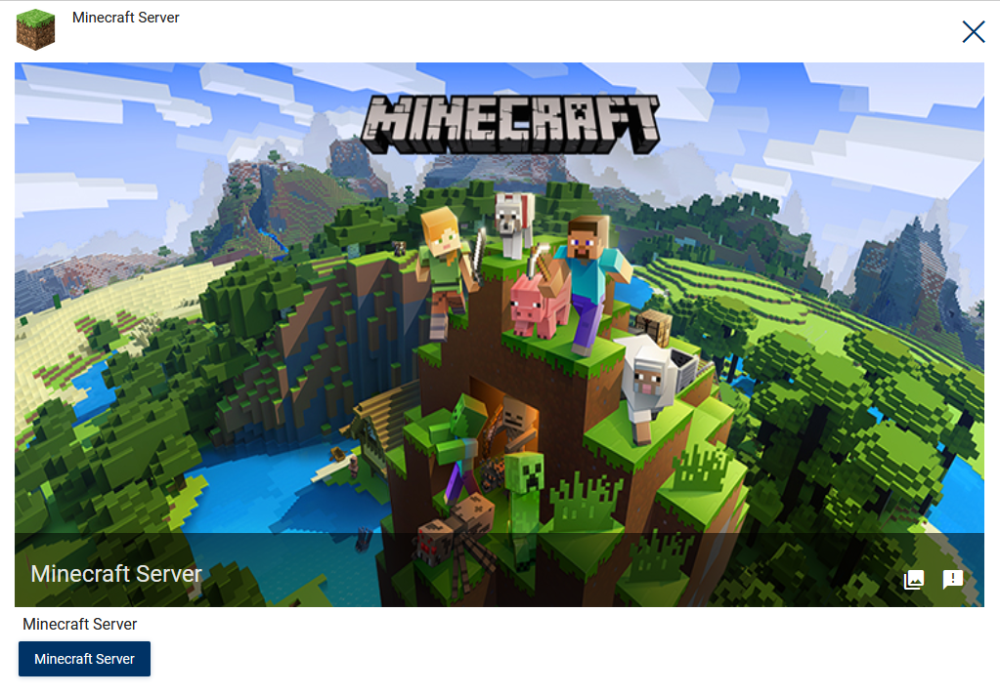

Now, start the application. I strongly recommend at least 4Gb ram and 4 CPU core. Less can work, but may be laggy for few players. If you plan to host more players on the server, you will need more resources and maybe some Java launch tunings. Also, ensure to request a persistent Vault in optional tab! Or your server chunks will not be saved once server shutdown.

Once application is started, you can grab the public ip to be given to users.

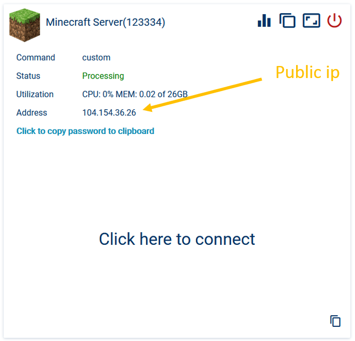

Note that for now, the server hasn't started yet. Server administrator now must connect once to the webshell to trigger server start. Click on "Click here to connect" to join the webshell and trigger server start.

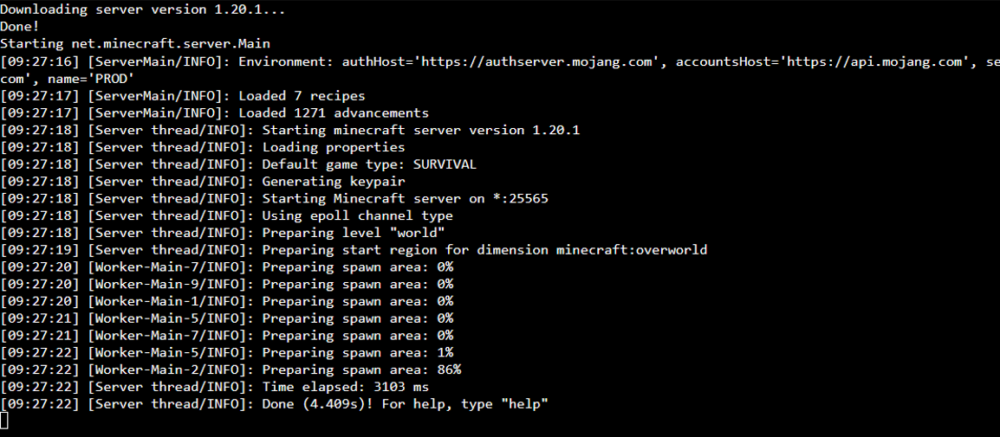

Once server is started, you need to establish a whitelist to prevent unwanted users to login, and add your players in it:

```
/whitelist on
/whitelist add username
/whitelist list
```

Then users can join the server if invited by server admin (i.e. added to whitelist), using multiplayer section on the Minecraft client.


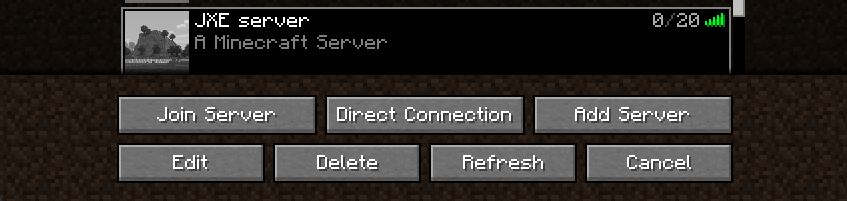

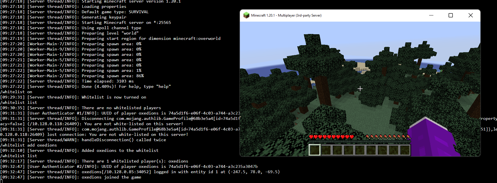

You can close webshell tab anytime, and rejoin later. Of course, do not give the link to any users!

Once server must be shutdown (upgrade, maintenance, etc.), ensure all users are aware of the shutdown, then use command `stop` to ensure server save chunks before stopping gracefully.

Note that to allow advanced server usage, like modding, etc., we could also propose a full remote desktop for this application, etc.

