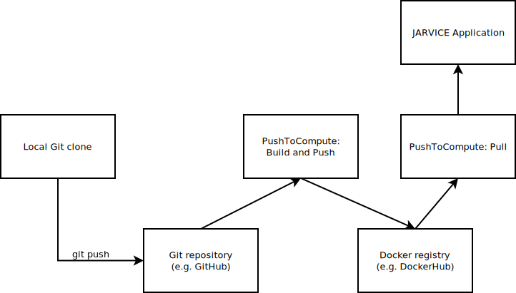
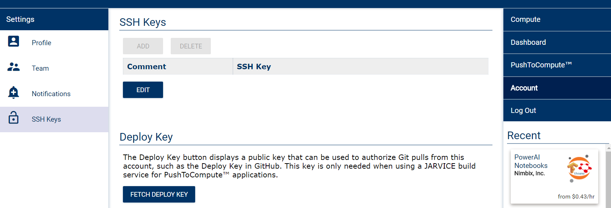
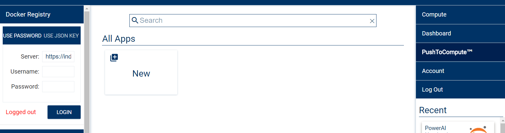
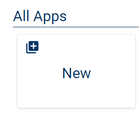
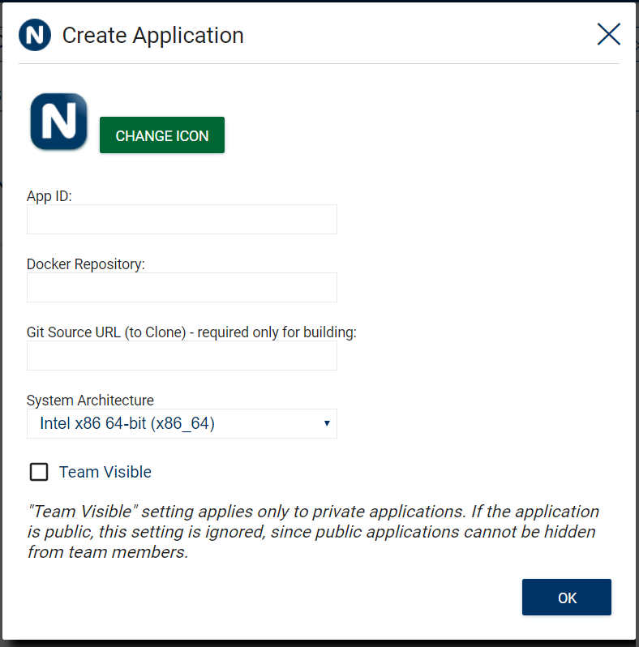
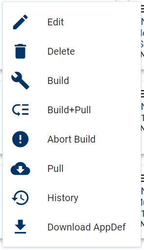
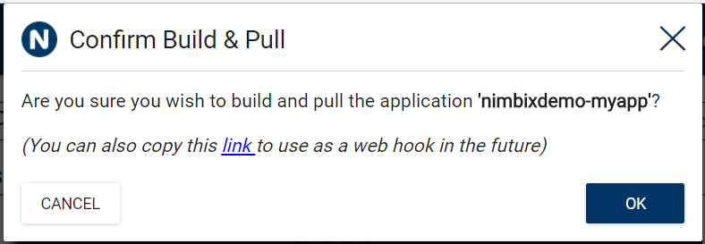

# PushToCompute Pipeline Overview

JARVICE provides an end-to-end continuous integration/continuous deployment (CI/CD) pipeline for compiling, deploying, testing, and maintaining containerized cloud computing applications.  This is all part of the PushToCompute&trade; feature of the platform.

This pipeline consists of various elements:

- Base images for facilitating building and local unit testing
- Integration with 3rd party Git repositories using trusted deployment keys
- Integration with 3rd party Docker registries using various forms of authentication
- Multiple application targets for various stages of the lifecycle (integration testing, system testing, production, etc.)

While Docker images may be built and pushed locally or built by 3rd party services (e.g. Docker Hub automated builds), JARVICE's PushToCompute&trade; provides multiplatform build services for **x86_64**, **ARM** and **ppc64le** (64-bit Little Endian IBM POWER) as an integrated function.

# Pipeline Description

The pipeline produces a JARVICE application from a Docker image, which in turn is compiled from Git source, as described above.  Users may pull the Docker image to run and test locally at any time.  The pipeline may also be automated using Web Hooks, to the point where a single `git push` can trigger an end to end build and deployment of the application to the JARVICE platform.

# Authorizing JARVICE

Users may authorize JARVICE to access private Git repositories and/or Docker images.

To authorize JARVICE to access a private Git repository, first generate a "Deploy Key" in the portal by clicking the *FETCH DEPLOY KEY* button in the *Account->SSH Keys* page of the portal, e.g.:

The next step is to copy this deploy key and add it to the accepted SSH keys in your Git repository, such as GitHub.  This would be equivalent to generating a private SSH key locally and pasting the public part of it into the remote Git repository to allow pulls and pushes from your client.

To log in to a Docker registry (which is often required even to push public images), use the *Docker Registry* widget in the *PushToCompute&trade;* page, e.g.:

This widget supports both DockerHub style username/password logins as well as Google Container Registry style JSON key logins.  If you are using a different registry, please make sure to change the *Server* entry to match the registry you are using to log into.  Generally speaking this should be the same value you would pass into the `docker login` command in your shell.

# Creating the Application

The next step is to define the JARVICE application, which involves creating a target and describing the Docker image and (optionally) Git source paths.  To do this, click the *New* application button in the *PushToCompute&trade;* page which in turn pops up the *Create Application* dialog box, e.g.:

*App ID* is a mandatory parameter and must be all lowercase, consisting of letters, numbers, and/or underscores, to give your application an identifier in the system.  It's recommended that this be a short identifier as it's used for API calls as well as displayed at the bottom of the application launcher in the *PushToCompute&trade;* page for quick reference.  **You may not change this value once set.**

*Docker Repository* is the image in the Docker Registry, including optional tags (default is `latest`) to pull from in order to create the application.  If you are building the application on JARVICE, it's also the Docker image to push to (see pipeline above).  This value would be the same as you would pass to the `docker pull` command on the local shell, for example.  You may change this value later if needed.

Example 1: push builds to and pull image from *repo/image:latest* ('latest' is implicit if no tags are specified):

`repo/image`

Example 2: push builds to *repo/image:tag1,tag2* and pull image from *repo/image:tag1*:

`repo/image:tag1,tag2`

Note: PushToCompute&trade; builds will always first push a uniquely generated docker build tag.  That tag will consist of the first seven characters of the latest git source repository commit hash and a datetime stamp.
i.e.&nbsp;*repo/image:git_commit.datetime_stamp*
e.g.&nbsp;*repo/image:a72500f.201802211706*

*Git Source URL...* is the Git URL, either `https:` or `ssh`.  This value would be the same as you would pass to the `git clone` command.  You may change this value later if needed.  JARVICE supports 2 additional extensions to the Git URL: specification of a branch, as well as a Dockerfile.  If branch is not specified, it defaults to `master`, and if Dockerfile is not specified, it defaults to `Dockerfile` at the top of the tree - e.g.:

Example 1: pull from *branch1*:

`git@github.com:myuser/myapp.git#branch1`

Example 2: build *Dockerfile.1* instead of *Dockerfile*:

`git@github.com:myuser/myapp.git?Dockerfile.1`

Example 3: combination of examples 1 and 2:

`git@github.com:myuser/myapp.git#branch1?Dockerfile.1`

*System Architecture* is the target system type the application runs on, currently **x86_64**, **ARM** or **ppc64le** only.  This will determine both the build architecture (if building from Git source) as well as the target runtime architecture.  **You may not change this value once set.**

*Team Visible*, if set, allows members of your team to run the application (but not modify it).  You may change this value later if needed.

To assign a custom graphic as the application icon, click the *CHANGE ICON* button and choose one from a local folder.  There is a 64KB file size restriction on such icons.  You may change the icon later if needed.

# Building and Deploying

Once you have an application in your *PushToCompute&trade;* page, you can click its context menu (the "hamburger menu" at the top left corner of the application card) to perform actions on it, e.g.:

*Edit* allows you to change parameters specified at creation time or since last edit (see above for which parameters can be changed and which cannot).

*Delete* allows you to delete the application from your account.

*Build* performs a source build by cloning the specified Git repository, performing a `docker build` for the appropriate architecture, and pushing the generated image to the specified Docker registry and target.  This option is enabled only if you specified a Git URL in the application.

*Build+Pull* performs a *Build* and then does a `docker pull` of the application into the target image on JARVICE.

*Abort Build* aborts a build already in progress, if possible.

*Pull* performs a `docker pull` of the application into the target image on JARVICE.

*History* opens a pop up window to monitor event history (such as build and pull status) of your application.  Use this function to know when a pull completes for example.

*Download AppDef* downloads the application's `AppDef.json`, which you can modify to change application metadata and endpoints.  The default `AppDef.json` provides standard endpoints and basic metadata.  You can upload changes by placing `/etc/NAE/AppDef.json` in your Docker image.  For reference on the application definition format (AppDef), please see the [Application Definition Guide](appdef.md) section.

# Running the Application

To run the application, simply click in the body of the card as you would other JARVICE applications.  This will launch the task builder.  If you are using the default AppDef, you will see 3 endpoints: *Batch*, *Server*, and *GUI*.

*Batch* is used to execute a command and exit, much like `docker run` does.

*Server* is used to boot the application image as if it were a full session, and later connect to its services (e.g. `ssh` or `http`).

*GUI* is used to execute a GUI command inside a graphical session accessible via browser (HTML5) or VNC client.  This endpoint only functions if your image includes the Nimbix Desktop.

# Updating the Application

You may update your application at any time by executing any portion of the pipeline (e.g. *Build*, *Build+Pull*, or *Pull*).  The application image is available immediately after a pull completes.

# Automating the Pipeline

All functions described above in *Building and Deploying* can be triggered via HTTP GET from other services.  You will see a confirmation dialog that allows youto copy a Web Hook URL to the clipboard before performing the action, e.g.:

In the above example, simply right click on the underlined _link_ and select *Copy* to copy it to the clipboard.  Then paste it into the Web Hook definition of your Git repository dashboard to link it to a `push`.  Subsequent `git push` will trigger a build from source, push to the Docker registry, and a pull into the JARVICE application.

