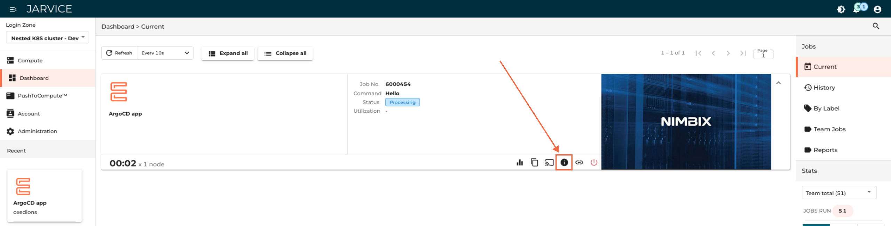

# Jarvice KNS Applications tutorial


Note: it is assumed that the user is already familliar with Jarvice Push to Compute (P2C). Please refer to [apps tutorial](apps_tutorial.md).

Note 2: This tutorial assumes that the user is building applications based on `appdefversion` version `2`.

## 1. Introduction

Before creating apps for KNS scheduler, it is important to understand how KNS operates, and what exactly is the KNS.

KNS stands for Kubernetes Nested Scheduler. As the name says, KNS is a Jarvice downstream component that will spawn nested Kubernetes clusters (based on K3S)
and will deploy Kubernetes based apps inside these nested clusters, as jobs.

While traditional Jarvice downstreams are made for HPC jobs and parallel short term jobs, KNS has been designed to host long running jobs with massive scaleup capabilities. KNS is in theory capable or running anything that can run on a Kubernetes cluster, making it a very nice shared "sandbox".

KNS apps are docker images that contains files (mostly helm/kubectl/kustomize templates) and instructions to be used to deploy Kubernetes based apps, like Kubeflow, ArgoCD, Kubeai, etc. When launching a new job, the KNS will create a dedicated nested K3S cluster for the job, pull the app image from within this cluster, and use image's instructions to deploy the expected resources. Ingresses will allow user to access the nested cluster services.

Note: some apps example for KNS can be found in the [Nimbix kns-apps repository](https://github.com/nimbix/kns-apps). The rest of the tutorial is based on the [Hello World KNS app that can be found here](https://github.com/nimbix/kns-apps/tree/master/apps/hello_world)

## 2. The AppDef.json KNS key

KNS introduces a new key, `nestedkubernetes`, inside traditional *AppDef.json* file of Jarvice applications, at `commands` level.

A very basic hello world app would use the following AppDef.json file:

```json
{
    "name": "Hello World",
    "description": "Hello world app for KNS.",
    "author": "oxedions",
    "licensed": false,
    "appdefversion": 2,
    "classifications": [
        "Uncategorized"
    ],
    "machines": [
        "*"
    ],
    "vault-types": [
        "FILE",
        "BLOCK",
        "BLOCK_ARRAY",
        "OBJECT"
    ],
    "commands": {
        "Hello": {
            "path": "/usr/bin/true",
            "name": "Start nested http server",
            "description": "Start a nested http server for testing and to say hello world.",
            "parameters": {},
            "nestedkubernetes": {
                "kubernetes_version": "",
                "enable_gotty_shell": "true",
                "ingress_type": "subdomain",
                "targets": [
                    {
                        "service_name": "web",
                        "service_port": 8080,
                        "service_namespace": "default"
                    }
                ],
                "templates_settings": {
                    "global_retry": 20,
                    "global_retry_sleep": 15
                },
                "templates": [
                    {
                        "name": "google-sample",
                        "type": "kubectl",
                        "path": "google-sample.yml"
                    }
                ]
            }
        }
    },
    "image": {
        "type": "image/png",
        "data": ""
    }
}
```

Lets examine this file step by steps. We will only focus on the commands part, everything else is the same than traditional Jarvice apps.

```json
    "commands": {
        "Hello": {
```

* `commands` is a list, so you can add any app entry points as needed. This can be useful to create an all-in-one app image for example.
* `hello` is the name of the current entry point for the app.

```json
        "Hello": {
            "path": "/usr/bin/true",
            "name": "Start nested http server",
            "description": "Start a nested http server for testing and to say hello world.",
            "parameters": {},
```

For KNS jobs, `path` and `parameters` are not used, but need to be present for the app to be usable by Jarvice upstream component.
`path` should be set to `/usr/bin/true` and `parameters` left as an empty dict.

`name` and `description` will display as before some details about this entry point, for users to be able to choose between multiple if exist.

```json
            "nestedkubernetes": {
                "kubernetes_version": "",
                "enable_gotty_shell": "true",
                "ingress_type": "subdomain",
                "targets": [
                    {
                        "service_name": "web",
                        "service_port": 8080,
                        "service_namespace": "default"
                    }
                ],
                "templates_settings": {
                    "global_retry": 20,
                    "global_retry_sleep": 15
                },
                "templates": [
                    {
                        "name": "google-sample",
                        "type": "kubectl",
                        "path": "google-sample.yml"
                    }
                ]
            }
```

`nestedkubernetes` is the new key that allows to define inside it all needed elements for a Kubernetes based app.
Lets see each parts of this new dict.

### 2.1. General parameters

```json
            "nestedkubernetes": {
                "kubernetes_version": "",
```

* `kubernetes_version` allows to specify the Kubernetes version to be used for the K3S nested cluster. Format is `v1.X.Y` with `X` the major and `Y` the minor versions. For example: `v1.28.11`. See the compatibility matrix [here.](https://vcluster.com/docs/v0.19/deploying-vclusters/compat-matrix)

### 2.2. Ingress parameters

Ingress parameters allow to connect app to the external world, by giving final user the URL to reach the app portal/entry point/API/etc.

```json
                "ingress_type": "subdomain",
```

`ingress_type` specify the type of ingress to be use. By default it is `subdomain`, which means that for each job, the ingress URL will be of format kns-job-XXX.mycluster.example.
On some clusters, a subdomain based ingress cannot be used, and so instead of providing a subdomain based ingress, the url will be of format mycluster.example/XXX. To do so, set `ingress_type` to `prefix`. Note that not all KNS applications are compatible with this workaround (Kubeflow for example will not work).

```json
                "targets": [
                    {
                        "service_name": "web",
                        "service_port": 8080,
                        "service_namespace": "default"
                    }
                ],
```

`targets` list is then used to define ingresses to spawn.
For now, KNS will only consider the first item in the list. This limitation will be removed in later versions.

The following parameters are to be set for each ingress target:

* `service_name`: name of the service to link ingress to.
* `service_port`: port of the service to link ingress to.
* `service_namespace`: namespace where the service to link ingress to is.

### 2.3. Templates parameters

#### 2.3.1. Global settings

```json
                "templates_settings": {
                    "global_retry": 20,
                    "global_retry_sleep": 15
                },
```

Templates are provided as a list, named `templates`, which will be executed in an ordered manner.

While each item of the list can set its own parameters, the following global parameters are available, which apply to all items of the tempate list:

* `global_retry`: how many retries to do if executing the item failed. For example, if the kubectl apply of the template fail, it will be retried. This is useful when a step needs another previous one to have completed to succeed (resources running).
* `global_retry_sleep`: how many seconds should we wait between each retry.

#### 2.3.2. Templates

```json
                "templates": [
                    {
                        "name": "google-sample",
                        "type": "kubectl",
                        "path": "google-sample.yml"
                    }
                ]
```

The `templates` list allow to execute instructions in an ordered manner, and to apply templates to deploy the app into the nested scheduler.
Since the init pod runs with cluster-admin rights (inside the nested K3S cluster), templates can create new namespaces, cluster roles, etc.

Note that before executing templates, the KNS will pull and extract the app image. All files inside the `/templates` folder of the image will be extracted and execution will take place **inside** this extracted folder.

For example, in our current example, hello world, the dockerfile contains:

```dockerfile
RUN mkdir /templates
COPY google-sample.yml /templates/google-sample.yml
```

For each step, a `name` parameter must be set. This is only for convenience, and ease logs reading.

It is also possible to fine define retry and sleep between retries:

```json
                "templates": [
                    {
                        "name": "google-sample",
                        "type": "kubectl",
                        "path": "google-sample.yml",
                        "retry": 10,
                        "retry_sleep": 30
                    }
                ]
```

For this item, `retry` will precedence `global_retry` if set, and `retry_sleep` will precedence `global_retry_sleep`.

There are then 3 types of actions available:

##### 2.3.2.1. kubectl type

Kubectl will execute the following command:

```
/usr/bin/kubectl apply -f path/to/template.yml
```

If `type` is set to `kubectl`, then a `path` must be provided, relative to the root of `/templates` folder of the app image.
In our example, since our `google-sample.yml` file is at `/templates/google-sample.yml` into our app image, `path` will simply be `google-sample.yml`.

Note that the kubectl type also allows to use an URL as a template, to fetch a remote template (with all risks that it implies!).
To do so, specify a special key `format` to `url`, and provide the URL inside the `path` key. For example, to deploy ArgoCD:

```json
                "templates": [
                    {
                        "name": "allinone",
                        "type": "kubectl",
                        "path": "https://raw.githubusercontent.com/argoproj/argo-cd/stable/manifests/install.yaml",
                        "format": "url"
                    }
                ]
```

Again, YOU MUST trust the owner of the remote template to use this feature.

##### 2.3.2.1. kustomize type

Kustomize will execute the following command:

```
/usr/bin/kubectl apply -k path/to/folder/
```

And so allow to use the equivalent of the kustomize command (that was merged into kubectl command) on a folder of dynamic templates.

As for kubectl type, you need to provide a `path` value, relative to the `/templates` folder of the app image.

##### 2.3.2.1. custom type

Custom allows to execute arbitrary scripts instead of using a specific command to apply templates.
Since the init image embed helm binary, it is possible to use custom type to deploy helm based applications.

When using custom, a `cmd` key must be set, and it should contain the script to be executed, encoded in base64 format.

For example, to deploy a basic kubeai, which uses helm to deploy:

```json
                "templates": [
                    {
                        "name": "helmdeploy",
                        "type": "custom",
                        "cmd": "IyEvYmluL2Jhc2gKIwoKc2V0IC14CgpnaXQgY2xvbmUgaHR0cHM6Ly9naXRodWIuY29tL3N1YnN0cmF0dXNhaS9rdWJlYWkgJiYgY2Qga3ViZWFpCgpjYXQgPDxFT0YgPiBoZWxtLXZhbHVlcy55YW1sCm1vZGVsczoKICBjYXRhbG9nOgogICAgZ2VtbWEyLTJiLWNwdToKICAgICAgZW5hYmxlZDogdHJ1ZQogICAgICBtaW5SZXBsaWNhczogMQogICAgcXdlbjItNTAwbS1jcHU6CiAgICAgIGVuYWJsZWQ6IHRydWUKICAgIG5vbWljLWVtYmVkLXRleHQtY3B1OgogICAgICBlbmFibGVkOiB0cnVlCkVPRgoKaGVsbSB1cGdyYWRlIC0taW5zdGFsbCBrdWJlYWkgLi9jaGFydHMva3ViZWFpIFwKICAgIC1mIC4vaGVsbS12YWx1ZXMueWFtbCBcCiAgICAtLXdhaXQgLS10aW1lb3V0IDEwbQoK"
                    }
                ]
```

The `cmd` content is this script:

```bash
#!/bin/bash
#

set -x

git clone https://github.com/substratusai/kubeai && cd kubeai

cat <<EOF > helm-values.yaml
models:
  catalog:
    gemma2-2b-cpu:
      enabled: true
      minReplicas: 1
    qwen2-500m-cpu:
      enabled: true
    nomic-embed-text-cpu:
      enabled: true
EOF

helm upgrade --install kubeai ./charts/kubeai \
    -f ./helm-values.yaml \
    --wait --timeout 10m
```

That was encoded this way:

```
cat myscript.sh | base64 -w 0
```

Encoding scripts prevents any kind of evaluation issues.

## 2.4. Gotty shell

It is possible to request a gotty shell to be created along the deployment of the application.

```json
                "enable_gotty_shell": "true",
```

A gotty shell is a web based terminal, that will allow app owner to interact via command lines with its nested cluster.

When app will be running, the app url will be by default in the `http://job-kns-XXX.mycluster.example` format. The gotty shell will be accessible at `http://job-kns-XXX.mycluster.example/gotty-shell`. Credentials to login to the gotty shell are provided through the help interface of the running app:




Note that the gotty shell can only be created if the local cluster administrator allowed it during the KNS main deployment.
