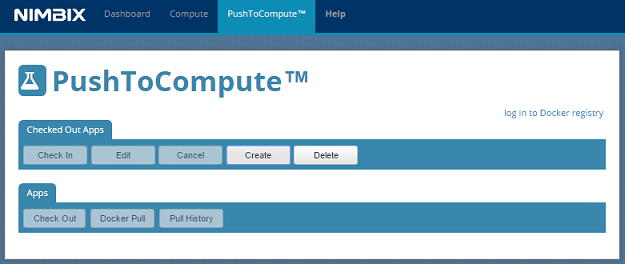
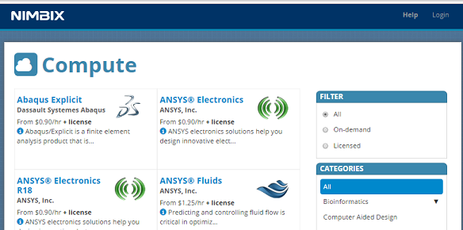
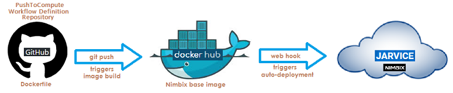

You’re a developer of large-scale enterprise-level, compute-intensive, containerized applications. The  apps need to perform fantastically complex modeling, simulation or analysis, or to crunch data using enormous data sets that are far beyond the abilities of traditional environments to handle.  They require a 

You’ve decided to use the powerful JARVICE cloud operating system, with its container runtime optimized for high performance and accelerated big compute and big data applications and simple API. (A very smart decision, by the way!)

Now, you’re ready to begin. How do you get your applications onto JARVICE quickly, so they can start solving large scale problems?   Nimbix provides a unique tool that is easy to use:   PushToCompute™.




------

## What is PushToCompute?     

PushToCompute is a feature of Nimbix’  JARVICE platform that is used for high performance, automatic platform orchestration during the Nimbix cloud runtime, providing continuous integration for your supercomputing applications. It’s the fastest, easiest way for developers to onboard compute-intensive applications into the cloud.  

The PushToCompute™ work flow exposes an application or a subset of the application’s capabilities to users on Nimbix' JARVICE platform.  End users typically consume work flows from the web-based portal at   https://cloud.nimbix.net, shown here:



## How does it work?

In a nutshell, PushToCompute work flows are defined using a simple, declarative repository structure centered around a Dockerfile.  PushToCompute automatically converts images in the industry-standard Docker format into the native Nimbix JARVICE format as part of the work flow.   

PushToCompute gives you a great deal of flexibility in how you construct the work flows.  In one common work flow setup, illustrated below, you build container images locally and push them to the Docker Hub or to another third party registry. 

Once configured, every it push to your PushToCompute™ Work Flow Definition repository will trigger the application image to be built on Docker Hub. Once building is complete, a Docker Hub web hook will trigger automatic deployment of the application onto JARVICE. 

- unit test -> push to GitHub ->automated build in Docker Hub -> JARVICE deployment via Webhooks from Docker Hub 

  

Alternatively, you can deploy PushToCompute work flows directly to GitHub or Bitbucket for free continuous integration and deployment onto JARVICE. 

- unit test -> Docker build -> Docker push to registry -> Explicit pull from JARVICE portal

Another work flow example:

- unit test -> Docker build ->integration test -> Docker push to registry -> JARVICE deployment via web hooks from registry

## Base images

**<u>Docker base images:</u>** <!--I don't yet know enough about docker to describe this section accurately - gave it a shot here but probably not correct.  -->

Nimbix provides Docker base images for various flavors and configurations of Linux. Docker is an open-source project that automates the deployment of applications inside software containers

You can search for Nimbix' Docker base images as follows:

​	*docker search nimbix*

The images are tagged by version.  For example, **centos**-**base** has both a version 6 and a 7 at the time of this writing.  The latest tag always refers to the newest version that is not considered experimental.  

**<u>NVIDIA-Docker base images:</u>**

While Nimbix' base images are best for most workflows, through our partnership with NVIDIA, we also support **nvidia-docker** base images.  JARVICE can now run images built on **nvidia-docker** bases unmodified in the Nimbix Cloud, taking advantage of large scale graphics processing unit (GPU) options on demand.  This  provides some interesting capabilities for developers looking to test code written for NVIDIA's **CUDA**  parallel computing platform and API model before deploying in cloud environments.  

 For more information about nvidia-docker bases, visit the [NVIDIA repository](https://hub.docker.com/r/nvidia/) on Docker Hub.

There are three types of base images available for each flavor/version of Linux: 

​      **base**:   Use this base image for batch-type applications that do not depend on CUDA,

​      **desktop:**   Use the desktop base image for interactive graphical applications

​      **cuda: **  Use the **cuda** base image for applications leveraging the NVIDIA CUDA toolkit.  

Nimbix will package the latest current release (not RC) version of NVIDIA CUDA.  When new versions are released, they will be added, but the existing ones in the **cuda** image will not be removed.  If your applications depends on a specific version of CUDA, it is best to set that version explicitly rather than relying on the **/usr/local/cuda** symlink, which will always point to the latest.

## Limitations and caveats

<u>**Kernel drivers:**</u>    You may <u>not</u> install kernel drivers inside your containers.  JARVICE automatically deploys the appropriate NVIDIA driver at runtime, if you select **GPU** hardware.  If you wish to install an earlier version of CUDA, make sure you install just the toolkit, not the kernel driver as well. You can check the **Dockerfile** for any of the **cuda** base images for details on doing this from the NVIDIA repositories.

**<u>ENTRYPOINT and EXPOSE commands:</u>**  These commands are ignored in the JARVICE runtime.  Use these only for unit testing.   Any command you run on JARVICE must be explicit; to test your application, instead consider using a wrapper script and launching that as part of a **docker run** command.

**<u>Rendering:</u>** (generating an image from a 2D or 3D model by means of computer programs):  OpenGL server-side rendering is available, but defaults to using the latest Mesa client libraries available for the base image chosen (**desktop** and **cuda** images only).  

If you wish to use the NVIDIA OpenGL libraries on NVIDIA GPU-based systems, you must create a configuration file explicitly (see below?).  Note that on non-GPU nodes, JARVICE automatically deploys Mesa with software rendering.  On GPU nodes, Mesa performs the hardware rendering automatically. However,  there may be cases where the NVIDIA libraries are preferred.

<u>**BitfusionBoost:**</u>  JARVICE offers support for Bitfusion Boost automatically.  This is native to the platform; you should not attempt to install any packages inside your containers. JARVICE automatically deploys the Boost client when you select the Bitfusion-powered machine type at runtime.  There is also no need to prefix your commands with bfboost client, as this is inherent in the platform.

**<u>PushToCompute:</u>** If you are using the **PushToCompute** feature, you should not manage or run images directly using the Images or Launch tabs in the portal.  Doing so may interfere with your future application deployment and may deliver a different experience.  You will see your images with the extension .**app** – these are images managed by PushToCompute, and should not be launched or modified directly.

**<u>File system layout</u>**: Information about the JARVICE runtime environment file system layout, known as the Nimbix Application Environment, can be found in the section “Layout of The Nimbix Application Environment” in the [JARVICE Quick Start Guide](https://www.nimbix.net/jarvice-quick-start-guide/).

**<u>Applications run as the nimbix user</u>**:  These are managed automatically by JARVICE at runtime.  Nimbix base images configure this user for passwordless **sudo** access. When unit testing, run the commands as follows:

```dockerfile
# batch workflows
docker run -h JARVICE <image> \
  /usr/lib/JARVICE/tools/sbin/init <command-line>

# graphical applications (redirect ports for VNC/HTML5 access)
docker run -h JARVICE -p 5901:5901 -p 443:443 \
  /usr/lib/JARVICE/tools/sbin/init /usr/local/bin/nimbix_desktop \
  <command-line>
```

## Building and deploying work flows 

For more in depth information on building and deploying applications on JARVIS using PushToCompute, visit [Building and Deploying Work Flows](ptc_workflow.md).

For an example that puts it all together, visit the 
[PushToCompute Tutorial](ptc_tutorial.md).


