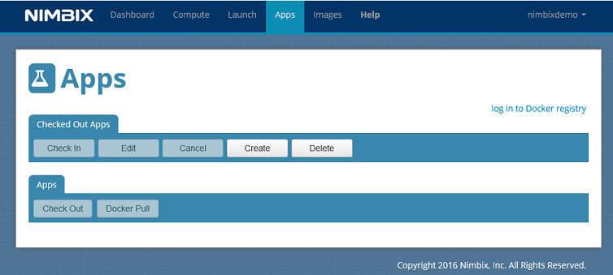
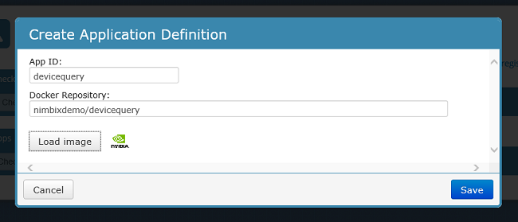
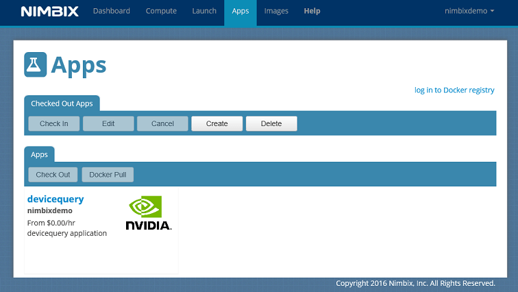
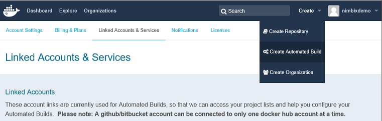
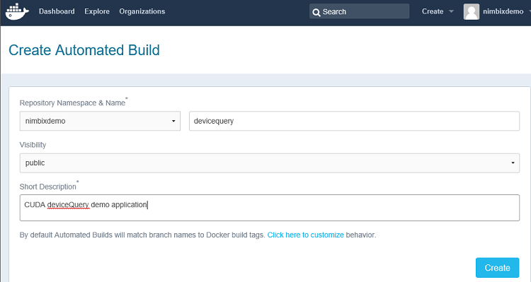
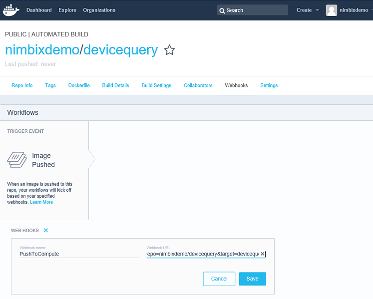
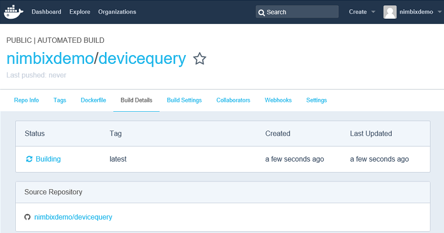
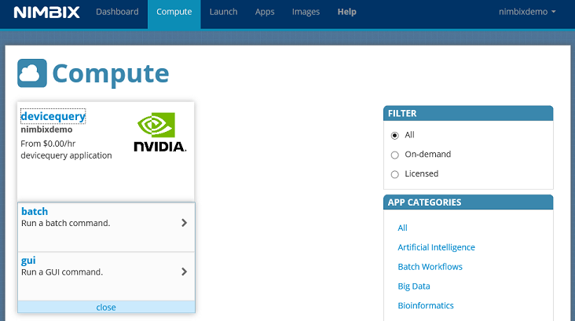
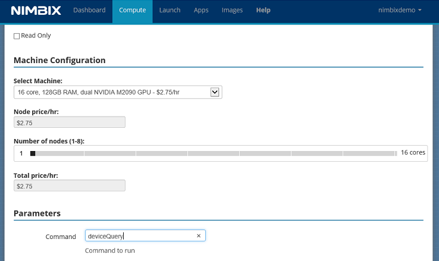
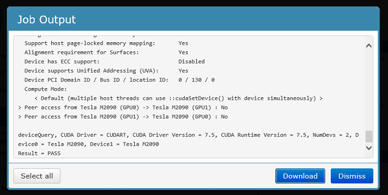

## Example of Building and Deploying a Work Flow

For this example PushToCompute work flow, we will be querying GPUs in the Nimbix Cloud. This example uses the **deviceQuery** application from **CUDA** (nimbix/ubuntu-cuda), NVIDIA's parallel computing platform and programming model.

For the entire work flow, the sources are in GitHub, the container repository is in Docker Hub, and the runtime application is in JARVICE.  This example uses the [nimbixdemo/devicequery ](https://github.com/nimbixdemo/devicequery) repository in GitHub, and will perform automated builds in Docker Hub to its own [nimbixdemo/devicequery](https://github.com/nimbixdemo/devicequery) repository.

in order to illustrate an end-to-end workflow integration, GitHub source code management is used here. However, the use of GitHub is optional; containers can be built and pushed directly to a registry.   

Here, the use of an automated build on Docker Hub is assumed, so that the images are built automatically from a Dockerfile and other files stored in a repository.  Automated builds offer several advantages:  the images are built exactly as specified, the Dockerfile is available to anyone with access to the Docker Hub repository, and the repository is kept up to date with automatic code changes. (If you are pushing directly to Docker Hub, this step can be skipped.)  

For more on automated builds on Docker Hub, visit [Configure Automated Builds on Docker Hub](https://docs.docker.com/docker-hub/builds/).

Step 1:   Creating the application in JARVICE

Step 2:   Creating an automated build in Docker Hub

Step 3:   Preparing the application source

Step 4:   Running the application

### Step 1: Creating the application in JARVICE

First, we set up the workflow from “right to left”, if you will, starting with the final target, which is the application in JARVICE.

After logging into the JARVICE portal, clicking on the **Apps** tab at the top brings up the application management page:  <!--Below, both Create and Delete are focused on?-->



Since we’ll be using a public repository in the Docker Hub, it's unnecessary to log in to the registry.  (If it were, you can simply click **log in to Docker registry** and follow the instructions.)

Next, we click the **Create** button, bringing up the "Create Application Definition" screen shown below, and fill in the details. Notice we've added an NVIDIA logo icon by clicking **Load image** and selecting it from the local computer.  

When naming the application, it's a good practice to give it the same name as the repository image (minus the namespace, which is not permitted on JARVICE, as it’s already implied in your user account). But it’s not strictly necessary.



Clicking **Save** brings up the "Apps" screen, showing the application in the "Checked Out Apps" section.  We’ll check it in, as we are not going to modify the definition at this time (we’ll use the default for this tutorial).  After selecting the app and clicking the **Check In** button, we now see the application checked in, as shown below:



We’ll select the app and click the **Docker Pull** button. The reason we are doing this is to bring up the web hook URL that we’ll want to put into our Docker Hub account for the corresponding repository.  We won’t complete the pull here.  (If we did, it would fail, since we haven’t yet pushed anything or created any repositories.)

On  the "Confirmation" screen that appears, you can see the repository name:


That’s the web hook URL.  By right-clicking on the underlined word **"link"**, we copy it to the clipboard.  

It's true that we can always **GET** that URL manually, or use the **Docker Pull** button in the JARVICE portal to pull the latest application image immediately.  But to illustrate the power of automation here, we’ll use the web hook to trigger pulls into JARVICE whenever code is pushed to GitHub.

### Step 2: Creating an automated build in Docker Hub

Next, we’ll create an automated build using Docker Hub.  As explained above, in order to illustrate the end-to-end workflow, it's assumed that a GitHub account has been linked already to the Docker Hub account.  (If you prefer not to link GitHub and Docker Hub, you can simply create a regular repository and **Docker Push** directly to it. 

You can use either public or private repositories in each system, but remember that you'll need to log in via the JARVICE portal’s link in order to use a private Docker registry repository.) 

With the GitHub and Docker Hub accounts linked, we select the **Create Automated Build** option in the Create menu, as shown below:



We’ll follow the steps to select the **nimbixdemo/devicequery** repository (that we should already have created in GitHub ahead of time). Finally, we arrive at the "Create Automated Build" screen:



We accept the default branch and tag behavior by clicking the **Create** button.  

Next, we’ll add the web hook URL that we copied to the clipboard earlier:



By clicking **Save**, we’ve completed the entire setup for this application!  

Next, it’s time to build and push the bits themselves…

### Step 3: Preparing the application source

The application source is the Dockerfile for the application to be pushed to the [nimbixdemo/devicequery](https://github.com/nimbixdemo/devicequery) repository on GitHub:

```dockerfile
FROM nimbix/ubuntu-cuda:trusty

RUN make -C/usr/local/cuda/samples/1_Utilities/deviceQuery

RUN ln -s/usr/local/cuda/samples/1_Utilities/deviceQuery/deviceQuery /usr/bin
```

Notice that the **nimbix/ubuntu-cuda** base image already has CUDA installed, so all we need to do is build the program we want to make available.  For convenience, we’re linking it to **/usr/bin** in order to avoid having to type the full path when running it.

In this particular case, our local machine does not have an NVIDIA GPU.  If it did, we could unit test this by building and running the container with an expanded NVIDIA .run package mapped (or copied) into a container directory called **/usr/lib/JARVICE/NVIDIA**.  If the base image init program (as illustrated above) finds nvidia-installer in that path, it executes it to install the non-kernel portions of the NVIDIA runtime package.  It assumes that you are passing the appropriate devices into the container as well.

To get this application into JARVICE, simply commit and push with Git (to origin master in this case).  Once you’ve done that, you can of course monitor the build in the Docker Hub:



Once this completes, we can check our inbox to see JARVICE in action. An email is sent when the Docker pull starts, and when it completes:


Each step may take a few minutes to complete, including the emails themselves.  The time to complete is highly dependent on the speed of GitHub, Docker Hub, and even the Internet at large. 

Most PushToCompute events should take ten minutes or less to complete all the way from GitHub;  if you're pushing directly to Docker Hub, they should take five minutes or less.

#### Step 4: Running the application

Once we receive email confirmation that the Docker image pull from JARVICE has completed, we can run our application.  

Returning to the JARVICE portal **Compute** tab, we scroll to the bottom to the Uncategorized category; doing so filters out other catalog applications.  Any new applications created default into this category. (We can always edit the application definition later to make adjustments to the JSON.)



The command we need can be run in either batch mode or by using the GUI. As this is not a GUI application that needs to be started in a graphical terminal, it's easier to run here in batch.  

Selecting the batch option brings us to the Task Builder: <!--It is confusing to me to call this pane the Task Builder as it does not say that anywhere on the UI....-->



As it’s a GPU application, we selected a GPU machine type to run it on.  We also wrote in the the program we want to execute: the **deviceQuery** command.  We put it in **/usr/bin** with the Dockerfile.  

After starting the job, we can check the output from the Dashboard, and confirm that the command indeed ran and performed the CUDA device query we were looking for:



Subsequent GitHub pushes will perform the same process over again -- which is how you would maintain your application.<!--The prior sentence is unclear to me...-->  You can manage multiple applications this way. 

By default, PushToCompute applications are private to your account. Nimbix can offer to publish one or more of your applications in the public catalog at a price of your choosing.  If you are interested in publishing one or more applications, please contact us for details.

This concludes the PushToCompute tutorial.


